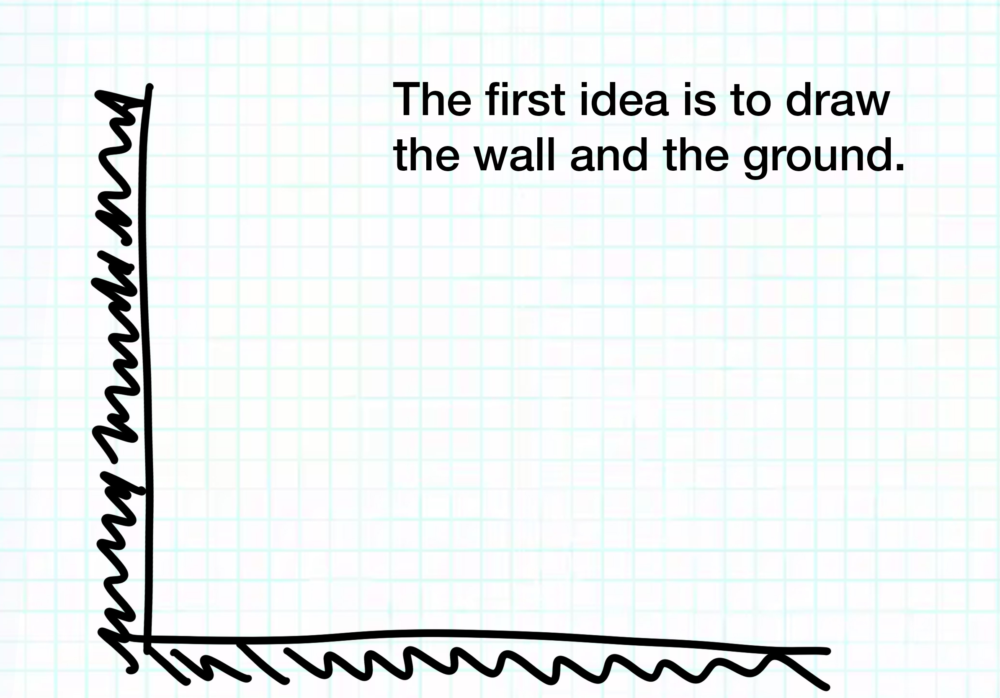
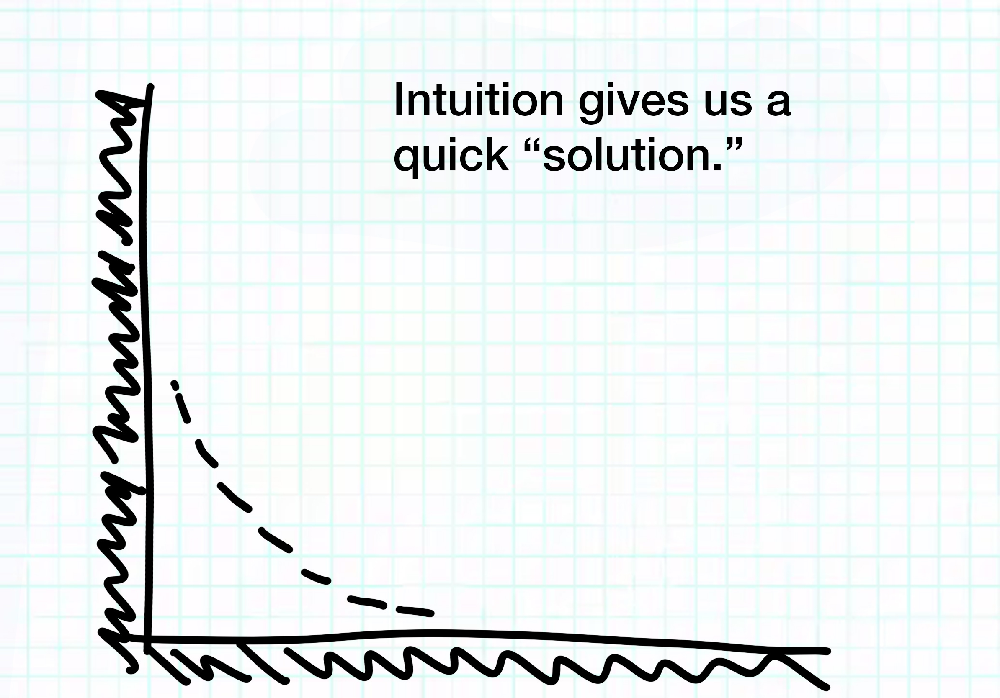
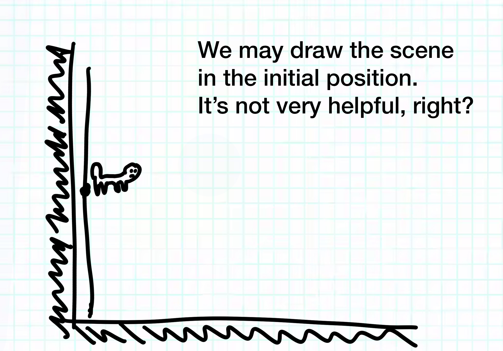
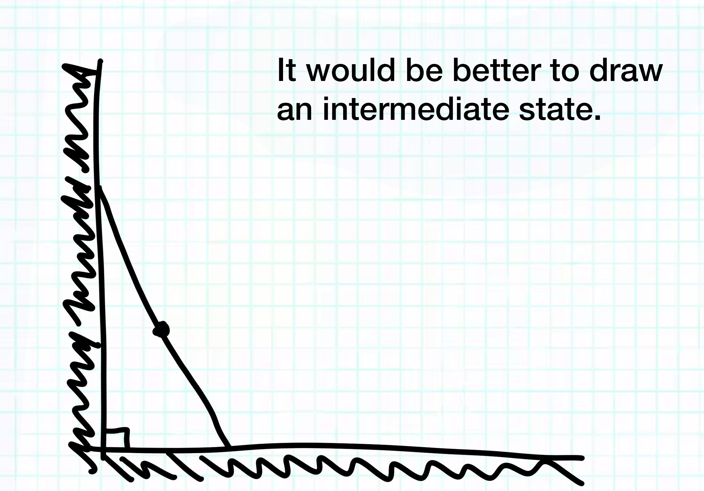
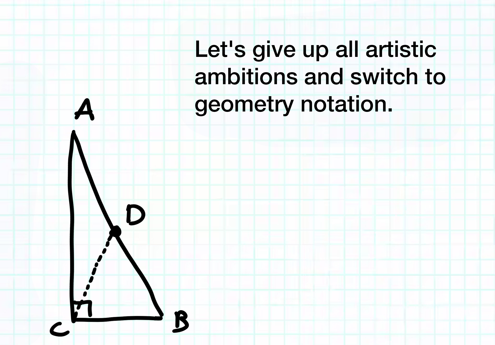

OK, let's use the task known to you as an introduction.
Assume that you are asked to find the longest common substring from the set of the given strings (no requirements about code size, limited number of strings, or limited string lengths). Let's say we have `n` strings of the `l` length and we have a fixed alphabet, for example, Latin.
Let's use Python as a language for the implementation.
Of course, we start with the simplest "brute-force" algorithm, checking all the possible substrings or the first string.
```
def naive_lcs(ss):
    if len(ss) > 0:
        for i in range(len(ss[0]), -1, -1):
            for x in range(0, len(ss[0]) - i + 1):
                t = ss[0][x:x+i]
                if all(t in s for s in ss[1:]): return t
    return ""
```
However, there is a pretty high probability that you will be asked to optimize it.
Well, using a generalized suffix tree, we may get something like this:
```
from suffix_tree import Tree

def stringify(_, length, path):
    return "".join([path[i] for i in range(length)])

def tree_lcs(ss):
    if len(ss) == 0: return ""
    if len(ss) == 1: return ss[0]
    tree = Tree()
    for id, s in enumerate(ss): tree.add(id, s)
    return stringify(*tree.common_substrings()[-1])
```
Just to illustrate the performance difference, I ran a few tests for `n = 10` and different `l` values. I'll skip the description of how exactly I generated strings, but they look something like this (`l = 32`):
```
['MNPPQVWTVVEBJDKBHNTFKPUZEJNRVZDH', 'ZBBFFHKJNPPNWRZRYFTZFLRZEJOTYDDH', 'MNQRUTYZWZAZJFOHPFMTALRXDJOTYDIN', 'ZBCDEFFHOJLLWTOXPXFTAHOXDJPVBDIN', 'MNOPTRTXXDWXJHDNGPFNVHOVCJPVBHNT', 'ZBDFDJHNPNSVWVSDXHYHVDLTCJQXBHNT', 'MNPRSVVVYXDHJJHDOHRHQZLTBJQXELST', 'ZBBDHHJLHROTWXWTFZRBLZIRBJRZELSZ', 'MNQPRTXTZBZFJLLJFRKVLVIRAJRZHPSZ', 'ZBCFGFLJILKRWZAZWRDVGVFPAJSBHPXF']
```

I got the following running time values:
```
  l  |    Naive   | Suffix tree
-----+------------+------------
  16 |    0.0003  |    0.0024
  32 |    0.0012  |    0.0044
  64 |    0.0046  |    0.0092
 128 |    0.0124  |    0.0169
 256 |    0.0601  |    0.0321
 512 |    0.175   |    0.0705
1024 |    0.7714  |    0.1376
2048 |    3.634   |    0.3067
4096 |   23.5737  |    0.6113
8192 |  191.8265  |    1.43  
```
Let it be. In a better world, we would get the `Θ(nl)` time complexity and the same space complexity, but the real benchmarking is a very, very different story from the asymptotic complexity.

But this is not the topic I want to discuss. I want to discuss the following questions:
* How do you prepare for a technical interview?
* What are the questions you'll be asked?
* What are the algorithms and data structures you need to know?
* How do you calculate that the average substring length is `⅓(l + 2)`?
* How do you design an efficient algorithm?
* What are the heuristics you can use during the interview?
* Why is the naive algorithm so fast for short strings?
* What are the basic things that, if you don't know, will mean failing the interview?
* How can randomization make the sorting of data faster?
* Are different programming languages really so different?
* What is the purpose of the randomization?
* What are the three major hacks in algorithm design?
* What do you absolutely need to do to get shortlisted?
* What does the `Θ` letter mean, and does anybody really care about it?

Well, I hope to answer these and other questions in the following posts. We'll see what comes of this.
🤝
I'll try to post here some notes about passing a technical interview. I don't promise to give you an exactly systematic narrative, a "step-by-step" algorithm, or even cover all the bases. But I will try to answer, at least partially, the following questions:
1. What is usually being assessed?
1. Who do you have to deal with?
1. What algorithms do you absolutely must reproduce "from memory"? And yes, I will try to explain them step-by-step.
1. What kind of non-programming puzzles may you be asked to solve?
1. What are my own "pass the interview" tips or "rules"?

Please note that this is still experimental content, and I'll probably make quite a few mistakes, but I'll try to do my best.

I will post in English only, because translating there and back again requires at least 50% more time. Anyway, understanding English—well, at least technical _Engrish_ from a non-native speaker—is a must.

Leave reactions and, of course, [***ask questions***](https://discord.com/channels/950701840901746708/1258454125457440811). YOU WON'T GET THE MOST OUT OF IT IF YOU DON'T ASK QUESTIONS.

*And I will be especially grateful for any help in catching bugs in the code samples.*
I have some hands-on experience conducting interviews. I had conducted more than 1200—and that's not an exaggeration—for our company in the last 25 years. Also, I played some role in the institutionalisation of human resources processes, or, as we prefer to name these processes right now, talent acquisition, talent management, and talent development processes in Itransition. I participated in that role in the training of _the interviewers_. 

And, of course, I always collect information about how interviews are conducted at other companies. It's just my professional curiosity.

Of course, it doesn't mean that I'm a "guru" or "expert"—see below—so, please **treat my recommendations with a grain of salt and modify them to suit your personal situation**.

I'm not going to write about questions and tasks I believe should be used during the technical interview—well, interviews don't work very well—I will describe *what questions are asked in practice* and what questions and tasks are proposed to candidates in reality. So, these notes may contain "bad" questions from the "they don't help to select needed employees" point of view, but usually these questions are quite _typical_.

> `Please don't read this as "how to conduct a technical interview" guide; treat this as "how to pass a technical interview" recommendations.`

**Also, these notes are not about the interview at Itransition—I deliberately will ponder on "common issues" even if we were able to fix them in our company.**

The best way to prepare for an interview—and I will write on that topic later—is, well, by participating in interviews. From my side, in addition to the recommendations you will find here, I can advise you *to come to the project defense*. *Our engineers will ask you some questions; you may consider that an interview rehearsal.*
And here is another disclaimer.

**Interview with "the experts" as a method of personnel selection work really poorly.** ***But it's used everywhere.*** Because, you know, people.

The estimates from experts are a very unreliable way to select a *good* employee, and this is a well-studied fact from the 1970s. It's easy to name quite a few people's biases related to this topic, e.g., insensitivity to prior probabilities, illusion of control, replacing predictions with estimates, and many others.

E.g., people generally don’t know how to separate events driven by pure chance from events controlled by skills. Why? We believe in our capability to control our environment and always underestimate the chance in our achievements. People conducting interviews may underestimate the chance in their own achievements and unfairly criticize you for the luck of your personal achievements. Add here also _fundamental attribution error_, and you understand why you should be very careful in the interpretations of the interview feedback.

📚

You may refer to 'Judgement under uncertainty: Heuristics and biases' by Kahneman, Tversky, Slovic—well, this is _the_ book about how people really work without spirituality, psychoanalysis, and all that humanitarian mantras, but I'm already digressing from the main topic.

**Even the simple linear models give better results than the expert predictions of future candidate performance. **Even a simple test in the controlled environment will work much better than an interview. You may consult experts about what questions to put in such tests because people are good at deciding if it is useful to know this and that, but we are terrible at aggregation, addition, and especially multiplication, yada-yada-yada. Some people working in this area know it and understand it. Some don't.

But. But. There is a huge "but." It's *really* hard to shift public opinion, change habits, and resolve the "everybody does it" issue.

Anyway, in reality, *you will undergo interviews*. Deal with it.

😡

As a teaser, here is a random question from a technical interview. What is your least favorite and most favorite feature of Java, C#, PHP, Python, Ruby, JavaScript, etc.? Of course, you are always asked about one specific language. This question allows not only to evaluate the depth of the knowledge but also the width (by asking to compare with other languages), as well as the ability to analyze and reflect. I love this question because it's a great opener—it's better than asking to write something from the very beginning because it minimizes the risk of getting three "I don't know" answers in a row.

So, you need to be ready to answer such questions. Prepare a feature you hate and a feature you love in your language.

I will propose an example or two, but by all means, prepare your own.

Remember, if you are asked about your opinion, you need to have a plan.
* Say, "I will talk only about the language itself; I will leave the community, ecosystem, and frameworks out of the discussion."
* Say, "It's only my personal opinion."
* Defend your point of view with arguments.
* Compare the chosen feature with the corresponsing capabilities of other languages.
* Be ready to accept objections (yes, it can be a part of the interview—some kind of "stress resistance" or "objection handling" evaluation).

Try to avoid pretty abstract ideas like "it's secure" or "it's robust." Also, I propose to leave compilation and static type checking—whether it helps or impedes—outside of the discussion because "dynamic typing" hippies usually just hate it, and it works the other way for "static typing" devotees too.

Let's start with the "I just hate it!" kind.

> Java
There are several "not so ideal" design choices that may seem arguable in retrospect, but when Java was out, there was a very different technological landscape:
* checked exceptions (some may argue that this is the greatest Java feature);
* suboptimal integration of primitives into the Java type system (there is a lot to talk about here—code duplication, generics, limited types in streams, etc.);
* absence of unsigned integer types (more about it later);
* arrays and collections are not very compatible.
[Let's discuss it](https://discord.com/channels/950701840901746708/1258454125457440811)!

> C#
* bloated syntax (LINQ, delegates vs. anonymous methods vs. lambdas, different ways to initialize a property, etc.);
* static (non-virtual) operator overloading;
* intricate object equality comparison implementation (override `Equals` and `GetHashCode`, implement `IEquatable<T>`, overload `==` and `!=`);
* `ref` and `out` parameters (almost universally mean the method is trying to do too much).
[Let's discuss it](https://discord.com/channels/950701840901746708/1258454125457440811)!

```
public class A
{
    private int p = 42;
    
    public int P { get { return this.p; } }
}

public class B
{
    public B() { P = 42; } 

    public int P { get; private set; }
}

public class C
{
    public int P { get; } = 42;
}

public class D
{
    public int P => 42;
}

public class E
{
    public int P { get; init; }
}

public class F
{
    public required int P;
}

public class Test
{
    public static void Main() 
    {
        Console.WriteLine(new A().P);
        Console.WriteLine(new B().P);
        Console.WriteLine(new C().P);
        Console.WriteLine(new D().P);
        Console.WriteLine(new E(){ P = 42 }.P);
        Console.WriteLine(new F(){ P = 42 }.P);
        Console.WriteLine(new { P = 42 }.P);
    }
}
```

> PHP
* inconsistent naming (`gettype` vs. `get_class`, `intval` vs. `strtolower` vs. `deg2rad`, etc.);
* `current` function;
* unlike most other programming languages, the ternary operator is left associative.
[Let's discuss it](https://discord.com/channels/950701840901746708/1258454125457440811)!

> Python
* `len` global function;
* dunders (magic methods);
* `map` function is globally available, but `reduce` function is in `functools` module.
[Let's discuss it](https://discord.com/channels/950701840901746708/1258454125457440811)!

> JavaScript
* `null` vs. `undefined`;
* semicolon inconsistency:
```
function getDocument() {
    return
        { 
            processed: false 
        };
}
```
* no integers (`9999999999999997 + 1`);
* type conversions (there are a lot of quirks in that area, e.g. `[] == ![]`);
* peculiar empty slots in arrays (`[, , ,].length == 3`).
[Let's discuss it](https://discord.com/channels/950701840901746708/1258454125457440811)!

> Ruby
* static variables are pretty useless;
* method aliases (`map` vs. `collect`, `size` vs. `length`, `inject` vs. `reduce`, etc.);
* different ways to compare objects (`==` vs. `eql?` vs. `equal?`);
* lambdas vs. procs differences.
[Let's discuss it](https://discord.com/channels/950701840901746708/1258454125457440811)!

👶

I will mostly write about junior- to middle-level interviews for the obvious reasons. There are many differences in the approach and questions if we speak about interviewing senior engineers and beginners.

Some may find it inappropriate to ask a senior engineer "ground" questions like implementing a sorting algorithm or something.

Well, almost nobody will spare juniors, you know. So, you need to prepare to defend your "grounds" both literally and figuratively \:).

Also, it means that some ideas or facts may appear trivial to you. I think it's better to repeat some trivial result one more time than realize "I don't remember how negative integers are stored" during the interview, right?

**I'm going to start with the general "soft" tips, then move on to "low level" bits, data types, OOP, and then to algorithms and data structures. Just wait for it.** 🙂

Who do you have to deal with during the interview?

Obviously, there are many different positions in different organisations, and processes differ significantly. But roughly speaking, you may separate all the people you will talk to into three major categories:

1) HR specialists (or talent acquisition specialists, etc.).
2) Engineers.
3) Managers.

I'll mostly focus on the questions related to the second group, but others will get a little bit of attention too.

Different groups have different goals, speak different languages (figuratively speaking), and ask different questions.

It means that you too have different goals in your communication with different groups of people. For example, it doesn't make much sense to try to impress HR with your deep technical knowledge and multiple readings of Donald Knuth's books (which are great, by the way). **They will not give an assessment of your technical skills.** Even if they try, nobody will take such an assessment seriously. But they work to assess the different traits, for example, the ability to appreciate the achievements of other people.

It's possible that you will speak with people from the different groups at the same time. It's customary that HR is present together with the manager or engineer; it's more often than not.

Well, fortunately, in most cases, they take turns questioning you. Let's say HR starts and has a small talk, then asks you some general questions about your expectations and wishes, plans and motivation, etc. Then you have "a technical interview" per se with an engineer, and after that, HR asks you more questions, e.g., checks your English levels, wishes you good luck, thanks you, and finishes the interview.
[Let's discuss it](https://discord.com/channels/950701840901746708/1258454125457440811)!

🗣️

Don't think, however, that an interview starts only in the special "meeting room"; in fact, you may "be watched" from the moment you pass the doors.

> Be polite to absolutely everybody, including service staff.

I've never heard of someone pretending to be a janitor to spy on a candidate, but hanging out at the reception before an interview is a classic move for an interviewer. Be careful. Again, be polite to every person in the office. There are cameras everywhere. 🙂

If you have a remote interview, you even have to pay attention to "technical staff," who, for example, just asks you to wait for other people. "Hello! My name is Paul. We need to wait a few minutes for our technical expert"—well, the interview has already started with the "hello" word. By the way, in such a situation—online or offline—it's more than OK to take the initiative, ask about the opportunity to ask questions, and, well, start asking questions. Very often, such a waiting time is some kind of test of your initiative.
[Let's discuss it](https://discord.com/channels/950701840901746708/1258454125457440811)!

🫵

Well, it's time for the first piece of advice.

You have to prepare for the interview.

You need to make a good impression. First of all, think about how you will arrive at an office or connect to a remote interview—you cannot be late; that wouldn't be good for your evaluation.

What if it's very bad weather, your boots are really dirty, and you make a total mess in the office? What if it's raining? Are you ready to be totally wet in front of the people who came to the office much earlier and look nice and dry? Well, obviously, no one will deliberately blame you for this, but I think somebody may _subconsciously_ prefer the candidate who doesn't leave behind puddles.

> Be prepared.

Is it hot? Think about how to avoid the wet spots on the shirt in the armpit area. Be prepared.

If you have a remote interview, check the connection, the hardware, and the software multiple times. You don't want Zoom to start installing updates when you have to have an interview right now. Be prepared.

Have your own pen (and extra pen) and paper. It's much "stronger" to propose your own pen to the interviewer than to ask them, "Do you have a spare pen?" At least, it shows that you are forethoughtful.

> Bring your own pen.

Of course, don’t be late. Leave home or start videoconferencing software a half an hour earlier. But bad things happen, and if you are late, contact the interviewer, apologise, and warn about being late. If you know how late you are going to be, add an extra 10 minutes to it. It might be annoying for people when you say it initially, but when you come before the stated time you said, it will evoke a far more positive reaction than underestimating your lateness time.

🩳

What should you wear?

Well, for the absolute majority of engineers, it doesn't matter. But I met quite a lot of people—usually managers—who commented on the candidate’s appearance. As they say, you are judged by appearances at first but by your mind later on. Well, think about the first moment too.

> Your clothes should be clean and ironed.

Should you wear something very formal, some kind of suit? It depends on the company and its culture. If you have an interview _in a bank_, then definitely _yes_. But _it's better not to overdress_ in most IT companies; it would look rather suspicious—are you trying to hide the lack of skill?

Avoid any extremes, like, I don't know, mesh sweatpants or a fully-equipped tactical vest.

However, aim for _moderation_, not _mediocrity_. It's more than OK to have some little "twist" or "shtick" for an _IT_ interview. I mean, not a rainbow mohawk haircut—although there is nothing bad in it, but in general, you have to look "compatible" rather than "rebellious" for the interview—but something that will help to remember you and _distinguish_ you from the other candidates. I will repeat, nothing extreme, not a T-shirt with copulating animals, but something like a bright handkerchief or nice shirt.

It's not trivial advice; it's too easy to overdo it, but it's worth a try.

I understand it may sound like a cheap trick, but it's a reality. Of course, it won't replace sensible answers at a technical interview, but the working routine for an HR usually includes four to six interviews per day, and in the evening when it's time to write everything down, it's good to be the one who is remembered, not only exists in the notes...

So, don't be extreme, but be just a _little_ bit eye-catching.

🚬

And I am really sorry, but if you have an interview in the office, wash yourself and use antiperspirant. Nobody wants to work near a smelly person. Well, engineers usually have a higher tolerance for this, but HR or the manager will either make a direct note or periphrastically say something about your unpreparedness for teamwork.

🫶

I got a good question from one of the students. Is there another way to become someone who will be remembered? For example, by his hobby or something.

Well, of course.

If you are asked about your hobby, you just have to say something _interesting_. I see three viable strategies:

1. Talk about something real that makes you tick. It's impossible to fake true passion. So, tell the truth about yourself! Honesty is the best policy—not always, though. Again, be prepared. For example, it's OK to show some photos on the phone illustrating your hobby, but be sure that there is nothing you don't want other people to see. Generally, don't be too shy. But there are two pitfalls:
 * Don't be overexcited; don't spend too much time talking about your passion. The clock is ticking. Your passion is only your passion, you know.
 * Don't talk about something too unconventional or something that some people may find inappropriate. For example, you may be a passionate hunter, but your interviewer may be even more passionate about animal rights. If you have such a hobby, well, don't take the risks; talk about something else.

2. It's tempting to select a hobby to talk about related to the job, like taking part in programming contests, programming microcontrollers, or something like this. But it's not really a good idea. Of course, if you have the top results in some contests, you have to list them in the list of your achievements. But usually phrases like "I really like programming" sound pretty false. I recommend using such stuff as an additional, secondary hobby. Name it after your true passion. For example, begin, "I'm absolutely crazy about skiing. Last winter I was in Switzerland, and <...>" And then, after the passionate talk—1 minute tops!—you may add something in the vein of, "Well, it's my main hobby. Also, I am a 3D-printing enthusiast, and lately I developed an open-source utility for G-code optimization for my printer; it's pretty popular <...>"

3. And there is the third option, the tactic of a snake.

An interview is a two-way information-gathering process. And you will know more about the company after the interview, yes. But you should try to learn as much about the company as possible before the interview.

> Know your "opponent."

The more you know, the better. It really helps you to find some "links" to the community of people. Find people who work there, talk to them, and gather the information. Study publicly available information about company events, retreats, and such. Look for something you can share with the company. For example, if you find that some team in the company uses the thing you did once or twice—I don't know, let's say rafting—as a usual team-building tool, you may exaggerate your passion about the rafting a little. It would bring you a little closer to the company.

It's kind of cheating, I know, and I hate when people do that. But life is not exactly fair.

> Please, don't lie! 

If you get caught, it would be an epic fail. So, if you decide to talk about hardware and microcontrollers as a hobby, be ready to answer some questions about diodes, I²C and CAN buses, voltage and current, and such.

Of course, the advice is a generic one:

> Find any possible link to the company and talk about this link during the interview.
[Let's discuss it](https://discord.com/channels/950701840901746708/1258454125457440811)!

I remember that I promised to write about technical interviews. But it won't help you prepare for the last stage if you fail at the first.

So, please stay with me. Or return here in 2-3 days, and I will eventually get to bit operations and code examples.

I remember that I promised to write about technical interviews. But it won't help you prepare for the last stage if you fail at the first.

So, please stay with me. Or return here in 2-3 days, and I will eventually get to bit operations and code examples.

What stages will you go through?

Different companies use different approaches; some require one interview, some require 3–4. Several interviews work as a sequence of filters.

In my opinion, there is no correlation between the number of interviews and the actual "difficulty" for you. If the process assumes several "stages," pretty often the most difficult for you is the only one.

Roughly speaking, we can separate three stages or "kinds" of interview (again, in some companies you will have one "combined" interview):
1. General evaluation
2. Job at this given project
3. Job at the company or department

The first stage is a "preliminary filter," or rough evaluation—the goal is to reject an inadequate candidate who took a neighbour’s resume, totally forgot about the interview, came drunk, etc.

The second stage is when your potential manager, team leader, or tech leader tests your willingness and preparedness to work shoulder-to-shoulder on a daily basis.

And the third is about hiring you for the long term, testing your compatibility with the company culture and values, and estimating your potential.

It's important to be hired not just for the given project but for the company as a whole. You should be careful if you are being asked only a very narrow set of questions about some very specific skill and aren't questioned about your wishes and plans; it’s _possible_ that you are considered only as a temporary "solution" and not considered for long-term employment. It's not unheard that a company has an immediate need to "close" a position and sell you your job or skills ASAP. It's not a disaster per se, but if the project is closed tomorrow, you will be fired without much additional consideration. It's better to be hired by the company or department, to have a talk with the department manager, and to have, at least in theory, some plans for the future.

Depending on the nuances of hiring processes, the _technical_ part can be in any combination of these stages. E.g., your technical level can be "estimated" at the very first stage (e.g., to find the engineer with the appropriate level to have a "deeper" talk later), or the first stage can be conducted by HR only. Or you may be "filtered" by several levels of management and get to the "engineer talk" at the finish line.

❔

OK, let's move on to the next topic: what will be assessed in the interview?

As always, it depends on the company, but in general, it's possible to distinguish several areas of assessment:
1. adequacy,
2. alignment with _the actual company culture_,
3. compliance with _the declared company values_,
4. English level,
5. personal compatibility with the manager,
6. potential (mid-term to long-term earning opportunity),
7. technical and professional skills.
[Let's discuss it](https://discord.com/channels/950701840901746708/1258454125457440811)!

Well, I believe some explaining here is necessary.

You need to demonstrate general "normality" and readiness to work within a collective of people; this includes responsibility, communicability, the ability to ask and answer questions, self-motivation, yada-yada-yada. Of course, you need to demonstrate a "positive attitude," because nobody wants to hire a person who declares, "I am already tired; I hate programming; it's just a boring job!" Well, a few years ago, you would have been hired anyway, but today, it's better to show some positivity.

Values can include "diversity" or "transparency," and culture can be built around hard work, initiative, or even overachievement. So, it would be beneficial to you to declare the sharing of the company values and demonstrate characteristics compatible with the company culture. How can _you_ find out about these things beforehand? Well, it's one of the major rules in the "how to successfully pass" area. 

> Try to know as much as you can about the company before you come to the interview. 

You need to ask people who work there, preferably not just someone who was recently fired or wasn't even hired at all.

If you have an English test, there is nothing to comment on. But if you have a "we need to check your English level" section during the oral interview, you have to try preparing.

Usually, you are asked to:
1. Describe your positive and negative character traits.
2. Tell something about your last project and the company you worked with.
3. Describe the last book you read about programming.
4. Imagine your future in the company or tell about your career plans or expectations.
5. Describe your ideal working day.

Of course, it's not an exhaustive list, but very likely the topic is somewhere near. Probably, you need to add a few more topics, like your hobby, "Why do you want to be a programmer?" or "Why do you want to work for our company?"

Well, prepare some speeches about these topics as well as some helpful phrases to finish, like "Well, I think that's everything; I don't even know what else I could say" or "I will be happy to answer all your questions."

It's better to exaggerate a little than to be too modest. *Never lie*, of course, but *avoid repeating many times "I am sorry my English isn't fluent"*. Emphasise that you have no problems with reading documentation, writing letters, or watching technical tutorials—and if you have such problems, well, try to fix it ASAP; seriously, it's important.

And do not be afraid—it's not uncommon that the person who asks the questions on duty doesn't speak English fluently and only gives you a binary grade (“can speak" or "cannot speak”).

> Prepare and rehearse little speeches about yourself, your experience and previous projects, your dream job and day, and a book.

What's the potential? Newly employed people are often overpaid by five to twenty percent just to seduce candidates to transition to a new job. "Potential" is the employee's value that will allow the company to make more money in the following years using his or her work. So, it’s better to show that you are _very_ eager to learn and ready to take on new responsibilities. Say and demonstrate that you want to grow in the company.

> Never look tired or bored. Sleep before the interview.

It's better not to say, "I know a lot." Anyway, it's an interviewer's task to measure your knowledge and skills. It's better to say, "I want to know more."

🛑

OK, enough. I have to move to some "meaty topics" about technical interviews, or you will stop reading this.

So, let's classify several "areas" or "categories" of the possible technical questions. I won't discuss if it's appropriate to ask such questions and test knowledge in these areas during the technical interview or not. Also, I want to avoid questions like, is it useful for your future job or not, etc. I don't mean that all of these have sense, but _these questions are asked, well, very often_.

1. Logic.
2. Math problems or math knowledge.
3. Computer science basics.
4. Knowledge of the very basic algorithms.
5. Ability to create algorithms.
6. "Jeopardy!" questions.
7. Languages, frameworks, and libraries.
8. Tools.
9. Domain-specific knowledge.

🧠

1. "Logic" questions.

Sometimes these questions are generic puzzles; however, sometimes they involve the use of dichotomy or information theory, e.g., calculating how many bits you can send in a message via some channel. Well, one may say that these tasks are somehow related to the profession.

There are many "popular" puzzles reused by the majority of interviewers. Believe me, it's very hard to invent an _original_ problem that can be easily formulated in a short time. Among others are "classic" lamp switching, coin weighting, and hat coloring—there are a bunch of them.

There are two main sources to "prepare"—well, you need to prepare somehow:
1) Old "recreational mathematics" books (like “Mathematical Box“ in Russian or Raymond Smullyan's “The Princess or the Tiger” and "What is the name of this book?” in English).
2) Specialized sites, blogs, and courses "Top Interview Questions and How to Answer Them".

Of course, nobody likes to explain many times some basic things that are known to the majority.

> Study some puzzles to learn the used language, terms, assumptions, etc.

Study a few basic puzzles like "wizards in hats" or "Knights and Knaves" (truth-tellers and liars) to understand the "language" and "assumptions" of the well-known logic problems.

And one of the best ways to get better at this is to have a series of interviews with different people in different companies (I will write about that later). Go to the interviews at several companies and listen to what logic puzzles are now popular. 

If you ask me, I would provide you with some of my favorite.

I'll go over the details for a few examples, but first I want to list several ideas frequently reused in such puzzles:

1) Dichotomy, division by two, etc.—split data into two portions.

2) Binary numeral system (or, if some values can be both added and subtracted, like in weighting or coin puzzles, it's often useful to think about a ternary or, more often, balanced ternary system).

3) Exclusive OR (XOR)—an operation that can be "reversed" by applying it twice.

4) Truth tables and "elimination grids" (think about a "comprehensive list of options").

5) Invariants.

6) _Worst possible_ or _best possible_ cases.

Obviously, sometimes you won't be able to solve something. **Never** say, "I'm so sorry I couldn't solve this problem." There are two good strategies, but the main one I will describe later in more detail because it isn't specific to the logic puzzles. Here is another. Say, "The problem is very interesting; thank you; I am glad that I learned such a result." And _try to demonstrate your interest in the generalization of the problem_.

E.g., after not being able to solve—or after the successful solution!—some puzzle about the arrangement of objects on a plane or some problem with 2 different options, say, "I wonder if this result will work in more dimensions (for 3 or more options)".

I can note that "logic puzzles" are usually selected by the following criteria:
1. The simplicity of the statement.
1. The counterintuitive result.

The last allows interviewers 1) to stress you (more on that later), 2) to have a topic to discuss, to go deeper, etc., to be able to evaluate your reasoning skills. Well, some may use it to make themselves look smarter and you the other way around, but let's hope that won't be the case.

> Don't believe your intuition.

It's highly probable that the "intuitive" result will be wrong.

💪

Here is a very illustrative "logic puzzle." You may face it during the interview. It's "typical"; it contains "common puzzle language" (colored hats); it's not "very intuitive"; it uses one of the "widely-used heuristics" (XOR); it has a nice generalization.

It exists in several story-based forms—guards and prisoners, a dragon and dwarves, an evil dictator and rebels—and they are absolutely the same.

One hundred dwarves are lined up in a single line. A black or white hat is placed on each of their heads **randomly**. **The dwarves cannot see the color of the hat on their own heads, but they can see the colors of all the hats in front of them. **The dwarf in the back can clearly see all 99 hats in front of him. The 50th dwarf in line can see the 49 hats in front of him, and the dwarf in front of the line cannot see anything. Also, the dwarves don't know the proportion of white hats to black hats in advance—it could be 50/50, but it could also be any combination that adds to 100.

A dragon is going to walk down the line, **starting in the back**, and ask each dwarf what color hat they have on. They can only answer "black" or "white" (*there are no other ways to communicate*). If they answer incorrectly or say anything else, they will be eaten. If they answer correctly, they will be set free. **Each dwarf can hear all of the other dwarves' responses, as well as any scream that indicates an incorrect response.** They can remember all of this information.

Before this process begins, the dwarves get to huddle up and make a plan. How can they **ensure** that the most dwarves possible survive?

I don't just want to provide the solution; I also want to describe the possible ways of thinking, reasoning, and pondering on this task.

Of course, it's easy to answer something in the spirit of "each has a 50% probability of dying, so, on average, half of the dwarves can survive.".

Well, that's wrong. First of all, don't believe your intuition. \:) And second, note the word "ensure" in the statement and try to understand what this task is about.

Well, you have to stop here and *try to solve this puzzle for yourself*. Seriously.
||
The task is to invent an algorithm that guarantees the survival of the majority (as many as possible) of the dwarves.

And after you understand this, you may start thinking about algorithms, as in "step-by-step action plans."

What can we say about the 100th dwarf (the one who will be asked first)? Well, nobody sees his or her hat, so the 100th dwarf dies in the "worst possible" case—well, you may say that he or she has a 50% probability of dying, but *it's impossible to guarantee his or her survival*.

And here is the catch: I saw several times when people said something like "arguing in a similar way, the same can be said about the 99th dwarf, than the 98th dwarf, etc.; it means that we cannot guarantee the survival of anyone." But this is wrong reasoning.

The 100th dwarf can "output" 1 bit of information, which means that the 99th dwarf is in a different situation than the 100th.

OK, we can propose that the 100th names the color of the 99th's hat (and dies in the "worst possible" case), the 99th repeats the answer (and survives), the 98th names the color of the 97th, the 97th repeats the answer, etc. So, this strategy allows the survival of the 50 dwarves.

Well, this is a better answer than the first one because it guarantees (ensures) something, but it's not the best.
||

I again advise you to stop here and try to solve the problem from here. Imagine that you've got some hints from the interviewer (read the text in the previous "Spoiler" section), and now you need to generate some good ideas.
||
We should think about color encoding." It's probably a very good idea to start with it; say that "black" and "white" aren't good enough for us from the very beginning. Well, _obviously_, we will use `0` and `1` instead of the "black" and "white" colors.

If we translate the "story" language to the "programming" language, dwarf's answer means "sending and receiving some information." In our case, each dwarf announces a single bit.

I think the next step is to think about the "efficiency" of trivially naming the previous dwarf's hat color. Can we save more than one dwarf with only a 1-bit answer? Well, it seems impossible... But we need to remember the problem statement: there is no limitation that every dwarf gets only 1 bit of information, only that he or she outputs only `0` and `1` (in our encoding).

The previous algorithm "wasted" too much information to save a single dwarf; in fact, dwarves with numbers from 99th to 1st can hear all the previous answers as well as know hat colors of dwarves in the front of them.
||

It's the last opportunity to try to solve it for yourself, and the right—well, expected—answer will be so good that you will have no doubts about the solution.
||
Let's assume that I am the 99th dwarf, and I see 98 dwarves in front of me, and I receive 1 bit from the dwarf behind me, who cannot "surely" survive. I need to "combine" information to get color of my hat, and color of my hat should contain exactly the information required by the next (98th) dwarf and so on.

If you get to this point, the solution is almost trivial—we find the XOR of all the "hat colors" we see as well as the colors we heard before. Of course, the 100th dwarf says only the XOR of the first 99 hat colors he or she sees.

It means we can save 99 dwarves, all except the last one.
||

🌈

Now a small note to illustrate that sometimes we can generalize the problem (you don't need to find the solution for the generalised problem; it's *just nice to demonstrate the ability to think about the generalization*).

The first generalization is obvious—we have `N` dwarves.

The second is just a little trickier but also lays on the surface—we have `K` different hat colors, and each dwarf can only name one color.

*What is the number of dwarves that can survive for sure if they can discuss their strategy beforehand (let's assume that they know the set of possible hat colors)?*
||
Using the same reasoning, we can show that the answer is still `N - 1`.

Of course, we need to use something more "sophisticated" than binary XOR, but the sum by modulo `K` will do if we number all the colors from `0` to `K-1`.
||

🪙

Another typical puzzle. 

You have 16 stacks of 16 coins. All of the coins in only one of these stacks are fake. All the other coins are not fake. A real coin weighs 16 grams. A fake coin weighs 17 grams. You have a very accurate digital scale. What is the minimum number of weighings needed to determine which stack is fake?

Again, try to solve this task for yourself.
||
The answer is one—you take 1 coin from the first stack, 2 coins from the second stack, 3 coins from the third stack, and so on (you take 16 coins from the last stack).

Of course, you have to know your basic math (more on that later) and be able to calculate the sum.
```
1 + 2 + 3 + ... + n = ½n(n + 1) 
16(1 + 2 + 3 + ... + 16) = 16 * 136 = 2176
```
It would be very nice to say, "Of course, if I forget this formula, I will use a simple code fragment to calculate the sum."

The chosen operation gives you 136 coins, which, if they were all true, would give you 2176 grams. However, some of them will be fake. For example, let's say the scale reads 2180. That means that the 4th stack consists of fake coins.
||

And, of course, it's possible to generalize the question. Again, try to propose it for yourself; don't wait to be asked—_even if you were not able to solve the problem for yourself_ and were guided through the solution. 
||
What if you have 17 stacks? Easy; you have to consider it stack number 0 and take no coins from it.

Obviously, you can use the exact same solution for `N` stacks of `N` coins each.
||
I will add a few more puzzles later, but we need to move further.

.

2. Math problems or math knowledge.

Do you wonder why you will be asked about math? There are two answers: either it can be considered in the same vein as "logic puzzles" to test your reasoning skills (such questions are similar to the ones from the first category) or the project actually requires _some_ math knowledge (and these questions are related to the 9th category).

Fortunately, math is not required in every project, and corresponding knowledge is more rare than "I can do JavaScript." So it's harder to find an engineer who can assess your level of knowledge, and usually your math will be tested at a very generic, very basic level. Like _school-level math_. But I will later post some useful links to help you "quickly update" your knowledge or get at least high-level understanding of some topics in demand like linear algerba and probability theory.

🧠

Before I continue to the main variant of the "school-level math questions," which are often used to test your reasoning skills, I want to give you an example that is somehow between categories 2 (math questions—well, it's kind of a "math puzzle") and 9 (specific domain knowledge—well, it requires knowledge of some probability theory).

Let's assume the probability that a server node is down is given as `p`. How many nodes will be required so that the probability that at least the majority of the cluster nodes are up is "three nines"?

Here is some technical jargon: "three nines" means 99.9%.

Try to calculate this probability for yourself.
||
This is a very typical problem about binomial distribution.

Let's introduce some notation. Let `N` be the total number of nodes.

The probability that exactly `k` nodes are up is `C(N,k)qᵏpᴺ⁻ᵏ`.

Here we take the number of ways to choose `k` out of `N` nodes (binomial coefficient `C(N,k)` ) and multiply that by `q = 1-p` for all `k` nodes that are up and multiply by `p` for all `N-k` nodes that are down.

There is a subtle point about how to interpret the word "majority." For an odd number of nodes, it's unambiguous, but what about 4 nodes? Let's assume that the majority in this case is 3.

Sought after probability that at least `⌈N/2⌉` nodes are up is
```
     N
     Σ C(N,k)qᵏpᴺ⁻ᵏ > 0.999
k=⌈(N+1)/2⌉
```
And then you say something like, "Now it's enough to solve this inequality for `N`".
||
After you get the formula, it would be beneficial to propose some ways of solving it, right?

Before I continue to the main variant of the "school-level math questions," which are often used to test your reasoning skills, I want to give you an example that is somehow between categories 2 (math questions—well, it's kind of a "math puzzle") and 9 (specific domain knowledge—well, it requires knowledge of some probability theory).

Let's assume the probability that a server node is down is given as `p`. How many nodes will be required so that the probability that at least the majority of the cluster nodes are up is "three nines"?

Here is some technical jargon: "three nines" means 99.9%.

Try to calculate this probability for yourself.
||
This is a very typical problem about binomial distribution.

Let's introduce some notation. Let `N` be the total number of nodes.

The probability that exactly `k` nodes are up is `C(N,k)qᵏpᴺ⁻ᵏ`.

Here we take the number of ways to choose `k` out of `N` nodes (binomial coefficient `C(N,k)` ) and multiply that by `q = 1-p` for all `k` nodes that are up and multiply by `p` for all `N-k` nodes that are down.

There is a subtle point about how to interpret the word "majority." For an odd number of nodes, it's unambiguous, but what about 4 nodes? Let's assume that the majority in this case is 3.

Sought after probability that at least `⌈N/2⌉` nodes are up is
```
     N
     Σ C(N,k)qᵏpᴺ⁻ᵏ > 0.999
k=⌈(N+1)/2⌉
```
And then you say something like, "Now it's enough to solve this inequality for `N`".
||
After you get the formula, it would be beneficial to propose some ways of solving it, right?

🗺️

I will use different programming languages for the code examples because:
1. It helps to draw mental connections, especially if you have experience with a language and try to study a new one.
1. It helps to highlight specific points demonstrating similar or different implementations.
1. It's unfair—and difficult to me—to select a single language.

So, I will sometimes use JavaScript, Java, C#, or PHP because it's likely that you will use some of them during the interview. I will also use Python and Ruby because:
1. They have a really concise syntax and are very easy to understand, and sometimes I need to help you understand the most of what I am trying to say.
1. You shouldn't worry about integer overflow. 🙂

And the integer overflow—well, it's definitely something to remember. I will mark in the posts below some very common "pitfalls" and common mistakes. You have to be really careful about them because the person proposing the task saw a lot of implementations and knows all the tricks and "traps for young players."

> Never forget about integer overflow.

It's a good time to write a code fragment, a function for the proposed formula.

Let's try to implement the solution in Ruby. First of all, we need a function for the calculation of `a`:
```
def C(n, k)
  ((1+n-k..n).inject(:*) || 1) / ((1..k).inject(:*) || 1)
end
```
It's better to handle "edge cases" like `0` or at least _to say something_ about the edge case, "It won't work for the edge cases; in reality, ***I*** have to check for zero."

> Edge cases: zeros, empty arrays, etc.

Then you implement the solution to the inequality:
```
def majority_availability(nodes, fault_p)
  majority = ((nodes + 1) / 2.0).ceil
  p, q = fault_p, 1 - fault_p
  (majority..nodes).sum{|k| C(nodes, k) * q**k * p**(nodes - k)}
end
```
This is a direct formula translation to the programming language; however, we have the next pitfall here. You should think about your datatypes, about the difference between integers and floats, and especially about division (the set of integers is closed for addition, subtraction, and multiplication but not for division).

> Integer division vs. float division.

Now we need to find the `N` for the given `p`.

Unfortunately, the function is not monotonic for `N` for the fixed `p` (it has "jumps" between odd and even numbers). **If** we restricted ourselves to only odd-numbered clusters, we could use some kind of binary search (more on that later). But we may just make a statement about it—declare, "I understand this isn't good; this is pre-dirty-alpha-draft"—and write a slow loop to find the first value—I mean, write a sequential (linear) search starting from 2 nodes and going up.

> Declare explicitly if you are trying to implement an inefficient algorithm.

In this case, you may propose to consider only clusters of odd node amounts and use a variant of the binary search (I will write about it later).

Of course, we should think about algorithm termination. E.g., we cannot find the solution if the probability that a node is down is greater than 50% , `p > ½`. For values slightly less than 50%, the search will run too long, so it's necessary to limit ourselves.

> Don't forget to check the termination conditions.

So, we can sketch something like the following:
```
MAX_FAULT_P = 0.45

AVAILABILITY = 0.999

NODE_LIMIT = 100

def find_minimal_cluster(fault_p)
  raise "Too high fault probability." if fault_p > MAX_FAULT_P
  (1..).take(NODE_LIMIT).find do |n| 
    majority_availability(n, fault_p) >= AVAILABILITY
  end
end
```

For those of you who prefer JavaScript:
```
const _ = require("lodash");

const C = (n, k) => _.range(k).map(l => (n - l) / (l + 1)).
                               reduce(_.multiply, 1); 

const majorityAvailability = (nodes, fault_p) => {
    const majority = Math.ceil((nodes + 1) / 2);
    const p = fault_p, q = 1 - fault_p;
    return _.range(majority, nodes + 1).
        map(k => C(nodes, k) * Math.pow(q, k) * Math.pow(p, nodes - k)).
        reduce(_.add, 0);
}

const MAX_FAULT_P = 0.45;

const AVAILABILITY = 0.999;

const NODE_LIMIT = 100;

const findMinimalCluster = (fault_p) => {
    if (fault_p > MAX_FAULT_P) throw new Error("Too high fault probability.");
    return _.range(1, NODE_LIMIT + 1).
        find(n => majorityAvailability(n, fault_p) >= AVAILABILITY);
}
```

🔢

Back to the school math!

I separate these questions into an individual group because:
1) They don't require using the typical heuristics like "truth tables," "binary," etc. (see above).
2) They use some very basic methods, ideas, or theorems from school algebra or geometry.

Here is an example. The kitten sits in the middle of a 10-meter ladder, standing vertically against a wall (the kitten's position on the ladder is fixed; the kitten cannot jump or move). The ladder slides down, the base moves along the ground, and the top of the ladder moves along the wall. What trajectory will the kitten follow?

Quite a few people give the wrong answer right away, answering "some kind of that" and waving their hands in the air. Think before you answer the question. It's OK.

> You may always ask, "Can I have a minute to understand the problem?"

Obviously, the answer should be specific; you need to specify the curve by some conventional method. You may name it "the line segment" or "the arc of the cardioid." You may provide some kind of equation, explicit, implicit, or parametric. But in any case, you will need to provide proof.

*It's a good time to think about how you would answer this kind of question.*

A very common mistake is to misinterpret the task and assume that ladder flips over, rotating around the bottom point. In this case, obviously, the kitten moves along the circle (the radius is half of the ladder length, or 5 meters). In this case, you will be corrected and reminded that the ladder slides.

And here is a universal recommendation (it works well for many tasks, including algorithms, data structures, etc.):

> Draw a sketch.

Usually you have a lot of paper for drawing and writing, but you do bring your own sheets just in case, right? The best choice is checkered A4, which is much more convenient for drawing and lines of code writing—not the white paper out of the office printer. Demonstrate your preparedness.

Let's start drawing.







After you get to this stage, you are out of the woods. You know what to do next; you've been trained for this for years.

Please try to solve this problem for yourself and think about _how_ you will formulate the answer.
||
We have the right triangle `△ABC`. `CD` is the median drawn to the hypotenuse (according to the problem statement, `AD = DB`).

Then we have `CD = AD = DB`. You may remember that the median `CD` is equal to half the hypotenuse `AB` *or* you may draw a circumscribed circle to the `△ABC` *or* you may use the second right triangle with the common hypotenuse to build a rectangle.

And that's it.

The distance between the point `D` (the kitten) and the point `C` is constant. `|CD|` is invariant. The kitten moves along the arc of the circle.
||
It's a little bit counterintuitive to have a convex curve instead of a concave one. It's just the way it is. Well, we may draw the conclusion that both cases—flipping over and sliding—give the same trajectory.

Well, if we speak about such questions, the math is always as simple as a radish. Very basic geometry, polynomials, maybe equation solving.

We'll repeat some selected math topics very briefly during the discussion of algorithm design. I do love math; it's the closest thing to magic we have. It's very powerful in predicting and controlling reality; however, we may say that it exists outside of the physical realm, and it requires years of studying. So, study it by all means. But I'm not sure that it will quickly help you get a job in modern software engineering.

Are there any different natural powers of `2` such that their base-ten digits are rearrangements of one another?

It's an example of a "bad" interview question; if you've never been exposed to number theory, you probably won't think of using remainders. But at least it's about powers of `2`, right? 
||
The usual set of math tricks can be applied here. 

1. If two numbers are written with the same digits, we can use the remainder when divided by base minus one, i.e., `9`, as an invariant.

2. Periodicity is a typical property of the remainders of the powers:
```
1, 2, 4, 8, 16, 32, 64, 128, 256, 512, 1024, 2048, 4096, 8192, ...
                             |
                             V
1, 2, 4, 8,  7,  5, 10,  11,  13,   8,    7,   14,   19,   20, ...
                             |                             
                             V
1, 2, 4, 8,  7,  5,  1,   2,   4,   8,    7,    5,    1,    2, ...
```
Of course, you have to remember the first sixteen powers of `2`; I probably don't need to mention this.

3. It means that if we find two powers with the required property, `2ⁿ` and `2ᵐ` (`m` > `n`), the distance `m - n` will be at least `6` (`2ᵐ` is at least `2` times bigger than `2ⁿ`). But the larger number can't be more than _ten_ times the smaller.
||
I don't like questions like this, but you may encounter them.

🖥️

I will give you more example problems later, but now we can move to the 3rd category of questions: "comp-sci basics."

It's highly probable that you'll have some of these questions. I gathered quite a few assorted topics here, but I excluded "algorithms" into a separate category.

Let's try to list "obligatory" topics, which you must know and understand at some level.

1. Binary numeral system (including two's complement).
2. Bitwise operations (including `NOT`, `AND`, `OR`, `XOR`, `NAND`, `NOR`, shifts, and the universality of `NAND` and `NOR`).
3. Basic data structures (including arrays, lists, stacks, queues, and associative arrays).
4. Basic data types (including integers, floats, strings, and objects).
5. Basics of OOP (including design patterns and SOLID).

It's the absolute minimum, but it can also be helpful to review the following topics before the interview:
1. "Advanced" data structures (trees, tries, priority queues).
2. Functional programming (including recursion, pure functions, referential transparency, lazy evaluation, map, filter, reduce, etc.).

OK, what should you *must* remember about the binary numeral system?
* Most languages use the `0b` prefix for _binary literals_; `13` in the binary is `0b1101`.

* Use powers of `2` right-to-left, i.e., `...—128—64—32—16—8—4—2—1` to convert from base-2 to base-10:
```
Powers: 2³  2²  2¹  2⁰
        8   4   2   1 
Bits:   1   1   0   1   
Result: 8 + 4 + 0 + 1 = 13

13₁₀ = 1101₂
```
Your language definitely has a method to convert strings of `0`s and `1`s to integers:
C#: `Convert.ToInt32("1101", 2)` (however, only bases `2`, `8`, '10', or `16` are supported)
Java: `Integer.parseInt("1101", 2)`
JavaScript: `parseInt("1101", 2)`
Python: `int("1101", 2)`
Ruby: `"1101".to_i(2)`
PHP: `intval("1101", 2)`

* Use division by `2` with the remainder, getting the _least significant bit_ first to convert from base-10 to base-2 (divide your number by `2`, get the lowest bit from the remainder, and repeat for the quotient until you get `0`):
```
Number        Q   R
    13 ÷ 2 => 6   1  (the least significant bit)
     6 ÷ 2 => 3   0
     3 ÷ 2 => 1   1
     1 ÷ 2 => 0   1  (the most significant bit)

1101₂ = 13₁₀
```
> You need to remember the API for the conversion as well as to be able to code the actual algorithm.

* The addition, subtraction, multiplication, and division in base-2 are exactly the same (use the same algorithm) if you replace 10 with 2 (in fact, it's much simpler because you need to add, subtract, or multiply either `0` or `1` only):
```
      ₁    (carry)
    1001
 +   101
  ------
    1110   (9 + 5 = 14)

    ..     (borrow)
    1001
 -   110
  ------
      11   (9 - 6 = 3)

     110
 x   101
  ------
     110
   110  
  ------
   11110   (6 * 5 = 30)  

  10011 | 110
- 000   | ------
  ---   | 011
  1001    
 - 110
  ---- 
    111
  - 110
    ---
      1   (19 ÷ 6 = 3 and 1 as a remainder)        
```

* Negative numbers are represented in two's complement (today it's universally). 
 * The most most significant bit is used as the sign (when it's `1`, the number is negative, and when it's `0`, the number is non-negative).
 * The representation of negative values depends on the number length (usually it's 32 or 64 bits). So, `-3₁₀` can be written as `11111111111111111111111111111101` or `1111111111111111111111111111111111111111111111111111111111111101` depending on the bit depth.
 * To convert a negative integer to the binary system, e.g., `-13`:
   - convert to binary the absolute value: `00000000000000000000000000001101`,
   - invert it (flip all bits): `11111111111111111111111111110010`,
   - add `1`: `11111111111111111111111111110011`.
 * When we subtract `1` from `0`, we get `11111111111111111111111111111111` in 32 bits.
 * When we add `1` to the largest possible positive number  `2³¹-1` or `01111111111111111111111111111111` (in 32 bits), we get the smallest possible negative number in 32 bits, i.e., `-2³¹` (`10000000000000000000000000000000`).
 * Given a set of all possible values, we can assign the lower (by the _unsigned_ binary value) half to be the integers from `0` to `2³¹ − 1` inclusive and the upper half to be `−2³¹` to `−1` inclusive.
 * There is a difference in our interpretation of the _signed_ 32-bit integer (e.g., `-13`) and the _unsigned_ 32-bit integer (`4294967283`), even if they are equal bit-by-bit. But there is no difference in addition and subtraction implementation. We kind of assume borrowing from the LSB of the next "word" or carrying to the LSB of the next "word" and ignore the rest.

```
  v
  ............................  ..    
   00000000000000000000000000001100   (12)
-  00000000000000000000000000011001   (25)    
  ---------------------------------
   11111111111111111111111111110011   (12 - 25 = -13)

  v
  ₁₁₁₁₁₁₁₁₁₁₁₁₁₁₁₁₁₁₁₁₁₁₁₁₁₁₁₁  ₁₁
   11111111111111111111111111111001   (-7)
+  00000000000000000000000000010011   (19)    
  ---------------------------------
   00000000000000000000000000001100   (-7 + 19 = 12)  
```

Of course, you may convert an integer to a string of zeros and ones. Usually, you don't get leading zeros out of the conversion methods.

C# gives you proper two's complement conversion of negative numbers with `Convert.ToString(-13, 2)` or `(-13).ToString("b")` (`11111111111111111111111111110011`). Unlike most languages with "arbitrary" base support—anyway, only up to `36`, because the Latin alphabet has only `26` letters—C# supports only bases `2`, `8`, '10', and `16`.

In Java, for `Integer.toString(-13, 2)` and `Integer.toBinaryString(-13)` you get `-1101` and `11111111111111111111111111110011` correspondingly.

In JavaScript, `(-13).toString(2)` gives you `-1101`.

Python's `bin` outputs the `0b` prefix, so I usually recommend using `format(-13, "b")` or `f"{-13:b}"` (you'll get `-1101`). Note that the common recipe "convert to binary and use string slicing" doesn't work well because you need to switch between `[2:]` and `[3:]` for non-negative and negative integers. If you need to use bases other than `2`, `8`, '10', or `16`, you may resort to `numpy.base_repr`.

In Ruby, `(-13).to_s(2)` gives you `-1101`.

In PHP, it's preferable to use `decbin(-13)` to get `-1101`, because `base_convert` with "arbitrary" base support ignores the number sign and may lose precision on large numbers.

Let's assume that you are asked to implement a zero-padded output of a 32-bit integer `n` without using any external library.

C#:
```
n.ToString("b32")
```
If Java gets string padding, the following options will become obsolete, but today the popular recommendation for Java is the following:
```
String.format("%32s", Integer.toBinaryString(n)).replace(' ', '0')
```
Personally, I prefer prepending a zero-filled prefix. It's a little longer, but an order of magnitude faster, and somehow more straightforward:
```
"0".repeat(Integer.numberOfLeadingZeros(n | 1)) + Integer.toBinaryString(n)
```
However, the best way, of course, is to use some library like Apache Commons:
```
StringUtils.leftPad(Integer.toBinaryString(n), 32, '0')
```
In Python and Ruby, numbers can have an arbitrary length, so generally we have to use an additional 32-bit mask, e.g., `format(n & 0xFFFFFFFF, "032b")` (Python) or `"%032b" % (n & 0xFFFFFFFF)` (Ruby). Of course, you may generate this mask from the bit length, e.g., `(1 << 32) - 1` or `~(-1 << 32)`.

In JavaScript, you may use the `>>>` operator to convert to an unsigned 32-bit integer:
```
(n >>> 0).toString(2).padStart(32, "0")
```
In PHP, you may use the following call:
```
sprintf("%032b", $n & 0xFFFFFFFF)
```

🚲

Let's consider the following interview question: implement the zero-padded output of a 32-bit integer _from scratch_.

Of course, you can write the direct implementation of the conversion algorithm described above. For example, in C#:
```
public const int BitLength = sizeof(int) << 3;

public static String ToZeroPaddedBinary(int n) {
    uint u = (uint)n;
    var s = new StringBuilder(BitLength);
    for(int i = 0; i < BitLength; i++) {
        (u, uint r) = Math.DivRem(u, 2U);
        s.Insert(0, r);
    }
    return s.ToString();
}
```
It's pretty slow. You may definitely be asked to optimize it. E.g., you may get the restriction to avoid division.

In this case, it's easy to replace division and remainder with shift and bitwise `AND` (note that we don't need to convert to `uint` anymore). But the main trick is to avoid integer-to-string conversion:
```
private static String ToZeroPaddedBinary(int n) {
    var s = new StringBuilder(BitLength);
    s.Length = BitLength;
    for(int i = BitLength - 1; i >= 0; i--, n >>= 1)
        s[i] = (n & 1) == 0 ? '0' : '1';
    return s.ToString();
}
```
This version is faster than the previous (of course, the exact timing highly depends on the platform version and hardware, but it's approximately 5 times as fast).

It's possible do even better if we abandon `StringBuffer` at all and change the algorithm (we get approximately 10 times faster implementation in comparison to the original):
```
private static String ToZeroPaddedBinary(int n) {
    uint u = (uint)n, power = 1U << BitLength - 1;
    var s = new char[BitLength];
    for(int i = 0; i < BitLength; i++, power >>= 1)
        (u, s[i]) = u >= power ? (u - power, '1') : (u, '0');
    return new String(s);
}
```

😲

There are many tricky moments with so-called the most negative number (`-2³¹` or `-2147483648` in 32 bits).

Let's repeat the algorithm for the negation: *flip all the bits and add `1`*. Right now, I will use 8-bit integers for simplicity. For example, `7₁₀ = 00000111₂`  =>  `11111000`  =>  `11111001`. This is `249` as an unsigned byte or `7` as a signed byte.

Try `-9₁₀ = 11110111₂`  =>  `00001000`  =>  `00001001`. It's `9`.

Try `0₁₀ = 00000000₂`  =>  `11111111`  => `00000000` (we get `100000000` and ignore the highest bit outside our 8-bit byte). So, `-0 = 0`.

So far, so good.

Let's try `-128` (the most negative number in a byte).

`-128₁₀ = 10000000₂` => `01111111` => `10000000`. And here is the problem. Obviously, we cannot store a positive `128` in a _signed_ byte.

In fact, this situation can cause hard-to-find defects in many languages. E.g., this Java expression returns `true`:
```
Math.abs(Integer.MIN_VALUE) < 0
```
or the variable `isZero` will contain `true` in C#:
```
int value = Int32.MinValue;
bool isZero = value == -value;
```
or you'll get an error trying to use integer division by `-1` (PHP):
```
intdiv(PHP_INT_MIN, -1)
```
OK, enough about binary numbers; we need to move further. But if you have any questions, just ask.

🛟

I'm sorry, I almost forgot about floats.

It may be helpful to remember what binary float means (e.g., `0.101₂ = 1·½ + 0·¼ + 1·⅛ = ⅝`).

There are two kinds of floats: single precision and double precision. OK, there are also more exotic kinds, like 'binary128', and lately, after the AI rise, low-precision floats became popular, like half-precision `float16` (to run a neural network, we need a lot of calculations, and "a lot" means we need to perform them quickly, but fortunately precision is not so important). But these topics are most definitely not for an interview.

So, roughly speaking, we have single precision floats (`float` in Java or `float` as an alias for `System.Single` in C#) and double precision floats (`double` in Java or `double` as an alias for `System.Double` in C#). Well, in C#, you can use the `System.Half` type that represents π as `3.140625`, but this is way out of the scope of the current topic. I won't spend time trying to describe how floats are stored; it's better to go to https://floating-point-gui.de, read, and click through the beautiful visualisations.

What do you have to remember?
* There is a universal standard for float number representation (IEEE 754).
* There are very many pitfalls, errors, and difficult-to-understand bugs in the area of float number calculations (rounding, comparison, and others).
* There are special values in floats: +∞ (`Number.POSITIVE_INFINITY` in JavaScript, `System.Double.PositiveInfinity` and `System.Single.PositiveInfinity` in C#), -∞, and not-a-number (`Number.NaN` in JavaScript, `Float::NAN` in Ruby).
* There are limits, e.g., the biggest number, the smallest positive number, etc.
* Not every value from a 32-bit (64-bit) integer can be preserved in some single (double) precision float. Ponder this Java code that prints `-46`:
```
int int32 = 1234567890;
float float32 = int32;
System.out.println(int32 - (int)float32);
```
* There are two zeros, `+0` and `-0`; it's not really important in practice; however, you get `false` from the call `Object.is(0, -0)` in JavaScript.
* The majority of math operations return `NaN` if one of the operands is `NaN`, except the `1.0` value you get from raising `NaN` to `0` power (e.g., `float('nan')**0` returns `1.0` in Python).
* There are separate rules about `NaN` value comparisons (e.g., `NaN != NaN` returns `true` in JavaScript, `float('nan') != float('nan')` returns `True` in Python,`Float::NAN != Float::NAN` return `true` in Ruby, and `Double.NaN != Double.NaN` return `true` in Java and C#).

🧠

Just for a change, to keep things interesting, a popular question that has something to do with safety protocols.

Let's say that members of a certain group of programmers decided to find out whether they earned more, less than, or equal to the average of their group. However, many of them signed a non-disclosure agreement with the World Evil Corporation, according to which a programmer who disclosed his salary to anyone could never receive a promotion. How can they find out the answer to their question? Let's assume that all programmers act honestly, nobody conspires, and everybody tries to help everyone get the right answer.

Try to find the solution.
||
Certainly, we promptly dismiss proposals such as "let whomever can disclose their salaries do so, from which we will calculate the average" and similar suggestions. For instance, employees of WEC may have salaries significantly above or below the average, a reasonable assumption given the confidentiality measures in place.

Therefore, the primary constraint is that programmers are unable to report their exact salaries.
||
||
Can we think of something that consists of some sequential steps?

What information can programmers provide? They can report _random_ values; this approach is secure. Is it feasible to conceal the salary figure within a random value securely?

Naturally, we must understand that the average value is closely related to the total sum of salaries.
||
At this point, I trust you can invent the concept of the "average salary" secure protocol for yourself.

You should always repeat, "I consider this a test problem; in reality, I would never implement a security protocol from scratch!"

This is a mantra. There is a good chance that the interviewer wants to hear something like this (and after the disclaimer you prove that you can, _in principle_). The following text is just an illustration that you should understand. You may use it as an "why not?" example.

Let's say that you have implemented something like the following:
```
import random

def random_long():
    return random.getrandbits(64)

def add_salary(secret, salary):
    return secret + salary

def average(secret, initial, n):
    return (secret - initial) / n

# Programmer #1 (initiator).
initial = random_long()
secret = add_salary(initial, 250)

# Programmer #2.
secret = add_salary(secret, 500)

# Programmer #3.
secret = add_salary(secret, 750)

# Programmer #4.
secret = add_salary(secret, 500)

# Programmer #1 (initiator).
print(average(secret, initial, 4))
```
Of course, there are many pitfalls here:
* The number of participants should be large enough (if you get to know the average of two values, knowing one of them, you can calculate another).
* Only a participant can know their own "input" and "output" values. If "evil hackers" intercept both "input" and "output" values, they could calculate the exact salary.

Are we safe if these conditions are satisfied?

There are so many issues in the real world... Let's say somebody intercepts messages from the initiator who participates in multiple rounds of salary averaging. 
```
SECRET_SALARY = 729

def get_initiator_answer():
    return add_salary(random_long(), SECRET_SALARY)

STATE_LENGTH = 624

capture = [get_initiator_answer() for _ in range(STATE_LENGTH // 2)]
```
We need such a relatively "long" series of observations because Mersenne Twister implementations in Python and Ruby use 624 32-bit integers to store the internal state; `java.util.Random` or `System.Random` use a single `long` (and Java uses only `48` bits of it by default).

OK, we get a lot of random numbers. Can we "restore" the salary value from them?

The short answer is yes.
```
# Use brute force over possible salary value.
MAX_SALARY = 5000

last = get_initiator_answer()

# https://github.com/eboda/mersenne-twister-recover
mtr = MT19937Recover()

for salary in range(MAX_SALARY):
    secrets = [x - salary for x in capture]
    state = [i for s in secrets for i in reversed(divmod(s, 1 << 32))]
    attempt = mtr.go(state).getrandbits(64)
    if (last == attempt + salary):
        print(f"Salary equals to {salary}.")
        exit()
print("Salary was not found.")
```
You see, some "random" numbers aren't random enough.

Next to the operation on bits!

I cannot claim that you will be asked about bitwise ops, but it's possible, especially if your interviewer is old-school, you know. Related questions may be put together with some flags or enums as well as go separately.

OK, first of all, you need to *understand* and be able to reproduce the following truth tables:
```
 x | y | NOT x | x AND y | x OR y | x XOR y | x NAND y | x NOR y
---+---+-------+---------+--------+---------+----------+---------
 0 | 0 |   1   |    0    |    0   |    0    |     1    |    1
---+---+-------+---------+--------+---------+----------+---------
 0 | 1 |   1   |    0    |    1   |    1    |     1    |    0
---+---+-------+---------+--------+---------+----------+---------
 1 | 0 |   0   |    0    |    1   |    1    |     1    |    0
---+---+-------+---------+--------+---------+----------+---------
 1 | 1 |   0   |    1    |    1   |    0    |     0    |    0
```

Let's change the subject to the boring shift operators for a moment and then return to the funny `XOR`s. Internally, shift operators are, well, binary shifts. There are left shifts and right shifts.

Let's assume that we have values `85` (`0b01010101` in binary) and `170` (`0b10101010`). What would you get from `85 << 1` or `170 << 1` (left shift)? Well, the answer is usually `170` and `340`, but there is a small catch with the data types.

If you have 32-bit or 64-bit integers (or JavaScript _numbers_) you are golden. But let's say you have bytes, either unsigned (`byte` in C#) or signed (`sbyte` in C# or `byte` in Java). The value `170` cannot be stored in the signed byte, so we'll use the `0b10101010 - 256` (`-86`) instead of the `170`  value.

Of course, if you just add two bytes in Java or C#, you will get a 32-bit integer because of the _numeric promotion_—you may find corresponding information in the [Java Language Specification](https://docs.oracle.com/javase/specs/jls/se21/html/jls-5.html#jls-5.6) or [C# language specification](https://learn.microsoft.com/en-us/dotnet/csharp/language-reference/language-specification/expressions#12473-binary-numeric-promotions).

By the way, do you have to read the specification for _your_ language? Frankly speaking, it's not critical for real-world programming, although I definitely won't say it's a waste of time. Of course, it will help answer useless "tricky" interview questions not related to day-to-day programming.

C# example (I hope this formatting will help):
```
   byte ub1 = 0b01010101; //  85
ub1 <<= 1; // 0b10101010 = 170
   byte ub2 = 0b10101010; // 170
ub2 <<= 1; // 0b01010100 =  84
  sbyte sb1 = 0b01010101; //  85
sb1 <<= 1; // 0b10101010 = -86
sbyte sb2 = unchecked((sbyte)0b10101010); // -86
               sb2 <<= 1; // 0b01010100 =  84
```
Java:
```
   byte sb1 = 0b01010101; //  85
sb1 <<= 1; // 0b10101010 = -86
byte sb2 = (byte)0b10101010; // 170
   sb2 <<= 1; // 0b01010100 =  84
```

Of course, you may get something similar in JavaScript:
```
const bytes = new Uint8Array([0b10101010]);
bytes[0] <<= 1;            // 0b01010100 = 84
```
So, you have to know that left shift is _a kind of_ multiplication by a power of `2`. E.g., shifting to `0` bits left multiplies by `2⁰ = 1`, `1` bit left shift multiplies by `2¹ = 2`, `2` bit left shift multiplies by `2² = 4`, etc. But there are nuances.

> Remember that left shift can be treated as a kind of multiplication by a power of `2`, but there are subtleties, e.g., you may get a negative value shifting a positive value to the left.

By the way, JavaScript has its own _nuances_ with shifts because bitwise operators in JavaScript convert their operands to 32-bit integers. So, `4.8 << 1` gives you `8`.

Here is another "tricky" moment. I'm not sure how useful it will be in general, but I was told a story about exactly this question used at the interview by the company I won't name (never use it in your code, please). What does the `0b100 << -2` expression return (it's the same in JavaScript, C#, and Java; Ruby in this case makes _left_ shift, and Python and PHP raise errors)?

It calculates to `0`. **Obviously**, it's not the _right_ shift by _`2`_ bits (however, in Ruby it is the _right_ shift, and in Python it simply fails). What does it mean? Let's try `4 << -3`. We get, pretty surprisingly, the value `-2147483648`. The binary is `0b10000000000000000000000000000000`. Is it a _right_ shift of `4₁₀ = 00000000000000000000000000000100₂` by _`3`_ bits after all?

No, it's the left shift still, but the right operand is treated as a _5-bit_ value. `-3` written as a 5-bit value is `3` => `00011` => `11100` => `11101` => `29` (or we can simply calculate `-3 + 32 = 29`. And shifting `4` by `29` bits to the left, we get exactly `0b10000000000000000000000000000000`. Interestingly enough, shifts behave this way in JavaScript too, despite the double-precision `Number` type (see above the note about conversion).

Enough about the left shift; let's move to the right shift. 

Of course, roughly speaking, we can treat the right shift as a division by a power of 2. Yeah...

In Ruby and Python, there is only one kind of right shift operator, but JavaScript, Java, and C# (since the 11th version) have _two_ variants:
* signed right shift operator (`>>` ),
* unsigned right shift operator (`>>>` ).

The difference in the value of the _sign bit_. The signed right shift leaves the sign bit unchanged, but the unsigned right shift fills the sign bit with `0`.

So, we get `-4` from `-8 >> 1` and `4` from `8 >> 1` (in JavaScript, Java, C#, Ruby, PHP and Python).

`-8 >>> 1` gives us `2147483644` and `8 >>> 1` gives `4`. It's easy to understand because `-8₁₀ = 11111111111111111111111111111000₂` and after the shift (filling the sign bit with `0`) we get `2147483644₁₀ = 01111111111111111111111111111100₂`.

In Java and C#, integer literals without prefix are 32-bit; if you'll use 64-bit longs, you would get `9223372036854775804` from `-8L >>> 1`. Bitwise operators and shifts in JavaScript effectively work on 32-bit integers. By the way, we can use it for the _integer division_ by `2`, `4`, `8`, etc.—`5 >> 1` results in `2` and `-5 >> 1` results in `-3` (the same as `-5 // 2` in Python or `5 / 2` in Ruby; unfortunately, C# and Java calculate integer `/` as well as `%` differently for negatives, but I definitely have no time for _that_).

Why do you need to know bit operations if you will probably use them very rarely on a real project?

As I promised, we discuss technical interviews, not the day-to-day job.

There is a very indicative story about the creator of Homebrew, who was rejected by Google. You know, in the vein of "most of our engineers use the software you wrote, but we aren't interested in hiring you."

Google for "Google rejected creator of Homebrew" to read quite a few stories (there are some interesting questions to study as well). As Max Howell commented, "But well, what the f.ck does comp-sci have to do with modern app development?" Yeah... It has to do something with technical interviews, though.

OK, enough about shifts; back to our bitwise logic operators.
 
In Java, C#, JavaScript, Python, PHP and Ruby, bitwise `NOT a`, `a AND b`, `a OR b`, and  `a XOR b` use `~a`, `a & b`, `a | b`, `a ^ b` syntax correspondingly.

> In general, you use different operators for logical data types (`!` for logical NOT, `&&` in JavaScript and Java, or `and` in Python for logical `AND`; PHP and Ruby have `and` and `&&` with difference precedences).

Different languages may have small distinctions in the application of logical operators and treating boolean data types, and sometimes the same operators may be used for both booleans and integers, but let's leave this for sometime later.

The _very_ important topic is what logical operators mean.

We may interpret `NOT a` as a _bitwise_ inverse (flipping `0`s and `1`s) or as a _bitwise_ `1 - a`. So, `~a` is similar to `~0 - a`.

By analysing the truth table, we find that `AND` is:
* bitwise _multiplication_,
* bitwise _minimum_.

Similarly, `OR` is:
* bitwise _saturating addition_,
* bitwise _maximum_.

Similarly, `XOR` is:
* bitwise _inequality_,
* bitwise _modulo 2 addition_,
* bitwise _parity_.

And probably the most important application from a practical point of view is the manipulation of the separate bits.

We can use `OR` to selectively _set_ bits in the number (set bits by mask) by using `number | mask`, e.g., to _set_ the 0th and the 3rd bits, we can write `number | 0b1001`.

We can use `AND` to selectively _reset_ bits in the number (set bits by mask) by using `number & ~mask`, e.g., to _reset_ the 0th and the 3rd bits, we can write `number & ~0b1001`.

We can use `XOR` to selectively _invert_ bits in the number (set bits by mask) by using `number ^ mask`, e.g., to _invert_ the 0th and the 3rd bits, we can write `number ^ 0b1001`.

OK, just to check the understanding, to summarize the "binary numeral system" and "bitwise operations" topics. Here is a question: what are the results of the `-~a` and `~-b` expressions?

Try to find the answer "in your head" (re-read the post above, if necessary).
||
These are calculated to `a + 1` and `b - 1` correspondingly, e.g., `~-0` is `-1`.
||
Of course, there are quite a few "bit twiddling" hacks, but their applicability in applied programming is very low. If you are interested, refer to the [Hacker's Delight book](https://github.com/lancetw/ebook-1/blob/master/02_algorithm/Hacker%27s%20Delight%202nd%20Edition.pdf), but we need to move further.

🖖

A few words about logic operations.

There are only two universal binary logic functions; you may build any of the 16 possible binary logic functions (there are 4 lines in the binary function truth table, and each result can be either `true` or `false` and 4² = 16) using only _NAND_ (or _NOR_).

E.g., for `NAND`:
* `NOT(a) = A NAND A`
* `a AND b = (a NAND b) NAND (a NAND b)`
* `a OR b = (a NAND a) NAND (b NAND b)`
* `a XOR b = (a NAND (a NAND b)) NAND (b NAND (a NAND b))`
* `a NOR b = ((a NAND a) NAND (b NAND b)) NAND ((a NAND a) NAND (b NAND b))`

Of course, it doesn't make much sense to try to remember these formulas; try to understand how they work. But you have to keep De Morgan's laws in mind.

> Remember De Morgan's laws.

Just in case.
```
NOT(a OR B) = NOT(a) AND (NOT b)
NOT(a AND B) = NOT(a) OR (NOT b)
```

It's typical for logical `AND` and `OR` operators to be "short-circuit," meaning they don't evaluate the right-hand operand if it isn't necessary.

Python:
```
x = 0
if (x := x + 1) > 0 and (x := x - 1) < 1: pass
print(x) # 0
x = -1
if (x := x + 1) > 0 and (x := x - 1) < 1: pass
print(x) # 0
x = 0
if (x := x + 1) > 0 or (x := x - 1) < 1: pass
print(x) # 1
x = -1
if (x := x + 1) > 0 or (x := x - 1) < 1: pass
print(x) # -1
```
JavaScript:
```
x = 0;
if ((x += 1) > 0 && (x -= 1) < 1) {}
console.log(x); // 0
x = -1;
if ((x += 1) > 0 && (x -= 1) < 1) {}
console.log(x); // 0
x = 0;
if ((x += 1) > 0 || (x -= 1) < 1) {}
console.log(x); // 1
x = -1;
if ((x += 1) > 0 || (x -= 1) < 1) {}
console.log(x); // -1
```
Ruby:
```
x = 0
if (x += 1) > 0 && (x -= 1) < 1; end
puts x # 0
x = -1;
if (x += 1) > 0 && (x -= 1) < 1; end
puts x # 0
x = 0;
if (x += 1) > 0 || (x -= 1) < 1; end
puts x # 1
x = -1;
if (x += 1) > 0 || (x -= 1) < 1; end
puts x # -1
```
Java:
```
int x;
x = 0;
if ((x += 1) > 0 && (x -= 1) < 1) {}
System.out.println(x); // 0
x = -1;
if ((x += 1) > 0 && (x -= 1) < 1) {}
System.out.println(x); // 0
x = 0;
if ((x += 1) > 0 || (x -= 1) < 1) {}
System.out.println(x); // 1
x = -1;
if ((x += 1) > 0 || (x -= 1) < 1) {}
System.out.println(x); // -1
```
C#:
```
int x;
x = 0;
if ((x += 1) > 0 && (x -= 1) < 1) {}
Console.WriteLine(x); // 0
x = -1;
if ((x += 1) > 0 && (x -= 1) < 1) {}
Console.WriteLine(x); // 0
x = 0;
if ((x += 1) > 0 || (x -= 1) < 1) {}
Console.WriteLine(x); // 1
x = -1;
if ((x += 1) > 0 || (x -= 1) < 1) {}
Console.WriteLine(x); // -1
```
PHP:
```
<?php
$x = 0;
if (($x += 1) > 0 && ($x -= 1) < 1) {}
echo $x, PHP_EOL; // 0
$x = -1;
if (($x += 1) > 0 && ($x -= 1) < 1) {}
echo $x, PHP_EOL; // 0
$x = 0;
if (($x += 1) > 0 || ($x -= 1) < 1) {}
echo $x, PHP_EOL; // 1
$x = -1;
if (($x += 1) > 0 || ($x -= 1) < 1) {}
echo $x, PHP_EOL; // -1
```

Python, JavaScript, and Ruby return the last evaluated value for the result.

Python:
```
print(False and 42); # False
print(42 and True);  # True
print(False or 42);  # 42
print(42 or True);   # 42
```
JavaScript:
```
console.log(false && 42); // false
console.log(42 && true);  // true
console.log(false || 42); // 42
console.log(42 || true);  // 42
```
Ruby:
```
puts(false && 42); # False
puts(42 && true);  # True
puts(false || 42); # 42
puts(42 || True);  # 42
```

I repeat that short-circuit operations are typically used; you should generally avoid writing code requiring the eager evaluation.

If you are asked about it during an interview, answer with the following:
1. Say, "In real code, I would just use variables to store two boolean results and use them in the usual short-circuit condition."
1. Then explain how you can replace `&&` (`and` in Python) and `||` (`or` in Python) with `&` and `|` to obtain the eager evaluation when both operands are evaluated.

😭

Just a crazy question to think about; you know, be prepared.

However, you should not really worry if you are unable to think of anything. The _only_ real reason to ask such a question during an interview is to perform "stress testing" to check whether you are stress-resistant and to verify that you wouldn't cry or throw a tantrum if you got an atypical problem.

How can the following code be extended to print the string "2 + 2 == 5" (to force the execution of the `if` body)? You may add some code where the one of comments is placed. Choose your language and try to come up with a solution.

Ruby:
```
# ???
x = 5
if 2 + 2 == x
  puts("2 + 2 = 5")
end
```
JavaScript:
```
// ???
x = 5;
if (2 + 2 === x) {
    console.log("2 + 2 = 5");
}
```
Python:
```
# ???
x = 5
if 2 + 2 == x:
    print("2 + 2 = 5")
```
C#:
```
public class CSharpAbuse
{
    // ???
    public static void Main()
    {
        // ???
        x = 5;
        if (2 + 2 == x) {
            System.Console.WriteLine("2 + 2 = 5");
        }
    }
}
```
Java:
```
public class JavaAbuse {
    // ???
    public static void main (String... args) {
        // ???
        x = 5;
        if (2 + 2 == x) {
            System.out.println("2 + 2 = 5");
        }
    }
}
```
PHP
```
<?php
// ???
$x = 5;
if (2 + 2 == $x) {
    echo "2 + 2 = 5";
}
```
You need to write a code fragment that makes it possible. Can you think of a way to do it in your language (unfortunately, this problem has a very different level of difficulty in different languages, from absolutely trivial to somehow complex)?

**And I repeat again, don't worry if you are stuck—this problem mainly exists to test your ability to smile and ask for help.**

[Let's discuss it](https://discord.com/channels/950701840901746708/1258454125457440811)!

🔃

And now I move on to one of the most important topics, i.e., basic data structures. You absolutely must understand how lists, stacks, and associative arrays work and can be used. It's necessary for day-to-day programming and often critical for the interview.

I'll just quote Linus Torvalds on this topic: _"I’m a huge proponent of designing your code around the data, rather than the other way around, and I think it’s one of the reasons git has been fairly successful... I will, in fact, claim that the difference between a bad programmer and a good one is whether he considers his code or his data structures more important. Bad programmers worry about the code. Good programmers worry about data structures and their relationships."_

> You must know your data structures.


Arrays and lists are definitely the most basic data structures.

The array's properties depend on the programming language. E.g., in Java and C#, arrays cannot be resized after their creation; you need to use the lists built upon the arrays to get behavior similar to the "array lists" in JavaScript, Python, or Ruby (`java.uitl.ArrayList<E>` in Java or `System.Collections.Generic.List<T>` in C#). Internally, such an "array list" uses an ordinary array and creates a new, bigger one when necessary, copying elements from the old.

Skipping a lot of details—there are too many different internal optimizations, e.g., how exactly the internal array capacity is increased or whether lists shrink automatically (Python) or only grow (Java)—we may assume the following average-case time complexity:
* getting an element by index—`Θ(1)`,
* setting an element by index—`Θ(1)`,
* searching for an element or checking if an element exists—`Θ(n)`,
* adding an element at the end—effectively `Θ(1)` (see below),
* removing an element by index of by value—`Θ(n)`,
* inserting an element—`Θ(n)`.

A small note about "arrays" in PHP—don't forget that they are, in fact, maps, not contiguous data structures. So, their basic characteristics are the same as associative arrays in other languages (I will talk about it later).

It's impossible to speak about data structures and don't mention the complexity of their operations (check out [this useful link](https://www.bigocheatsheet.com)).

> You must understand the difference between `O(1)`, `O(log n)`, `O(n)`, `O(n log n)`, and `O(n²)`.

There is, of course, a difference between `O` (asymptotic upper bound), `Ω` (asymptotic lower bound), and `Θ` (exact asymptotic behavior). You often describe the best-case time with `Ω` ("no faster than"), the worst-case time with `O` ("no slower than"), and the average-case time with the exact asymptotic `Θ`. Technically, you can describe the `Θ(n²)` algorithm as a `O(n!)` one; it's useless, but you can. 

To tell you the truth, in reality, almost nobody cares. If you want, you may limit yourself to the `O` in the "colloquial" or "nobody cares about definition" sense.

Of course, you need to understand the difference between _best_, _worst_, and _average_ cases (you will be asked about it). In the following discussion, I write only about the **_average_** time complexity.

Remember that "default" lists aren't linked lists.

Why is it possible to add an element in "effectively" constant time? There are two reasons:
1. When you add an element, _the capacity_ (the size of the internal array) is increased by the value bigger than `1` (usually, it is some fraction of the current capacity, but very often such details aren't even specified).
2. You may create a list with a specified capacity beforehand.

We may conclude that it's a good idea to plan the capacity of your lists and prefer adding several elements at once rather than one by one.

It's necessary to say a few words about linked lists.

There is a pretty common misconception that linked lists allow quick insertions and deletions. But in many implementations (e.g., `System.Collections.Generic.LinkedList<T>` in C#, `java.util.LinkedList<E>` in Java, `collections.deque` in Python, or `List` from `collection.js`) you can quickly add or delete elements at the beginning or end of the list, but you get the _linear_ time when you access the linked list by the _index_, not by the _node_:
* performing push/pop/unshift/shift/enqueue/dequeue (see below)—`O(1)`,
* inserting an element by index—`O(n)`,
* removing an element by index or by value—`O(n)`,
* getting an element by index—`O(n)`,
* setting an element by index—`O(n)`,
* searching for an element or checking if an element exists—`O(n)`.

You may wonder why you need doubly linked lists at all. Well, you get fast modifications at both ends (I will write later about stacks and queues). Also, you may quickly manipulate such lists by the nodes, not using indices. But most often, you just use the array-based list.

Some languages have a special concept of the tuple, which is an immutable array with a pre-defined length.

Few examples. C#:
```
(string, float, float, float) red = ("red", 1.0f, 0.0f, 0.0f);
(string Name, float R, float G, float B) azure = ("azure", 0.0f, 0.5f, 1.0f);
```
TypeScript:
```
const white: [string, number, number, number] = ["white", 1.0, 1.0, 1.0];
```
Python:
```
blue: tuple[str, float, float, float] = ("blue", 0.0, 0.0, 1.0)
```
There are also some fancy things remotely related to this topic, like `record` in Java and C#, `namedtuple` and a whole bunch of other things in Python, or `Struct` in Ruby; however, I cannot cover everything, right? But you may ask questions.

Here is another crazy question from the interview. How do you create a one-element tuple? You write in Python something like `(42,)`, and in C# it may look like `ValueTuple.Create(42)`.

The general applications of the tuples are:
* To group multiple elements in a single fast, lightweight data structure, e.g., if you want to return several values but declaring a separate type isn't feasible.
* To use a compound key in a dictionary.

There are two other important data structures: _stack_ and _queue_.

A stack is a linear LIFO (Last In, First Out) data structure in which elements can be inserted (_pushed_) and deleted (_popped_) only from one side (so called _top_). Stack is often used for algorithms with recursion and backtracking (for example, parsing expressions or "undo").

Queue is a linear FIFO (First In, First Out) data structure in which elements can be inserted (_enqueued_) only from one side (so-called _rear_) and deleted (_dequeued_) only from the other side (_front_). Queue is often used for algorithms that process elements in a specific order (for example, scheduling jobs or processing requests).

There are different approaches; for example, stack and queue may have even the same underlying implementation, based, for example, on the linked list (`java.util.LinkedList<E>` in Java). You may also meet the term _deque_ (double-ended queue). In Python, for example, you may try to use the list instead of the stack (which is OK because adding or removing elements from the end works efficiently enough) or instead of the queue (which isn't OK because removing elements from the list at the beginning requires "moving around" list data). Of course, Python also contains a separate, efficient implementation of the deque.

You need to study the collections included within your language (platfrom) and understand their applications and _tradeoffs_.

> You need to master your collections.

🧑‍💻

Here is an interesting, however simple, problem. Let's assume that we have some tree structure, e.g., an orgchart
```
const tree = {CEO: {
    COO: {Mngr11: {Wrkr111: null, Wrkr112: null}, Mngr12: {Wrkr121: null}},
    CFO: {Mngr21: {Wrkr211: null}, Mngr22: {Wrkr221: null, Wrkr222: null}},
    CIO: {Mngr31: {Wrkr311: null}, Mngr32: {Wrkr321: null}},
    CKO: null
}};
```
and we need to print all the position names. We don't know the depth of the tree (the number of hierarchy levels in the organization).

When you see a tree, your instinct is, for sure, to use some recursive procedure. However, let's assume that you are asked during the interview to do this without recursion, to implement an _iterative_ algorithm.

The idea is simple: we'll use some storage to temporarily store unprinted nodes.

A little bit of terminology first. There are two tree traversal algorithms: _breadth-first_ traversal (or search, BFS) and _depth-first_ traversal (or search, DFS). The difference is simple. _DFS_ will go to the next level first and move to the next node on the current level only if there are no more unfound child nodes. On the other hand, _BFS_ will traverse all the nodes in the current level first and move to the next level of nodes only after that.

If we assume that we need to print all the positions as they go in the tree: CEO, COO, Mngr11, Wrkr111, etc. It means that we need the _depth-first_ traversal.

DFS uses _stack_ as storage. Here is the solution in JavaScript:
```
const storage = Object.entries(tree);
while (storage.length > 0) {
    const [position, subordinates] = storage.pop();
    if (subordinates) storage.push(...Object.entries(subordinates).reverse());
    console.log(position);
}
```
If we don't care about the order on the given level, i.e., we can print `CKO` before `COO`, we can skip the call to `reverse()`.

If you don't agree with the phrase "we don't even change our algorithm," we can implement the approach that accepts the storage as an argument. Let's define our _stack_ and our _queue_ classes:
```
class Stack extends Array {
    store(...args) { this.push(...args.reverse()); }

    retrieve() { return this.pop(); }
}

class Queue extends Array {
    store(...args) { this.push(...args); }
    
    retrieve() { return this.shift(); }
}
```
Now we can create a single generator that will use either DFS or BFS, depending on the used data structure.
```
function* traverse(tree, storage) {
    storage.store(...Object.entries(tree));
    while (storage.length > 0) {
        const [position, subordinates] = storage.retrieve();
        storage.store(...Object.entries(subordinates ?? {}));
        yield position;
    }
}
```
Now we can print our org chart, e.g., by the hierarchy levels:
```
for(const position of traverse(tree, new Queue())) console.log(position);
```
As a note, it's a good idea to check if our implementation works for a one-person company `{CEO: null}`, an empty company `{}`, and a company with several CEOs.

OK, let's talk about associative arrays (aka maps, dictionaries, hash maps, or hash tables). It will require a full-size book to cover all the existing implementations in popular languages, so I limit myself to the following few posts with the hash tables only. And I'll describe the simplest form of hash table data structure. Real implementations may be based on a tree of some kind or use additional linked lists to maintain order; different probing strategies exist, e.g., some implementations may use an additional hash function. However, in most cases, you are guaranteed to have a _sublinear_ time complexity for the basic access operations (add by key, find by key, update by key, delete by key), which is fast for any practical use.

Why do you need to know "intrinsic details" of hash tables for a technical interview? There are quite a few reasons for this, i.e.,
1. To understand limitations for the keys used in associative arrays.
2. To understand what hash code is and how it's connected to object equality.
3. To be able to at least "draw" an implementation of the real high-performance data structure.
4. To be able to use hashing in many related applied computer science problems, like caching or indexing.

So, let's say you need to store and access your data (so-called _values_) by the identifiers called _keys_ (e.g., non-sequential numbers, strings, or tuples).

Of course, you need to do it quickly.

The first "bad" idea is to simply store pairs `[key, value]` in the array. The problem is slow access—if you know the key, you need to perform a linear search, checking all the stored keys to look your value up.

The next idea is to sort these pairs. It would be possible to use `Θ(log n)` binary search. However, the insertion time would be slow because we would need to insert a new value in the middle of the sorted data.

My internal educator tries to explain step-by-step how to arrive at the idea of a hash table. Sorry. Anyway, this is a really good moment to stop reading and try to "invent" an algorithm that will guarantee _sublinear_ time both for search and insert.
||
OK, so we would like to have some kind of array ordered in such a way that the key gives us the location where the value is.

Well, when we start to think about implementing that approach, we will inevitably come up with the following ideas:
1. Keys must be converted into locations. What's a location? Some kind of position, some index... We need integer numbers.
2. Ideally, we prefer exact locations, but approximate ones will do; we can look at several—fixed amount—nearest neighbors.
||

🔢

OK, we need a mapping from the set of all possible keys to the integers. We can decide to use 32-bit integers like C# or Java do, or use longer values like Python or Ruby. But it's not really important because we will bring them to the required range later anyway.

We'll call this mapping a key's _hash code_. Although there is some similarity to the cryptographic hash functions, it's a slightly different concept. What conditions should these _hash codes_ meet?
1. Their calculation should be very fast.
2. If we stored a value with the given key yesterday, we must be able to find it tomorrow with the same key or the key equal to the original. In other words, the same key should produce the same "address" in different moments of time _in the relation to the same hash table_, i.e., should have the same hash code, and equal keys should also produce the same "addresses."
3. Different keys should "give away" as many different addresses as possible. Of course, the power of the set of all possible keys is much greater than the power of all possible 32-bit hash codes. So, we are ready to tolerate _some_ collisions; however, it would be useless to get the same "address" for all the keys we use. So, we want as uniform a distribution as possible.

What don't we need? We don't really care if hash codes are absolutely unique. We don't really care about the possibility of restoring the key from the hash code.

In most languages, we have hash codes for basic key types (numbers, strings, symbols, and tuples) right out of the box. In some languages, we can use a custom object as a key, and usually we need to provide our own hash code implementation.

For example, you can override the `int hashCode()` method in Java, `int GetHashCode()` in C#, or `hash` in Ruby. But more about that later. Back to the hash table implementation.

Internally, a hash table uses some kind of storage (e.g., an array) to store so-called _buckets_. An empty hash table is initialized with some initial number of buckets (so-called "capacity"), e.g., `16` in Java's `java.util.HashMap<K,V>`.

When the hash table gets the key (for an add, find, update, or delete operation) the key's hash code is computed. The hash table then calculates the remainder of the hash code divided by the number of buckets. And this bucket is used to store the pair key and value.

Note that a hash table can provide constant-time performance only assuming the hash code disperses the elements properly among the buckets.

For example, let's say that we have an empty hash table with `16` buckets.

```
|___|___|___|___|___|___|___|___|___|___|___|___|___|___|___|___|
  0   1   2   3   4   5   6   7   8   9   10  11  12  13  14  15               
```
We store the value `7` by the key `"ABC"`. The hash table calls a method to calculate the hash code of the key (in Java, for example, `"ABC".hashCode()` returns `64578`). Then the hash table calculates `64578 % 16`  and gets `2` as a bucket number.
```
  0   1   2   3   4   5   6   7   8   9   10  11  12  13  14  15 

|___|___|___|___|___|___|___|___|___|___|___|___|___|___|___|___|
          ↧
      ["ABC, 7]              
```

I propose that you think about the following questions:
1. What should the hash table do if we try to store the key and value pair into the bucket, which already contains something (_the hash values may collide_ or remainders may collide)?
1. Why do we need to store the key if each query to the hash table is provided with the key?
1. What should the hash table do if all the buckets are full?
1. What will happen if the stored key is changed inside itself?

||
There are the answers:
1) The hash table can use a _short_ linked list for each bucket to store all the key and value pairs in it (using the linear search for these _short_ lists). If the hash table limits the number of collisions in some way, it can still provide the average `0(1)` time complexity (for add, find, update, or delete operations).
2) Because we have collisions. We need to distinguish values in the same bucket, so we need to compare the key with all the keys stored in the corresponding bucket. Also, a hash table can provide an iterator over all the stored keys.
3) Sometimes we need to create a larger number of new buckets and _rehash_ all the stored data into them. In fact, this operation is always performed before all buckets are full.
4) The corresponding pair will be "lost" (if a key change results in a different hash value). That's why the hash table keys should be immutable.
||
To understand when a hash table needs to be rehashed, we require the _load factor_ concept. The _load factor_ is the number of occupied positions relative to the whole number of bins in the hash table. The hash table is rehashed when the number of entries in the hash table exceeds the product of the load factor and the current _capacity_ (number of buckets). Java's `java.util.HashMap` uses  `0.75` as a default load factor value.

But we need to remember that we can "break" the hash table if the hash codes of the used keys are badly distributed.

> A hash table works fast as long as keys have uniformly distributed hash codes.

🤷

Remember that actual implementations use more sophisticated algorithms.

For example, it may be beneficial to use an additional hash to try the second bucket instead of storing a whole linked list of entries.

Some implementations use very specific capacities. For example, C#'s `System.Collections.Generic.Dictionary<TKey,TValue>` uses prime numbers to have "nice" distributions for some specific hashes. The capacity of Ruby's `Hash` or Java's `java.util.HashMap<K,V>` is always the power of `2`, because the modulo operation for big numbers is very slow (if `capacity` is a power of `2` we can replace `hash % capacity` with `hash & (capacity - 1)`).

There are also security concerns that can require attention. For example, a denial-of-service attack could be created on a hash table by sending a large number of keys with the same hash value. This results in a worst-case insert time. What can be done with this problem? A hash table implementation may dynamically switch to a tree instead of a linked list if there are too many entries in the given bucket. Also, a hash table may use an additional internal "randomizing" second hash calculated from the key's hash. Of course, this hash should be built upon a more or less _cryptographically secure_ but very fast hash function (e.g., the SipHash algorithm) and should be _randomly seeded_.

📟

It's time to talk about the basic data types. After that, just a few short notes about OOP, and we'll move to the 4th category of questions (algorithms you must be able to reproduce from memory).

Data types are impossible to talk about in the separation from "language-specific knowledge," and some of the questions probably may be classified in the 7th category. Of course, you need to know the types, ranges, constants, literal syntax, and that specificity in the selected _language_. 

> Re-read the information about data types specific to your language.

🕸️

For example, JavaScript uses a single—if we don't count `BigInt` (corresponding literals use the `n` suffix)—`Number` type for, well, numbers. A number literal like 42 in JavaScript is a double precision floating-point value, not an integer. Why should you care? For example, one cannot just call a method on an "integer" with a dot like `42.toString()`, but needs to call it as `42.0.toString(2)` or `42..toString(2)`.

You have to remember that more or less safe "integer" calculations are possible only in the range from `Number.MIN_SAFE_INTEGER` to  `Number.MAX_SAFE_INTEGER` (`9007199254740991 = Math.pow(2, 53) - 1`; note that `Number.MIN_SAFE_INTEGER` is just a negation of `Number.MAX_SAFE_INTEGER`, not `-Math.pow(2, 53)` exactly because it's a float that stores sign, mantissa, and exponent separately).

E.g., call `(Math.pow(2, 53) - 1).toString(2)` gives the string consisting of 53 ones, but `(Math.pow(2, 54) - 1).toString(2)` gives `1000000000000000000000000000000000000000000000000000000`. 

Another example: you get the same `0` from both `(Number.MAX_SAFE_INTEGER + 1) % 2` and `(Number.MAX_SAFE_INTEGER + 2) % 2`. It may lead to some odd—sorry for the pun—behavior.

The behavior is different from 32-bit integer arithmetic, 64-bit integer arithmetic, or 52/53/54-bit integer arithmetic, for that matter.

If we try to calculate the value of the expression `(1 << 30) * (1 << 30)`, we get `0` in Java (32-bit integers), `1_152_921_504_606_846_976` in PHP (64-bit integers on a 64-bit system) or in Python (long arithmetics), and `1_152_921_504_606_847_000` in JavaScript (although `1_152_921_504_606_847_000 == 1_152_921_504_606_846_976` is `true` in JavaScript).

To get a "proper" result of the 32-bit signed integer multiplication with overflow, you may use the `Math.imul` function.

Also, it means that you don't have 64-bit integer arithmetic in JavaScript without resorting to `BigInt`. What about 16-bit and 8-bit integers? JavaScript isn't too far in that matter from Java or C#, where all the _short_ and _byte_ arithmetic is performed on the 32-bit integers. The only reason to prefer shorter integer types is to reduce memory utilization for large sequences of numbers. Every JavaScript `Number` takes 8 bytes, but you may use JavaScript's _typed arrays_ as a solution for this. Additionally, typed arrays improve efficiency because the garbage collector doesn't have to scan their contents because they aren't allowed to retain object references.

☕

What about integer types in Java? Java have:
* `byte` (8-bit signed integers with a minimum value of `Byte.MIN_VALUE = -128` and a maximum value of `Byte.MAX_VALUE = 127`),
* `short` (16-bit signed integers with a minimum value of `Short.MIN_VALUE = -32_768` and a maximum value of `Short.MAX_VALUE = 32_767`),
* `int` (32-bit signed integers with a minimum value of `Integer.MIN_VALUE = -2_147_483_648` and a maximum value of `Integer.MAX_VALUE = 2_147_483_647`),
* `long` (64-bit signed integers with a minimum value of `Long.MIN_VALUE = -9_223_372_036_854_775_808L` and a maximum value of `Long.MAX_VALUE = 9_223_372_036_854_775_807L`).

You may consider the _char_ (a character) as a kind of unsigned 16-bit integer type. If you run the following Java code
```
char unsigned = 0x7FFF;
unsigned *= 2; // Avoid 32-bit integer promotion.
System.out.println((int)unsigned);
short signed = 0x7FFF;
signed *= 2; // Avoid 32-bit integer promotion.
System.out.println((int)signed);
```
you will get `65534` and `-2`. But it's more curiosity than a useful feature.

In Java, `int` is _always_ 32-bit wide, and `long` is _always_ 64-bit wide (it doesn't depend on the platform bit depth).

There is a very important distinction between primitive types and wrappers for primitive types. E.g., the `Integer` class wraps a value of the primitive type `int` in an object. An object of type `Integer` contains a single `int` field as well as several methods for converting, comparing, bit manipulating, etc.

In total, there are 8 primitive types in Java: four integer types (`byte`, `short`, `int`, and `long`), a single character primitive type (`char`), two float types (`float` and 'double'), and a logical type (`boolean`).

Here is a puzzler for you—I wish I could say that you won't ever get such questions. Why can you print a number in Java with `System.out.println(042);` but get a compilation error "integer number too large" for `System.out.println(039);`?
||
Because leading zero means octal integer literal (base-8), the first line will print the `34` number, and the second will result in an error because there is no `9` in base-8. That's pretty common; for example, it works the same way in Ruby and JavaScript. However, there are no octal literals in C#, and Python nicely requires using the `0o` prefix.

Of course, there is the standard `0x` (`0b`) prefix for hexadecimal (binary) numbers in Java as well as in C#, JavaScript, Python, and Ruby.
||
The trailing letter `L` (`l`) after the number means that the literal is of `long` type.

In Java, as in C#, you may use a trailing `F` (`f`) or `D` (`d`) letter to express a single precision float or double precision float correspondingly.

While we are at it, let's recall that it's possible to use a scientific notation for floats with the help of the letter `E` (`e`):
`[+|-] {digit} [.{digit}] e|E [+|-] {digit}`

For example, `-1.2E-3` gives `-0.0012` in Java, C#, JavaScript, Ruby, or Python.

There is a less-known Java feature allowing you to express hexadecimal float literals with the help of the letter `P` (`p`). Let's say that you want to write the fraction 1¹⁵⁄₁₆ as a hexadecimal literal. You cannot use `0x1.F` for that, but you may write `0x1.FP0`. Here, `P` designates a hexadecimal float literal, and the number after it represents a _binary_ exponent written in the base-10. E.g., `0x100P-10` gives `0.25`, `0x1.8P2` gives `6.0`, and `0x3P-3` gives `0.375`.

C# supports signed (8-bit `sbyte`, 16-bit `short`, 32-bit `int`, and 64-bit `long`) and unsigned integers (8-bit `byte`, 16-bit `ushort`, 32-bit `uint`, and 64-bit `ulong`). C# can also access `System.Int128` and `System.UInt128` types.

These type names are simply C# aliases for the corresponding .NET runtime types (i.e., `int` **is the same as** `System.Int32`). There are obscure, rare technical limitations where you can use only alias, e.g., `unchecked((System.Byte)-1)` won't work, but `unchecked((byte)-1)` will, but they are _the same for any practical application_.

There are also "native-sized" `nint` and `nuint` with some limited "low-level" applications, as well as the decimal floating-point 128-bit number type `System.Decimal` (`decimal`), which can store integers up to `2⁹⁶-1` and is well-suited for financial calculation (the trailing letter `M` (`m`) is used in literals).

🐍

Integers in Python (`int`) and Ruby (`Integer`) have unlimited length.

Floats in Python (`float`) and Ruby (`Float`) are usual standard IEEE 754 double precision floats.

Both Ruby (`Complex`) and Python (`complex`) support complex numbers. However, Ruby uses `i` in complex literals, for example, `1+0.5i`, and Python uses `j` instead, for example, `0.7-2j`.

Ruby supports rational numbers (`Rational`) via literals with the trailing `r`, for example, `3/4r`. Python supports rational numbers with the help of the `fractions` module:
```
from fractions import Fraction
Fraction(3, 4) - Fraction(1, 2)
```

🐘

For floats, PHP typically uses the standard IEEE 754 double precision values.

The size of an PHP integer is platform-dependent (`PHP_INT_SIZE` gets the size in bytes; there are also `PHP_INT_MAX` and `PHP_INT_MAX`), but today it's usually 64 bits. PHP doesn't support unsigned integers.

In PHP, an operation that results in a number beyond the bounds of the integer type returns a float. E.g., `is_int(PHP_INT_MAX + 1)` returns false.

Note that `3 / 2` is `1.5` in PHP (as in JavaScript); however, `floor(3 / 2) === 1` returns `false` in PHP (but `Math.floor(3/2) === 1` is `true` in JavaScript).

🎸

OK, what about strings?

The most important thing about strings is that ***they are "immutable,"*** which means they cannot be changed after they are created (in C#, Java, JavaScript, and Python, but in Ruby strings are mutable; see below).

It means when you call a method that "modifies" a string, you get a new string (see below).

Consider the following example in JavaScript:
```
let obj = {};
console.log(Object.is(obj, obj.self = obj));
```
It outputs the `true` value because the object referenced by the `obj` variable is changed before the `Object.is` call is executed (we may replace this call with `object === (object.self = object)` with the same result).

Of course, we get the absolutely same result in Python (an expression cannot contain an assignment, so I resort to the `setdefault` method, but it's absolutely unsignificat right now):
```
obj = {}
print(obj is obj.setdefault("self", obj))
```
Ruby:
```
obj = {}
puts obj.equal?(obj[:self] = obj)
```
Java:
```
var obj = new HashMap<String, Object>();
System.out.println(obj == obj.merge("self", obj, (_, v) -> v));
```
C#:
```
var obj = new Dictionary<String, Object>();
Console.WriteLine(Object.ReferenceEquals(obj, obj["self"] = obj));
```
PHP:
```
$obj = (object)[];
var_dump($obj === $obj->self = $obj);
```
It's a really _trivial_ example; we just compare an object with itself, but stay with me, please. **Note that we compare object _references_, not the inner content _equality_.**

But what if we try to modify a string? Well, we can't (without some "magic" techniques like unmanaged code, heavy reflection, modifying BCL, etc.).

JavaScript prints`false`:
```
let s = "string";
console.log(Object.is(s, s.replace("r", "irr")));
```
Python prints `False`:
```
s = "string"
print(s is s.replace("r", "irr"))
```
Java prints `false`:
```
var s = "string";
System.out.println(s == s.replace("r", "irr"));
```
C# prints `False` (however, boolean literal in C# is written as `false` from a lowercase letter):
```
var s = "string";
Console.WriteLine(Object.ReferenceEquals(s, s.Replace("r", "irr")));
```
PHP  prints `bool(false)`:
```
$s = "string";
var_dump($s == str_replace("r", "irr", $s));
```
Because strings are mutable in Ruby, it prints `true`:
```
s = "string"
puts s.equal? (s.sub!("r", "irr"))
```
However, we can treat Ruby strings the same way as ones in Python or JavaScript. Note that the `sub!` method, which changes the string in place, can be replaced with the one without the exclamation mark (`sub`) to get `false`.

😭

And it would be too nice if that was the end.

But there is a very interesting optimization that sometimes gives "unexpected" results. Let's say we have two strings, accessible via `a` and `b` variables. And we produce two different string objects containing the concatenation of `a` and `b`:
* `(a + b) is (a + b)` returns `False` (Python 3.12.1);
* `(a + b).equal?(a + b)` returns `false` (Ruby 3.2.2);
* `(a + b) == (a + b)` returns `false` (Java 21.0.1);
* `Object.ReferenceEquals(a + b, a + b)` returns `false` (C# 12, .NET 8);

But:
* `Object.is(a + b, a + b)` returns `true` (JavaScript, Node.js 21.4.0);
* `($ref =& $a.$b) === ($ref =& $a.$b)` returns `true` (PHP 8.2.18).

Why?

Let's try with the literals:
* `("a" + "b") is ("a" + "b")` returns `true` (Python, but there is a warning-advise to use `==`);
* `("a" + "b").equal?("a" + "b")` returns `false` (Ruby);
* `("a" + "b") == ("a" + "b")` returns `true` (Java);
* `Object.ReferenceEquals("a" + "b", "a" + "b")` return `true` (C#);
* `Object.is("a" + "b", "a" + "b")` returns `true` (JavaScript).

Well, it's easy to guess that sometimes strings are cached—[_interned_ is the term](https://en.wikipedia.org/wiki/String_interning). Object interning is a technique used to optimize memory usage and improve performance by reusing immutable objects instead of creating new instances.

Details are specific to the language, platform, and version. Ruby cannot do it automagically because strings are mutable in Ruby. Java and C# analyze string literals during the compilation, and some interning is specified. Python tries to do it for short strings; for example, `"a" * 10 is "a" * 10` returns `True`, but `"a" * 5000 is "a" * 5000` returns `False`; etc.

It means that you should be careful when asked about _reference equality_ of strings. Be prepared to use language along the lines of "the exact result of the _reference equality_ test may depend on the implementation."

There are a few more tricky moments about interning that may arise during the interview, because interning is an inexhaustible source of tricky questions.

You can force the interning of a string by calling `sys.intern` (Python), `String.intern` (Java), or `String.Intern` (C#).

PHP interns every string.

JavaScript interns pretty much every string, but you may create a non-interned string (also called a `String` object, which is not a primitive) by calling the `String` constructor. But—it's another tricky moment—calling `String()` without `new` gives you interned ("primitive") strings:
* `Object.is(new String("a"), new String("a"))` returns `false`;
* `Object.is(String("a"), String("a"))` returns `true`.

Ruby uses a `Symbol` data type as a kind of "interned string" (mainly for hash table keys), and the corresponding method `intern` simply converts a string to a symbol.

And JavaScript has a `Symbol` data type as well, which is used to get _unique_ objects. Or exactly the other way around. Let's say that we have some string in the `key` variable. Than `Object.is(Symbol(key), Symbol(key))`  is guaranteed to return `false`. But `Symbol.for`, on the contrary, is guaranteed to return the same value for the "same" strings.

So, `Object.is(Symbol.for(new String(key)), Symbol.for(new String(key)))` returns `true`, even though  `new String(key) == new String(key)` returns `false`. A nice story, right?

And the last note: not only strings can be interned. Java and Python, for example, intern certain integers in a specific range for performance optimization.

Python:
```
a = 10
b = 10
c = a << 10
d = b << 10
print(a is b) # True
print(c is d) # False
```
In Java, integers are _primitives_, however, wrappers can be interned (note `Integer` instead of `int`):
```
Integer a = 10;
Integer b = 10;
Integer c = a << 10;
Integer d = b << 10;
System.out.println(a == b); // true
System.out.println(c == d); // false
```

What delimiters can be used to define a string?

Java and C# use double quotes `"`. In C#, you may also use multiple quotes. For example,
```
    Console.WriteLine(""""
    "42"
    """".Length);
```
will print `4`.

I'll skip Ruby because it has a whole zoo of string literal syntaxes; e.g., it's possible to use most of the characters—even spaces—to delimit a string using `%` as well as use  `<<` or `<<-` to exploit strings as delimiters.

In Python and JavaScript, you may use single quotes `'` or double quotes `"` as string delimiters. Python supports tripled quote delimiters as well: `len("""'''""")` results in `3`.

And, of course, there is also a very important feature called _string interpolation_ or _template literals_.

JavaScript:
```
`2 * 2 = ${((x) => x * x)(2)}`
```
Ruby:
```
"2 * 2 = #{->(x){x * x}[2]}"
```
Python:
```
f"2 * 2 = {(lambda x: x * x)(2)}"
```
C#:
```
$"2 * 2 = {((Func<int, int>)((x) => x * x))(2)}"
```
Java:
```
STR."2 * 2 = \{((Function<Integer, Integer>)((x) -> x * x)).apply(2)}"
```
Idiomatic PHP goes like this:
```
2 + 2 = <?= (function($x){return $x * $x;})(2) ?>
```
Forgive me for such an example; of course, it's a really bad style—don't write something like this during the interview; I'm just trying to illustrate the concept.

Just as a side note, all these languages are not _that_ different, right?

🧩

Let's discuss the solution to the `2 + 2 = 5` problem I stated some time ago. We've already discussed a few ideas you can use.

Of course, the simplest one is just to remove `x = 5` or `x = 5;` assignment, replacing `5` with `4`. We'll still execute the`if` statement, so this is not exactly cheating. 

In Java, JavaScript, and C#, it can be done with a simple additional `if`:
```
var x = 4; if (x != 4)
```
The same works for Python:
```
x = 4
if x != 4:\
```
Or PHP:
```
$x = 4; if ($x != 4)
```
In Ruby, it may seem that we need to close `if` with `end` to "hide" the assignment, but Ruby syntax is very flexible, so we can use, for example, an assignment into a temporary object's field:
```
require "ostruct"
x = 4; OpenStruct.new.\
```

🍱

What should you refresh (or study) about OOP before an interview?

* What is OOP?
* Abstraction, encapsulation, inheritance, polymorphism.
* Composition and delegation over inheritance.
* SOLID principles (**S**ingle responsibility principle, **O**pen-closed principle, **L**iskov substitution principle, **I**nterface segregation principle, **D**ependency inversion principle).
* Component design principles, cohesion (REP, CCP, CRP), and coupling (ADP, SDP, SAP).
* Design patterns.

Sorry, I'll just copy the definition from Wikipedia.

_Object-oriented programming is a programming paradigm based on the concept of objects, which can contain data and code: data in the form of fields (often known as attributes or properties) and code in the form of procedures (often known as methods)._

Did you like it? Well, it's absolutely correct. You may easily reproduce it because it's clear. But did you like it? Do you think the person who hears such a phrase will believe that you understand what OOP is?

Fortunately, people _love_ stories. So, I propose to you a good answer to the question, "What is OOP?"

*First*, you say something in the vein of the Wikipedia definition. And *after that, you tell an illustrative story.* You may invent your own, of course. But below is the one attributed to Steve Jobs. Because he was a genius at using other people's ideas, I suspect that he overheard something like this in the Xerox Palo Alto Research Center, so the real author of these words is probably Alan Kay or Adele Goldberg. OK, nevermind:

_Objects are like people. They’re living, breathing things that have knowledge inside them about how to do things and have memory inside them so they can remember things. And rather than interacting with them at a very low level, you interact with them at a very high level of abstraction, like we’re doing right here.

Here’s an example: If I’m your laundry object, you can give me your dirty clothes and send me a message that says, "Can you get my clothes laundered, please." I happen to know where the best laundry place in San Francisco _[replace with your city]_ is. And I speak English _[change to the used language]_, and I have dollars in my pockets. So I go out and hail a taxicab and tell the driver to take me to this place in San Francisco _[replace with your city]_. I go get your clothes laundered, I jump back in the cab, I get back here. I give you your clean clothes and say, "Here are your clean clothes."

You have no idea how I did that. You have no knowledge of the laundry place. Maybe you speak French, and you can’t even hail a taxi. You can’t pay for one, you don’t have dollars in your pocket. Yet I knew how to do all of that. And you didn’t have to know any of it. All that complexity was hidden inside of me, and we were able to interact at a very high level of abstraction. That’s what objects are. They encapsulate complexity, and the interfaces to that complexity are high level._

Of course, I cannot describe the OOP in one or two posts, but let's refresh your memory. You definitely have to know and be able to talk about the _four_ pillars of the OOP. It's impossible to say that they are exclusive to it, but together, well, they kind of make it.

**Abstraction** in OOP is the use of only those characteristics of an object that accurately represent it in a given system. The main idea is to represent an object with a _minimal_ set of fields and methods and, at the same time, with _sufficient_ accuracy for the problem being solved.

For example, there is no such thing as "the universal OOP model" of a car. You can have a `Car` model suitable for your specific problem domain. *If you develop an application that models traffic, your `Car` will not have wheels.*

**Encapsulation** goes along with decoupling (like in interdependence between parts) and prevents _external_ code from being concerned with the _internal_ details of an object. There are nuances in the interpretation of the encapsulation term, but there are two main parts:
* bundling of data with the methods that operate on the data;
* limiting direct access to some of that data and methods.

The classic example is some kind of `Account` object, which doesn't provide direct access to the internal numerical value but includes methods for managing the account.

**Inheritance** allows the creation of classes or objects that are built upon existing classes or objects to specify a new implementation while maintaining the same interface, allowing the reuse and extension of the already written code. The best possible way of thinking about inheritance is as an _"is-a"_ relationship.

For example, class `Dog` inherits from class `Animal` (or extends, or subclasses). It means that all dogs are animals, and anything a generic animal could do, a dog should be able to do as well.

**Polymorphism**'s traditional definition is "providing a single interface to entities of different types." You may think of it as writing code that works with different data types.

For example, you send a message `draw` to a `Shape` instance, and different `Shape` implementations are drawn differently.

If you've never seen any language besides Java, it may be hard to separate the **inheritance** from the **polymorphism**. And, yes, "Why do we need two separate words?" is a typical interview question. However, inheritance is not the only way. For example, duck typing in languages like Python or Ruby or prototypal inheritance in JavaScript can provide other variants of **polymorphism**, but these languages support inclusion polymorhism as well. For example, you may run the following Ruby code without any problem, although `Integer`, `String`, and `Array` have only `Object` and `BasicObject` as common superclasses:
```
aggregate = -> *a { a.reduce(:+) }
aggregate[1, 2, 3, 4]         # 10
aggregate["1", "2", "3", "4"] # "1234"
aggregate[[1, 2], [3, 4]]     # [1, 2, 3, 4]   
```
Traditionally, two kinds of polymorphisms are separated: **ad hoc** (ad hoc polymorphic code works on a finite set of different—probably unrelated—types) and **universal** (universally polymorphic code works on a potentially infinite number of types).

There are two major kinds of ad hoc polymorphism:
* overloading, for example, given the following functions in C#,
```
int Aggregate(params int[] numbers) => numbers.Sum();
String Aggregate(params String[] strings) => String.Join(null, strings);
```
you may call them like this:
```
Aggregate(1, 2, 3, 4);         // 10
Aggregate("1", "2", "3", "4"); // "1234"
```
* coercion, for example, in C#, you have the `Math.Sqrt` function that accepts a `double` value:
```
Math.Sqrt(16D);      // 4.0 
Math.Sqrt(16F);      // 4.0
Math.Sqrt(16);       // 4.0
Math.Sqrt((byte)16); // 4.0
```

There are two major kinds of universal polymorphism:
* parametric, for example, `System.Linq.Enumerable.Aggregate<TSource,TAccumulate,TResult>` method in C#:
```
new int[]{1, 2, 3, 4}.Aggregate((a, b) => a + b)          // 10
new String[]{"1", "2", "3", "4"}.Aggregate(String.Concat) // "1234"
```
* inclusion, aka subtyping, aka runtime, aka dynamic, aka late binding, for example, given the following declarations in C#,
```
public abstract class Shape 
{
    public abstract double Area();
}
    
public class Disk : Shape 
{
    public double Radius { get; private set;}
        
    public Disk(double radius) => this.Radius = radius; 
        
    public override double Area() => Math.PI * Radius * Radius;
}

public class Square : Shape 
{
    public double Side { get; private set;}
        
    public Square(double side) => this.Side = side; 
        
    public override double Area() => Side * Side;
}
```
you may write something like this:
```
Shape shape1 = new Disk(1.0), shape2 = new Square(1.0);
shape1.Area(); // 3.141592653589793
shape2.Area(); // 2.0
```

A few small notes about previous examples.

Passing `null` to `String.Join` is allowed by the documentation, but it's a bad style; you generally should prefer `String.Empty`.

Double values `4.0` and `2.0` are printed as `4` and `2` in C# by default (however, you may use different formatters).

Calling the `Aggregate` method without an initial accumulator value will fail on an empty array.

You may refer to [this text (see chapter 1.3 specifically)](http://lucacardelli.name/Papers/OnUnderstanding.A4.pdf) for detailed discussion of different kinds of polymorphism.

There is a shaky question you may get during the technical interview—the one about the comparison of these four "pillars" of the OOP. What is most important or least important?

The catch there is that most young players will call **interitance** the most important one. 

First of all, don't forget about **abstraction**. Always list four "pillars,"  not three. There are no doubts that **abstraction** is the most important of them. 

I don't recommend naming something the least important. If you say so, it will automatically interpreted as unimportant, and you will hear a long series of objections and nitpicking from the interviewer. You can call **inheritance** the most _problematic_ instead.

There is an important OOP principle named "[composition over inheritance](https://en.wikipedia.org/wiki/Composition_over_inheritance)". 

In general, you should prefer code reuse by classes _composition_ (by referencing instances of other classes with the desired functionality) over _inheritance_ from a parent class. The superclass of a class is fixed. A class containing a reference to an interface can use different implementations, and _that choice can be changed in runtime_.

In other words, it's preferable to compose what objects can do (using _"has-a"_ relations) than extend what they are (_"is-a"_ relations).

For example, if you design a model of a computer, avoid creating many levels of inheritance like this:
```
Keyboard-▷InputDevice-▷ComputerComponent-▷ElectronicComponent-▷Merchandise
                               △
                               |
                 Display-▷OutputDevice
```
_In reality, a keyboard and a display share very few common traits._

It doesn't mean that inheritance should not be used—sometimes it's just the best thing to do. But you should beware of possible problems. See, for example, [yo-yo problem anti-pattern](https://en.wikipedia.org/wiki/Yo-yo_problem).

> Keep the inheritance graph as shallow as possible.

Generally, inheritance overdoing causes fragile and inflexible designs. If you begin to spend a lot of time modifying the base class to "help" subclasses, it's a good time to stop and think about your choices.

I'll repeat that it doesn't mean that you should avoid inheritance. It's just pretty often not the best approach. We'll meet several examples when we discuss design patterns.

If you are interested, read this post (about today's OOP relevance, inheritance, etc.)[https://medium.com/nerd-for-tech/is-oop-relevant-today-3b3fdc2d1ab2]

And another illustration to the series of questions like "Do I really need OOP?" and "Can't I just jungle with a bunch of methods, you know, like functional programming?": [part 1](https://chrlschn.medium.com/weve-been-teaching-object-oriented-programming-all-wrong-part-1-e171f57aa209), [part 2](https://medium.com/codex/structural-control-flow-with-object-oriented-programming-part-2-7d18526146de).

🪨

It's impossible to describe SOLID principles and component design principles better than Robert C. Martin, aka Uncle Bob. I highly recommend his books and, especially, his video series.

But just to recap before the interview, here are the main ideas extremely briefly.

> **S**ingle responsibility principle

There should only be one reason to change a class (each class should be responsible for a single task in the system). And yes, this applies to methods too.

Let's consider the following example (Ruby):
```
class Product
  attr_accessor :title, :price, :tax_rate

  def initialize(title, price, tax_rate)
    @title = title
    @price = price
    @tax_rate = tax_rate
  end

  def calculate_tax
    @price * @tax_rate
  end
end
```
It may look simple and tidy; however, the tax calculation should not be in the `Product` class, because whenever we need to change the taxes (use fixed taxation or support different countries, etc.), we need to change the class `Product`. So, we need to extract a new `Tax` class and remove the `tax_rate` field from the `Product`.

***Don't worry about classes being too small.*** Such a problem doesn't exist; usually classes are too big.

> **O**pen-closed principle

Be open for extending but closed for changing (this can be said about classes, modules, and functions).

For example, this code violates the open-closed principle (JavaScript):
```
class Circle {}

class Square {}

class Renderer {
    renderAll(...shapes){
        shapes.map(shape => {
            switch (shape.constructor.name) {
                case Circle.name: return "○";
                case Square.name: return "□";
            }
        }).forEach(s => console.log(s));
    }
}

new Renderer().renderAll(new Circle(), new Square());
```
We cannot add a new type without changing the `renderAll` method. We need to refactor code to be extendable without changing:
```
class Circle {
    render() { return "○"; }
}

class Square {
    render() { return "□"; }
}

class Renderer {
    renderAll(...shapes){
        shapes.map(shape => shape.render()).forEach(s => console.log(s));
    }
}

new Renderer().renderAll(new Circle(), new Square());
```
Sorry, but I just have to point out that, although `switch` is not a problem per se, it makes your method _large_, so you can consider the first example as "bad" from another point of view.

>**L**iskov substitution principle

An object of a class may be replaced by an object and a class that extends the first class without breaking _anything_. You can think of this as an explanation of the fact that inheritance means "is-a".

Here is [a classic example](https://en.wikipedia.org/wiki/Circle–ellipse_problem) of Liskov substitution principle violation (Python):
```
class Rectangle:
    def set_size(self, width, height):
        self.width = width
        self.height = height

class Square(Rectangle):
    def set_size(self, side):
        super().set_size(side, side)
```
It looks harmless because a square _is a_ rectangle, after all. However, it doesn't mean you need an inheritance; it's also a rhombus (diamond), and, excuse the pun, we came dangerously close to the [Deadly Diamond of Death](https://en.wikipedia.org/wiki/Multiple_inheritance). Anyway, this is a clear violation of the _LSP_, because any code setting the size of the rectangles will fail to process a square. Note that even if we change the `set_size` method in the `Square` to accept two arguments and throw an exception if they are different, it will still violate the _LSP_.

If you feel a little lost—how the heck should I reuse `Rectangle` to create a `Square`?—don't be. Just use composition instead of inheritance.

> **O**pen-closed principle

Be open for extending but closed for changing (this can be said about classes, modules, and functions).

For example, this code violates the open-closed principle (JavaScript):
```
class Circle {}

class Square {}

class Renderer {
    renderAll(...shapes){
        shapes.map(shape => {
            switch (shape.constructor.name) {
                case Circle.name: return "○";
                case Square.name: return "□";
            }
        }).forEach(s => console.log(s));
    }
}

new Renderer().renderAll(new Circle(), new Square());
```
We cannot add a new type without changing the `renderAll` method. We need to refactor code to be extendable without changing:
```
class Circle {
    render() { return "○"; }
}

class Square {
    render() { return "□"; }
}

class Renderer {
    renderAll(...shapes){
        shapes.map(shape => shape.render()).forEach(s => console.log(s));
    }
}

new Renderer().renderAll(new Circle(), new Square());
```
Sorry, but I just have to point out that, although `switch` is not a problem per se, it makes your method _large_, so you can consider the first example as "bad" from another point of view.

> **L**iskov substitution principle

An object of a class may be replaced by an object and a class that extends the first class without breaking _anything_. You can think of this as an explanation of the fact that inheritance means "is-a".

Here is [a classic example](https://en.wikipedia.org/wiki/Circle–ellipse_problem) of Liskov substitution principle violation (Python):
```
class Rectangle:
    def set_size(self, width, height):
        self.width = width
        self.height = height

class Square(Rectangle):
    def set_size(self, side):
        super().set_size(side, side)
```
It looks harmless because a square _is a_ rectangle, after all. However, it doesn't mean you need an inheritance; it's also a rhombus (diamond), and, excuse the pun, we came dangerously close to the [Deadly Diamond of Death](https://en.wikipedia.org/wiki/Multiple_inheritance). Anyway, this is a clear violation of the _LSP_, because any code setting the size of the rectangles will fail to process a square. Note that even if we change the `set_size` method in the `Square` to accept two arguments and throw an exception if they are different, it will still violate the _LSP_.

If you feel a little lost—how the heck should I reuse `Rectangle` to create a `Square`?—don't be. Just use composition instead of inheritance.

> **I**nterface segregation principle

Clients should only depend on the interfaces they use. For example, if a client sends emails, then it should work via the interface `MessageSender`, not `SmptClient`. The same problem from the other side is when an interface grows and not every implementation is able to support all the methods. Very often, when you need an `java.lang.UnsupportedOperationException` or `System.NotSupportedException` when implementing an interface, you are violating the _ISP_.

It means that the interface should be as "thin" as the most "restrained" client, not the client that uses the most number of features.

For example, imagine that you design a base interface for the set of geometric figures (Java):
```
interface Figure {
    void render();
    
    double getArea();
    
    double getPerimeter();
}
```
At first glance, it appears OK. But this is probably a violation of the _ISP_. Will all other parts of your implementation use all these methods? It's probable that the rendering part won't need areas and perimeters. Or, what about the `Angle` figure that doesn't have area or the `KochSnowflake` with no perimeter at all? Shouldn't they be rendered?

And again, it is pretty difficult to find _too thin_ interfaces in the wild; usually they are _too fat_.

> **D**ependency inversion principle

High-level modules should not import anything from low-level modules. Both should depend on abstractions.

Here is a pretty typical example of the _DIP_ violation (C#):
```
namespace Notifications
{
    public class ErrorNotification
    {
        public void Notify(String message) 
        {
            var smtp = new Smtp.SmtpClient();
            smtp.SendEmail(message);
        }
    }
}

namespace Smtp
{
    public class SmtpClient 
    {
        public void SendEmail(String message)
        {
        }
    }
}
```
What is the problem?

High-level `Notification` shouldn't depend on the low-level `SmtpClient` implementation. It should depend on an abstraction.

It's easy to fix:
```
namespace Notifications
{
    public class ErrorNotification
    {
        private Smtp.IMessageSender sender;

        public ErrorNotification(Smtp.IMessageSender sender)
        {
            this.sender = sender;
        }

        public void Notify(String message) 
        {
            sender.SendEmail(message);
        }
    }
}

namespace Smtp
{
    public interface IMessageSender 
    {
        public void SendEmail(String message);
    }

    public class SmtpClient : IMessageSender
    {
        public void SendEmail(String message) 
        {
        }
    }
}
```
That's better. For example, we can now replace the implementation. For example, we can use some kind of test double for unit testing.

Is that it? Well, no. Dependency _inversion_ is not just dependency _injection_.

Note that there is a very important part of this principle stating that abstractions should be owned by higher-level modules and implemented by lower-level modules:
```
namespace Notifications
{
    public interface IMessageSender 
    {
        public void Send(String message);
    }

    public class ErrorNotification
    {
        private IMessageSender sender;

        public ErrorNotification(IMessageSender sender)
        {
            this.sender = sender;
        }

        public void Notify(String message) 
        {
            sender.Send(message);
        }
    }
}

namespace Smtp
{
    public class SmtpClient : Notifications.IMessageSender
    {
        public void Send(String message) 
        {
        }
    }
}
```
I find [this diagram in Wikipedia](https://en.wikipedia.org/wiki/Dependency_inversion_principle#Implementations) really helpful.

😆

Also, [these motivators](https://www.globalnerdy.com/2009/07/15/the-solid-principles-explained-with-motivational-posters/) can be, well, motivational.

🧩

Very briefly about component design principles, again, refer to Uncle Bob's materials.

There are two groups of them: *cohesion* (which classes go in what package, module, namespace, or anything your platform uses) and *coupling* (how packages, modules, or namespaces are interrelated).

Component cohesion:
* **REP** (**R**euse /Release **E**quivalence **P**rinciple)
Classes grouped together into a component should be releaseable together, share the same version number, and be described by the same release documentation.
* **CCP** (**C**ommon **C**losure **P**rinciple)
Gather those classes together that change for the same reason at the same time. Separate into different modules, packages, or namespaces those classes that change at different times for different reasons.
* **CRP** (**C**ommon **R**euse **P**rinciple)
Don’t force clients to depend on things they don’t need. Classes that are not tightly bound to each other shouldn't be together.

Component coupling:
* ADP (**A**cyclic **D**ependencies **P**rinciple)
There should be no cycles in the component dependency graph.
* SDP (**S**table **D**ependencies **P**rinciple)
Depend in the direction of stability—packages or modules or namespaces that are easy to change (less amount of work required to make a change) should only depend upon more stable (in the "harder to change" meaning) ones.
* **SAP** (**S**table **A**bstractions **P**rinciple)
A component should be as abstract as it is stable. High-level abstractions should be placed into stable components, and they should be depended on by other classes.

🏁

Fortunately, you don't need to remember a huge list of design patterns—even 23 original ones by the "GoF." However, you need to know _some_, let's say, at least the most important, widespread patterns.

Of course, you can refer to the original book "Design Patterns: Elements of Reusable Object-Oriented Software" by the Gang of Four (you can look for "Design Patterns CD" if you are interested in an e-book).

It's the actual classic, but if you prefer a less academic narrative or want examples in more modern language, I highly recommend the "Head First Design Patterns" book. The most commonly used patterns are explained with visuals and very detailed examples. Alternatively, you may use [one of many online pattern catalogs](https://refactoring.guru/design-patterns), or browse Wikipedia. There are so many explanations on the Web about design patterns—even with examples from StarCraft—you'll definitely find something suitable for you.

What is the minimum set of design patterns you need to know? I propose to you my list, which I think will cover most of the possible questions. These are probably the most important (I tried to sort them in each category by widespreadness in descending order):
* Dependency Injection, Factory Method, Builder, Lazy Initialization, Singleton.
* Adapter, Proxy, Facade, Decorator, Composite.
* Strategy, Observer, Iterator, Mediator, Template Method, Command, Null Value.

If you are deep into functional programming, you have to know, for example, Fluent Interface, Monad, and Currying.

And, of course, you need to add a few architectural patterns: MVC, MVP, MVVM, Layered, Microservices, Event Bus, and Controller-Responder.

What should you know about each pattern? Of course, the name and intent, as well as the participants and structure—ideally, you should be able to sketch some kind of UML class diagram. Also, you need to be able to write a sample implementation. The best possible thing to say after the short description of the pattern intent is to describe a real-life analogy (google for "Non-software examples of software design patterns" by Michael Duell, John Goodsen, and Linda Rising) or name some examples from BCLs or frameworks.

Of course, if you are able to discuss disadvantages or problems of the given pattern (e.g., Fluent Interface may break encapsulation or make classes bigger), can compare patterns (e.g., describe the difference between Builder and Factory or between Adapter and Proxy), and can make connections between patterns (e.g., describe how you may use Mediator, Observer, and Singleton to construct the Event Bus pattern)—well, you are golden.

A small note—it's not related to interviews per se, but it helps understanding—patterns are, by definition, typical solutions to common problems. Some programming languages, especially dynamically typed ones, _mitigate_ "common problems" by providing some out-of-the-box "fancy" capabilities. Therefore, not all the patterns look the same in different languages. But the patterns still solve the same problems. Of course, sometimes your language may have a better—i.e., cleaner, more expressive, "idiomatic"—alternative. Sometimes it is even better without classes or interfaces at all. To think of it, you may implement variants of design patterns based only on functions. But [it doesn't make design patterns "unneeded" or "obsolete"](https://www.youtube.com/watch?v=vzTrLpxPF54).

> The programming language and class libraries you use _affect the design_.

Do you know what book the quote above is from? It's from the original Design Patterns.

Even if Ruby or JavaScript allows you to modify the adaptee object on-the-fly instead of using the Adapter pattern by creating a new type, it doesn't mean that this is an optimal approach for every case or even a good idea at all. And you can implement a "classic" Adapter anyway.

Design patterns are also a language for communicating design ideas between engineers.
You will use delegates in C# instead of inventing some kind of `IObserver` interface to apply the "classic" structure of the Observer. But you will use the same "this _observes_ that" language anyway in discussions.

Of course, each pattern has drawbacks, not only advantages. But we don't discuss the question of whether you need to use design patterns and when to use them. We talk about the fact that you may be asked about OOP, SOLID, and design patterns during an interview.

In the following few posts, if I write about interface, this term is used in a very wide sense of "protocol," not technically an interface per se. E.g., in languages that use dynamic typing, we may talk about "interface" if a class contains a certain set of methods. For example, for the Adapter you may inherit `abc.ABC` in Python or use modules in Ruby, etc.

I will very briefly describe only five commonly used patterns with examples in different languages, so you can quickly refresh your memory. As always, you may ask questions.

> Adapter

The Adapter converts the interface of a class into another interface needed by the client. The idea is to change the interface while leaving the implementation (behavior) as it is. The Adapter is very useful if you plan to connect your application with some other system you can't modify, and you want to reduce coupling.

The real-world analogy is, well, an adapter. E.g., a USB Type-A to USB Type-C adapter. Let's say our client is a power source with USB Type-C sockets used for powering a set of devices. And we need to power a lamp with a USB Type-A connector. We want the same "behavior" (constant current, 5V voltage), but we need to access it via another "interface" (the shape of the socket). So, we use the corresponding adapter.

A real example: the `io.StringIO` adapter in Python provides the ability to access a string as a file.

There are two main variants of the Adapter pattern: one based on inheritance (Class Adapter), and the other based on composition (Object Adapter). You may [find corresponding diagrams on Wikipedia](https://en.wikipedia.org/wiki/Adapter_pattern).

Here is an _illustration_ (JavaScript):
```
class Phone // A modern device.
{
    maxVoltage() { return 9; }

    connectToUSBC(voltage) { 
        console.log(`Phone is charging (${voltage}V).`); 
    }
}

class PowerSource // The client accesses all devices via the same interface.
{
    constructor(...devices) { this.devices = devices; }

    turnPowerOn() { 
        this.devices.forEach((d) => d.connectToUSBC(d.maxVoltage())); 
    }
}

class Lamp // The adaptee is accessible via the "old" interface only.
{
    connectToUSBA() { console.log(`Lamp is on.`); }
}

class Adapter // The adapter converts the interface for a legacy device.
{
    constructor(adaptee) { this.adaptee = adaptee; }

    maxVoltage() { return 5; } // Only low voltage is supported.

    connectToUSBC(_) { this.adaptee.connectToUSBA(); }
}

new PowerSource(new Phone(), new Adapter(new Lamp())).turnPowerOn();
```
When can you apply this pattern?
* You plan to use some existing class, but its interface—e.g., data format or method signature—isn’t compatible with your code.
* You have to deal with a set of existing classes with related behavior but different interfaces and want to use them together.
* You want to provide additional decoupling between your code and some API, e.g., to have the ability to easily switch different libraries.

What are the advantages of the Adapter pattern? You don't modify adaptees; you only extend them (OCP). You can also separate the interface conversion from the primary logic (SRP). But there is also a drawback—you must necessarily increase the number of classes. Sometimes it may be rather simpler to modify an adaptee than implement an adapter.

Comparison to the related patterns:
* [Proxy](https://en.wikipedia.org/wiki/Proxy_pattern) doesn't change the interface but modifies behavior.
* [Decorator](https://en.wikipedia.org/wiki/Decorator_pattern) doesn't change the interface or simply extend it, but may be used to create several levels of composition.
* [Facade](https://en.wikipedia.org/wiki/Facade_pattern) creates a new simplified interface for the complex set of existing classes, but the Adapter converts a single class to its client.

> Facade

The Facade provides a simplified interface to some set of classes, a library, or a framework. It's an additional level of abstraction masking complex underlying code.

The real-world analogy is an internet store (e.g., Amazon). You use a high-level interface and don't touch the details of production, distribution, logistics, invoices, etc. The underlying "implementation" uses many interconnected objects, initializing each other and executing each other's methods in the correct order, and so on. But you work only through a simple "interface."

Real example: `console` in JavaScript allows calling a few simple methods that hide underlying streams.

The Facade has [a very simple structure](https://en.wikipedia.org/wiki/Facade_pattern). The client class doesn't access the subsystem classes directly but instead works through the Facade class.

Here is an _illustration_ (Python):
```
class Client: # The Client uses the simple interface of the Facade.
    def buy_book():
        book = Amazon.create_cart("The Sign of Four")
        book.buy("221B Baker Street", 4111_1111_1111_1111)

class Amazon: # The Facade provides the simple interface.
    def create_cart(*products):
        cart = Amazon()
        setattr(cart, "products", list(products))
        return cart

    """
    Initialize, connect, and use a lot of objects here.
    """
    def buy(self, address, card): 
        print(f"Pay with a {card} card.")
        for product in self.products:
            print(f"Buy {product}.")
        print(f"Deliver order to {address}.")

class Manufacturer: pass # A complex subsystem.

class Storage: pass # A complex subsystem.

class Delivery: pass # A complex subsystem.

class Payment: pass # A complex subsystem.

class Tracking: pass # A complex subsystem.

Client.buy_book()
```

When can you apply this pattern?
* You want to have a limited but simple interface to a complex subsystem.
* You have an API with only a small portion of use cases requiring some fine-tuning; however, the majority of use cases need only a few simple calls.
* You want to provide additional decoupling between two layers by requiring them to communicate only through the facade.

What are the advantages of the Facade pattern? You hide the complexity and reduce coupling. But there is also a potential danger—the Facade can easily become an anti-pattern God Object.

Comparison to the related patterns:
* [Proxy](https://en.wikipedia.org/wiki/Proxy_pattern), unlike the Facade pattern, provides the same interface as a proxied object.
* [Adapter](https://en.wikipedia.org/wiki/Adapter_pattern) wraps a single object and just converts one interface to another, not trying to "simplify" it.
* [Mediator](https://en.wikipedia.org/wiki/Mediator_pattern) centralizes communication parts of the subsystem (and parts communicate through the Mediator). The Facade also organizes collaboration between parts of the subsystem; however, parts don't know about the "external to them" Facade.
* _Sometimes_ it makes sense to implement the Facade as a [Singleton](https://en.wikipedia.org/wiki/Singleton_pattern).

> Strategy

The Strategy defines a family of interchangeable implementations into separate classes.

The main idea is to be able to switch different algorithms at runtime.

The real-world analogy is traveling from point A to point B. Travelers may use different "implementations" of transportation—travel on foot, by train, by taxi, by bus, etc. Any of these will get a traveler to the destination; the choice is based on tradeoffs between time, cost, convenience, etc.

Real example: method `System.Collections.ArrayList.Sort` in C# accepts a strategy of element comparison as an implementation of the `System.Collections.IComparer` interface. You may use the same sort algorithms for sorting different data or sorting data differently, e.g., sorting in ascending and descending order, sorting numbers in lexicographic order, or randomly shuffle data.

[The Strategy structure is trivial](https://en.wikipedia.org/wiki/Strategy_pattern)—the context calls an implementation of the strategy interface for performing an algorithm instead of implementing it directly.

Here is an illustration (Ruby):
```
class City # The Context uses an interchangeable Strategy.
  def transport=(transport)
    @transport = transport
  end

  def travel(from, to)
    puts "I'm at #{from}."
    @transport.travel()
    puts "I'm at #{to}."
  end
end

class Taxi # A Strategy.
  def travel; puts "I'm taking a taxi."; end
end

class Walk # A Strategy.
  def travel; puts "I'm walking."; end
end

class Bus # A Strategy.
  def travel; puts "I'm going by bus."; end
end

city = City.new
city.transport = Bus.new
city.travel("home", "work")
```

When can you apply this pattern?
* You want to use different behaviors within an object and be able to switch them during runtime.
* You need to refactor a large set of conditional statements switching between different variants of the behavior.
* You want to provide additional decoupling between the business logic of a class and the implementation details of some algorithms that may not be as important in the context of that logic.

What are the advantages of the Strategy pattern? The Strategy directly follows OCP, using composition instead of inheritance. The Strategy allows switching behaviors at runtime. The Strategy eliminates conditional statements. But there are also drawbacks: the increased number of objects and the necessity for the clients to understand different implementations and select the appropriate one. An alternative implementation can be used _sometimes_, for example, based on lambda expressions without bloating the code with extra types.

Comparison to the related patterns:
* [Command](https://en.wikipedia.org/wiki/Command_pattern) converts operations into objects, allowing to manage their processing, queueing, distributing between processing nodes, etc. The Strategy allows switching between similar behaviors.
* [State](https://en.wikipedia.org/wiki/State_pattern) is similar to the Strategy; however, different strategies are independent from the context and unaware of each other.

> Observer

The Observer defines a relationship between the subject and the observers so that when the subject changes state, the observers are notified by calling their methods.

The important feature is that the subject stores internally a whole collection of subscribers, providing a one-to-many relationship.

The real-world analogy is a user subscribing to an e-mail newsletter on some site.

Real example: module `Observable` in Ruby. If some object's class includes this module, other objects can subscribe to notifications by calling the `add_subscriber` method and passing a reference to itself.

You may find [the corresponding diagrams on Wikipedia](https://en.wikipedia.org/wiki/Observer_pattern).

There is a useful variant of this pattern that uses weak references, allowing the garbage collector to remove unused observers.

Of course, most modern languages provide some kind of nice implementation of this pattern or its variations. And sometimes, internal mechanisms are pretty messy but provide deceptively simple-looking syntax as well as fixes for some pitfalls of the naive implementations of the Observer pattern, like lacking information about the actual changes, an uncontrolled order of notifications, a lack of thread safety, etc.

E.g., by declaring a delegate type in C#, you force the compiler to generate a subclass of `System.Delegate` (well, specifically, `System.MulticastDelegate`), which represents some kind of reference to a method. It has a `Target` field storing a reference to the object (for non-static methods) and a `Method` field storing method information (as a `System.Reflection.MethodInfo` instance). Also, this object can act as a "list," storing a set of delegate instances in a private array (with adding or removing operations). When you create a delegate by specifying a method group, declaring an anonymous method, using a lambda expression, etc., you create an instance of this generated class.

Also, you may declare an event in the subject, forcing the compiler to generate a field of the corresponding delegate type as well as operations to add ("subscribe") and remove ("unsubscribe") a new observer (using the "list" mentioned above).

Add thread safety to this recipe, and you'll get something not exactly trivial. But well, it's the same Observer with additional decoupling provided by the "delegate" layer working as a "reference to a method" and some nice expressive C# syntax.

Here is an illustration (Java):
```
import java.beans.*;

class User implements PropertyChangeListener {
    public void propertyChange(PropertyChangeEvent event) {
        System.out.printf("I'm reading \"%s\".%n", event.getNewValue());
    }

    public static void main(String[] args)
    {
        var site = new NewsSite();
        var user = new User();
        site.subscribe(user);
        site.post("PEACE!");
        site.unsubscribe(user);
        site.post("MEN WALK ON MOON");
    }
}

class NewsSite {
    public static final String NEWS_PROPERTY_NAME = "news";

    private String news;

    private PropertyChangeSupport dispatcher;

    public NewsSite() {
        dispatcher = new PropertyChangeSupport(this);
    }

    public void subscribe(PropertyChangeListener observer) {
        dispatcher.addPropertyChangeListener(observer);
    }

    public void unsubscribe(PropertyChangeListener observer) {
        dispatcher.removePropertyChangeListener(observer);
    }

    public void post(String news) {
        String old = this.news;
        this.news = news;
        System.out.format("New post: \"%s\".%n", news);
        dispatcher.firePropertyChange(NEWS_PROPERTY_NAME, old, news);
    }
}
```

When can you apply this pattern?
* When an object needs to notify multiple other objects.
* When the set of objects interested in notification is changing dynamically.

What are the advantages of the Observer pattern? It's possible to introduce a new subscriber without changing the publisher’s code (OCP). The relationship between the subject and the observers can be modified at runtime. But there are also drawbacks. [Unneeded observers can become memory loiterers](https://en.wikipedia.org/wiki/Lapsed_listener_problem). Generally, this pattern is considered to be able to reduce coupling between the observers and the subject; however, sometimes it may be too tight for both the observers and the subject to be aware of each other. There is no ability to control the order of the notifications.

Comparison to the related patterns:
* [Mediator](https://en.wikipedia.org/wiki/Mediator_pattern) is often implemented using the Observer (however it's non-obligatory; also, it's possible to have a large set of subjects and observers without a mediator). The Mediator, unlike the observer, generally allows two-directional communication.
* [Chain of Responsibility](https://en.wikipedia.org/wiki/Chain-of-responsibility_pattern) also works with several "handlers," but it's used when a job needs to be handled by a single object out of many and it's unknown as to who would handle it. The Observer doesn't "handle" any job; it just gets notifications about some state changes.

> Decorator

The Decorator allows attaching new behaviors to an object by enclosing these objects inside special wrapper objects that contain additional behaviors with the same interface as the source object.

The important feature is supporting the multiple layers of decorators as Russian nesting dolls because decorators implement the same interface.

The real-world analogy is wearing clothes. If it's cold, a person can wear a coat. If it’s raining, it's possible to put on a raincoat. During work, the person can wear safety goggles. Even wearing all these clothes, the person behaves like a person, even with additional "tunings." Note that it's theoretically possible to wear clothes in any order—they have the same "interface"—but you aren't guaranteed to get everything working properly.

Real example: streams in Java (`java.io.BufferedInputStream`, `java.io.ObjectInputStream`, `java.util.zip.GZIPInputStream`, etc.). For example, you may _decorate_ instances of `java.io.FileInputStream` in `java.util.zip.GZIPInputStream` and `java.io.ObjectInputStream` to read an archive of serialized Java data.

Check out [the corresponding diagrams on Wikipedia](https://en.wikipedia.org/wiki/Decorator_pattern).

Note that the decorator can somehow extend the interface, not only leave it the same.

Here is an illustration (C#):
```
using System;

public interface IPerson
{
    public void DoJob();
}

public class Person : IPerson
{
    public void DoJob() => Console.WriteLine("I'm doing my job.");
    
    public static void Main()
    {
        IPerson worker = new Person();
        worker = new CleanClothes(new Coat(new Goggles(worker)));
        worker.DoJob();
    }
}

public abstract class DressedPersonDecorator : IPerson
{
    private readonly IPerson wrappee;
    
    protected DressedPersonDecorator(IPerson wrappee) 
    {
        this.wrappee = wrappee;
    }
    
    public virtual void DoJob() => wrappee.DoJob();
}

public class Coat : DressedPersonDecorator
{
    public Coat(IPerson target) : base(target) {}
    
    public override void DoJob() 
    {
        Console.WriteLine("I'm taking off my coat.");
        base.DoJob();
        Console.WriteLine("I'm putting on my coat.");
    }
}

public class Goggles : DressedPersonDecorator 
{
    public Goggles(IPerson target) : base(target) {}
    
    public override void DoJob() 
    {
        Console.WriteLine("I'm putting on my safety goggles.");
        base.DoJob();
        Console.WriteLine("I'm taking off my safety goggles.");
    }
}

public class CleanClothes : DressedPersonDecorator 
{
    public CleanClothes(IPerson target) : base(target) {}
    
    public override void DoJob() 
    {
        base.DoJob();
        Console.WriteLine("I'm going home to do the laundry.");
    }
}
```


When can you apply this pattern?
* When you want to add extra behaviors to objects at runtime without breaking the existing code.
* When it’s impossible or inconvenient to extend behavior using inheritance.

What are the advantages of the Decorator pattern? You will not drown in a huge number of possible combinations (five decorators can be combined in 32 ways—including no decorators at all—without permutations; it's always impractical to create a comparable number of subclasses). Each behavior aspect is in a separate class (SRP). But there are also drawbacks. In the standard implementation, it's difficult to manage the order of decorators (e.g., remove a specific decorator). Initialization of the multiple layers of Russian dolls can be pretty bulky. Usually, behavior depends on the order of decorators.

Comparison to the related patterns:
* [Proxy](https://en.wikipedia.org/wiki/Chain-of-responsibility_pattern) might create the proxied object itself or might have it injected. The decorated object is always passed to the Decorator. Also, the Proxy always knows the specific type of the proxied object and, as such, is usually not stacked; the Decorator doesn't know what exactly it wraps, probably some other decorator. The Proxy can "restrict" the interface; however, the Decorator can only "extend" it somehow.
* [Adapter](https://en.wikipedia.org/wiki/Adapter_pattern) changes the object interface. The Decorator leaves the interface the same or extends it.

> Template Method

The template method defines the overall step-by-step "plan" of the operation while allowing redefinition of certain steps **without modifying the whole "plan."**

The template method is usually a method in a superclass (possibly abstract) that calls separate steps implemented as additional methods typically overriden in the subclasses.

The real-world analogy is making coffee. You have a general algorithm: roast coffee beans, grind coffee beans, pour water into the coffee machine, etc. However, some steps can be customized—for example, the "adding milk" step can be implemented with "cow's milk," "oat milk," "foam," or even the tastiest "no milk at all."

Real example: method `CopyTo` in the abstract `System.IO.Stream` in C#.

Each step may either be abstract or have some default implementation. Of course, the whole "plan" shouldn't be exactly sequential; it can use conditions and loops. Typically, the Template Method is final, but it's not necessary.

Here is an illustration (PHP):
```
<?php
 
abstract class Coffee {
    final public function prepare() {
        $this->roast();
        $this->grind();
        $this->brew();
        $this->extract();
        $this->addMilk();
    }
    
    private function roast() { echo 'Roast.', PHP_EOL; }
    
    private function grind() { echo 'Grind.', PHP_EOL; }
    
    protected function brew() { echo "Brew single espresso shot.", PHP_EOL; }
    
    private function extract() { echo 'Extract.', PHP_EOL; }
    
    abstract protected function addMilk();
}

class DoubleCappuccino extends Coffee
{
    protected function brew() { echo "Brew double espresso shot.", PHP_EOL; }
    
    protected function addMilk() { 
        echo "Add steamed milk with a layer of milk foam.", PHP_EOL; 
    }
}

$coffee = new DoubleCappuccino();
$coffee->prepare();
```

When can you apply this pattern?
* When you have multiple classes with algorithms with only some minor differences.
* When you want to let clients modify only a particular step but not the whole algorithm.

What are the advantages of the Template Method pattern? You can control the whole algorithm and allow overriding only certain parts. The main motivation for this pattern is to reduce duplication. This pattern follows the OCP. But there are also drawbacks. The Template Method specifically uses inheritance and can break LSP. 

Comparison to the related patterns:
* [Strategy](https://en.wikipedia.org/wiki/Strategy_pattern) is somehow similar to the Template Method.  The later is used when a particular operation has some high-level behavior that can be defined in terms of the varying "steps." In the Strategy, the behavior implementations are independent. Typically, the Strategy has a single public method, whereas the Template Method defines a set of public methods. Of course, both patterns could easily be used together (you might have the Strategy where several implementations belong to a family of strategies implemented using the Template Method).
* [Factory Method](https://en.wikipedia.org/wiki/Factory_method_pattern) is a specialized case of the Template Method.

Just a few more examples of design patterns in base class libraries or frameworks:
* [Builder](https://en.wikipedia.org/wiki/Builder_pattern): the `java.lang.StringBuilder` and `java.lang.Thread.Builder` interfaces in Java; `System.StringBuilder` in C#; `Illuminate\Database\Query\Builder` in Laravel.
* [Factory Method](https://en.wikipedia.org/wiki/Factory_method_pattern): `System.Data.IDbConnection.BeginTransaction` in C#.
* [Prototype](https://en.wikipedia.org/wiki/Prototype_pattern): it's possible to use the `Object.MemberwiseClone` method to get a shallow copy in C#; `copy.copy` and `copy.deepcopy` in Python.
* [Singleton](https://en.wikipedia.org/wiki/Singleton_pattern): `java.lang.Runtime` in Java is a typical singleton; `Singleton` module in Ruby can be included in class to convert it into a singleton; `Illuminate\Http\Request` from global `request()` in Laravel.
* [Adapter](https://en.wikipedia.org/wiki/Adapter_pattern): `java.util.Arrays.asList` in Java provides access to data from an array via the list interface; `System.IO.StreamReader` in C# reads characters from a byte stream.
* [Composite](https://en.wikipedia.org/wiki/Composite_pattern): `System.Windows.Forms.Control` in C#.
* [Decorator](https://en.wikipedia.org/wiki/Decorator_pattern): `java.util.Collections$SynchronizedSet`, `java.util.Collections$CheckedSet`, `java.util.Collections$UnmodifiableSet` created via methods of the `java.util.Collections` class can be nested to modify `java.util.Set<E>` behavior in Java; subclasses of `System.Windows.Controls.Decorator` in C#.
* [Facade](https://en.wikipedia.org/wiki/Facade_pattern): `System.Xml.Serialization.XmlSerializer` in C#; `Illuminate\Support\Facades\Auth` in Laravel.
* [Proxy](https://en.wikipedia.org/wiki/Proxy_pattern): `java.lang.reflect.Proxy` and `System.Reflection.DispatchProxy` can be used for the generation of dynamic proxies; the `Forwardable` module in Ruby and `Proxy` object in JavaScript can be used to implement proxies easily.

* [Chain of Responsibility](https://en.wikipedia.org/wiki/Chain-of-responsibility_pattern): `javax.servlet.Filter` in Java.
* [Command](https://en.wikipedia.org/wiki/Command_pattern): the implementation of the `java.lang.Runnable` interface in Java; the `System.Threading.ThreadStart` delegate in C#.
* [Flyweight](https://en.wikipedia.org/wiki/Flyweight_pattern): the `Byte.valueOf` method in Java returns interned wrappers for `byte` values.
* [Interpreter](https://en.wikipedia.org/wiki/Interpreter_pattern): `System.Linq.Expressions` in C#.
* [Iterator](https://en.wikipedia.org/wiki/Iterator_pattern): `java.util.Iterator<E>` in Java; `System.Collections.IEnumerator` in C#.
* [Observer](https://en.wikipedia.org/wiki/Observer_pattern): `SplObserver` and `SplSubject` in PHP.
* [Template Method](https://en.wikipedia.org/wiki/Template_method_pattern): the `java.io.Reader.skip` method in Java.
* [Visitor](https://en.wikipedia.org/wiki/Visitor_pattern): the `java.nio.file.FileVisitor<T>` interface in Java; `System.Linq.Expressions.ExpressionVisitor` in C#.

Of course, it's possible to use patterns in the wrong way. E.g., Singleton, one of the simplest design patterns, shouldn't be used just because it is simple. In fact, very often, the overuse of the Singleton is a well-known antipattern (like overuse of static methods). 

OK, let's rewrite the patterns I briefly described above with a little less OOP and move on.

Variation of the Adapter in JavaScript (illustration):
```
const phone = {
    maxVoltage: () => 9, 
    connectToUSBC: (voltage) => 
        console.log(`Phone is charging (${voltage}V).`)
};

const powerSource = (...devices) => ({ 
    turnPowerOn: () => 
        devices.forEach(d => d.connectToUSBC(d.maxVoltage()))
});

const lamp = {
    connectToUSBA: () => console.log(`Lamp is on.`)
};

const adapter = adaptee => ({
    maxVoltage: () => 5,
    connectToUSBC: (_) => adaptee.connectToUSBA()
});

powerSource(phone, adapter(lamp)).turnPowerOn();
```

Variation of the Facade in JavaScript (illustration):
```
const client = {
    buyBook: () => {
        const book = amazon.create_cart("The Sign of Four");
        book.buy("221B Baker Street", 4111_1111_1111_1111);
    }
};

const amazon = {
    create_cart: (...products) => ({
        buy: (address, card) => {
            console.log(`Pay with a ${card} card.`);
            for(const product of products)
                console.log(`Buy ${product}.`);
            console.log(`Deliver order to ${address}.`);
        }
    })
};

client.buyBook();

const manufacturer = undefined; 

const storage = undefined; 

const delivery = undefined; 

const payment = undefined; 

const tracking = undefined; 
```

Variation of the Strategy in JavaScript (illustration):
```
const city = transport => ({
    travel: (from, to) => {
        console.log(`I'm at ${from}.`);
        transport();
        console.log(`I'm at ${to}.`);
    }
});

const taxi = () => {
    console.log("I'm taking a taxi.");
};

const walk = () => {
    console.log("I'm walking.");
};

const bus = () => {
    console.log("I'm going by bus.");
};

city(bus).travel("home", "work");
```

Variation of the Observer in JavaScript (illustration):
```
import { EventEmitter } from 'events';

const NEWS_EVENT_NAME = "news";

const user = news => console.log(`I'm reading "${news}".`);

const newsSite = new EventEmitter();
newsSite.post = news => {
    console.log(`New post: "${news}".`);
    newsSite.emit(NEWS_EVENT_NAME, news);
};

newsSite.on(NEWS_EVENT_NAME, user);
newsSite.post("PEACE!");
newsSite.removeListener(NEWS_EVENT_NAME, user);
newsSite.post("MEN WALK ON MOON");
```

Variation of the Decorator in JavaScript (illustration):
```
const person = () => console.log("I'm doing my job.");

const coat = wrappee => () => { 
    console.log("I'm taking off my coat.");
    wrappee(); 
    console.log("I'm putting on my coat.");
}

const goggles = wrappee => () => { 
    console.log("I'm putting on my safety goggles.");
    wrappee(); 
    console.log("I'm taking off my safety goggles.");
}

const cleanClothes = wrappee => () => { 
    wrappee(); 
    console.log("I'm going home to do the laundry.");
}

cleanClothes(coat(goggles(person)))();
```
Of course, we can easily combine "decorators" dynamically if we want:
```
[person, goggles, coat, cleanClothes].reduce((wrappee, f) => f(wrappee))();
```

Variation of the Template Method in JavaScript (illustration):
```
const Step = Object.freeze({ 
    ROAST: 0, 
    GRIND: 1 , 
    BREW: 2 ,
    EXTRACT: 3 ,
    ADD_MILK: 4 
});

function prepare(steps) {
    for (let [_, value] of steps) value();
}

let coffee = new Map();
coffee.set(Step.ROAST, () => console.log("Roast."));
coffee.set(Step.GRIND, () => console.log("Grind."));
coffee.set(Step.BREW, () => console.log("Brew single espresso shot."));
coffee.set(Step.EXTRACT, () => console.log("Extract."));
coffee.set(Step.ADD_MILK, () => {});

let doubleCappuccino = new Map(coffee);
doubleCappuccino.set(Step.BREW, 
    () => console.log("Brew double espresso shot."));
doubleCappuccino.set(Step.ADD_MILK, 
    () => console.log("Add steamed milk with a layer of milk foam."));

prepare(doubleCappuccino);
```

🖥️


It's time to move on. Let's talk about the fourth category of questions—basic algorithms.

Before we continue, I want to point out to you a classic [Donald Knuth's joke](http://www.cs.bme.hu/~friedl/alg/knuth_song_complexity.pdf). You may not only find it funny, but also quite enlightening.

I think there are 5 algorithms that you must be able to implement right away without much thought. It would be oke-ish, if you made an error or two and fixed them after additional questions. But you shouldn't answer, "I don't know."

Why do I think that you should be able to implement these algorithms? To deprive the people conducting the interviews of the opportunity to give negative one-liner feedback. Of course, you may be asked to balance trees, do topological sorting, or look for cycles in the graph. It's also pretty basic. But "can't even implement the Knuth-Morris-Pratt algorithm" doesn't sound half as bad as "can't even implement an array search or sort algorithm," right?

Fortunately, these 5 algorithms are really simple:
1. Linear search.
1. Search for the min or max element.
1. Binary search (in an ordered list).
1. Simple sort algorithm.
1. Quicksort algorithm.

I believe that the best possible steps to answer a question about "please, write an implementation of..." are:
1. You say, "I understand that I need to demonstrate my ability to implement such basic stuff, but in reality, of course, I would use this and that ready API, BCL, or 3rd-party library." It would be great if you remembered the corresponding package (or namespace, or module), class, and method names.
2. Next, you discuss possible design choices, data types you need to support, etc.
3. And then you implement the algorithm.
4. After that, you start the discussion of the time and space complexity of your implementation (don't wait to be asked about it).
5. And finish with some ideas for possible generalizations, optimizations, etc. I'm dead serious. Always try to ask yourself whether the problem is just a part of a bigger one.

And now I'll give you the golden advice of passing a technical interview.

It's a door opener, a game changer, it's _the_ advice. Seriously, if you can remember only one thing, remember the following recommendation.

Are you ready?

> BRING A LAPTOP, OPEN TERMINAL, AND WRITE, DEBUG, AND RUN CODE IN IT.

Nothing will make you look more confident, more mature, and more real than this.

If you don't have a laptop, borrow one from your friends (of course, you should train to use it for a few days before, install the necessary tools, etc.).

Don't ask, "May I?" Just do it. It should look like the most natural thing to you.

If you have an interview in the office, change your place to show your screen to the technical expert conducting the interview, and start typing in the already open terminal.

If you have a remote interview, it's even simpler. Just share the terminal you already opened.

Prefer the terminal to an IDE. It's faster—at least for a one-file interview-like task; nobody likes to wait—and it's more manageable. It's a really good idea to learn to manipulate files and directories, install packages, and run code within the terminal.

I understand that some of you may be afraid of the terminal, and, of course, it's more effective to use something that you know well. Probably, you'll want to use the code completion feature. It's OK to use an IDE, but I still recommend that you at least demonstrate that you know some basics, can generate a project or create a source file from the terminal, use it to run code and analyze output, etc.

OK, let's start with the linear search.

1. How can we find an element in an unordered collection with an out-of-the-box API? For example, in JavaScript, you use the `indexOf` method of the array, which returns the first index at which the element is found or `-1` if there is no such element.
```
console.log([1, 100, -7, undefined, 42, []].indexOf(undefined)); // => 3
console.log([1, 100, -7, , 42, []].indexOf(undefined)); // -1
```
2. Let's decide that we will use Java and implement two overloaded methods for `Object[]` and `int[]`. If an element is not found, we shouldn't generate an exception because a not-found element is not an _exceptional_ situation.

3. And, of course, there are nuances. It seems reasonable to throw a `NullPointerException` if we get a `null` instead of the array; however, we need to support `null` as a possible value to look for, right? It means that we cannot call `equals` neither on the array elements nor on the element we are looking for. You may be asked, "What does the element equal to another element mean?" Should you compare the _content_ of the elements by calling their `equals` implementation? Or should you test _reference equality_ (an object equal only to itself)? You may propose the second variant as an option to discuss, but don't start with it (it's enough to replace `Objects.equals` with `==`). If you agree to the first variant, write something like the code below.
```
public static int NOT_FOUND = -1;

public static <E> int indexOf(final E[] array, final E element) {
    for(int i = 0; i < array.length; i++) {
        if (java.util.Objects.equals(array[i], element)) return i;
    }
    return NOT_FOUND;
}

public static int indexOf(final int[] array, final int element) {
    for(int i = 0; i < array.length; i++) {
        if (array[i] == element) return i;
    }
    return NOT_FOUND;
}
```

4. The best case is boring; it means that we are lucky to find the needed element at the beginning of the array. The average and the worst cases obviously have a time complexity of `O(n)` (it's a _linear_ search in the end).

Is this algorithm relevant (we may name binary search or hash tables as possible alternatives)? Yes, because it works _faster_ for very short lists (and it's dead simple).

5. Let's discuss the optimization possibility. Can we optimize our implementation to make it faster? Well, we may try. The first candidate is two comparisons per iteration (in the `for` and element comparisons). There is a very interesting idea, the so-called sentinel value—if we put the element we are looking for at the very end of the array, we may skip the condition in the loop, right?

However, we have several problems.
* The first problem is specific to Java and C#—it's impossible to change array size, so we cannot simply add a new element and need to swap the last value. It will slightly increase the size and complexity of the implementation, but you have to be ready to do it during the interview.
* The next problem is much more serious—we need to modify our array, which is rarely acceptable for the search operation. We may write some "safety" code to revert the modification; e.g., we should be ready for the loop to be interrupted in the middle for some external reasons:
```
public static int badIndexOf(final int[] array, final int element) {
    final int length = array.length;
    if (length == 0) return NOT_FOUND;
    final int last = array[length - 1];
    int i = 0;
    try {
        array[length - 1] = element;
        while (array[i] != element) i++;
    } finally {
        array[length - 1] = last;
    }
    return i < length - 1 || element == last ? i : NOT_FOUND;
}
```
_However, we lost the ability to perform several searches in parallel, using several threads._

* But that's not all. It may seem that you have a single condition per iteration. You may even check the compiled byte code; you'll see pretty much the same logic. However, in reality, you won't see a significant performance gain. If you check JIT-compiled code, you would still find the two conditions per iteration—well, they probably actually differ, and you find different CPU ops, but they still perform pretty much the same two comparisons. Why is it so? It's necessary to understand that even if we skip index checking during the array access, Java still wouldn't allow us to access the array outside its range. So, it still performs the same checks at the lowest level. You may say the JIT compiler doesn't "understand" that we added some special value to guarantee "in-range" access; however, it may "understand" and optimize the simplest iteration form with the `array.length` upper limit.

So, what is the moral of the story? Write simple, easy-to-understand code and don't do _premature optimizations_ (e.g., there are no reasons to store `array.length` in a separate variable except for readability).

If you've been asked about such an optimization, well, write something and describe the pitfalls I've mentioned before.

What are the possible variants of this task you may be asked to implement? There is a very popular series of questions to find something absent in the array. Well, it's a totally different task, but the usual restriction is to solve it in `O(n)` time and `O(1)` space. For example:
1. Given an array of integers in the specified range, all integers in that range except one of them are presented, e.g., all possible `short` integers except one of them, or 32-bit integers in the range from `a` to `b` inclusive (`a ≤ b`) except one of them. Find the absent value.
2. Given an array of integers. All numbers occur twice except one, which occurs once. Find that number in `O(n)` time and `O(1)` space.

The approach is the same: iterate over the array and calculate some "aggregation" that gives the result away. Usually it's an arithmetic sum or bitwise sum modulo 2 (`XOR`).

So, the first variant (32-bit integers in the range from `a` to `b` inclusive (`a ≤ b`) except one of them) can be solved by calculating the sum of all possible integers, including absent, and subtracting integers in the array from such a "total sum".

The second variant is solved by calculating the `XOR` operation over all elements in the array.

Of course, you may use summation in the second variant and `XOR`-ing in the first; it's just a matter of taste. However, the second variant is simply created for `XOR`.

Your input array contains almost all the possible values anyway, so writing a loop for finding the "total sum" won't affect time complexity; it will still be `O(n)`, but, of course, it's expected to use "formulas" for the "total sums".

OK, just to give some ideas of what such formulas could look like. Don't worry, it's not important to remember them—see above—and it's OK to make some errors; the idea is more important than the exact operation during the interview.

Here is the formula for `XOR` of all integers from `0` to `n` (inclusive):
```
(n & 1) == 0 ? n + (n >> 1 & 1) : ~n >> 1 & 1
```
In fact, this code will work correctly for all 32-bit values, assuming that the next integer after `Integer.MAX_VALUE` is `Integer.MIN_VALUE`, i.e., for a negative value of `n`, we calculate
```
0 ^ 1 ^ 2 ^ ... ^ 2147483647 ^ -2147483648 ^ -2147483647 ^ ... ^ n
```

For the sum, the _simplest_ and _safest for an interview_ approach to calculating the "total sum" is to use wider numbers to avoid overflow edge cases. So, my recommendation is to use `long` for summing `int` integers or `java.math.BigInteger` for `long` integers.

But you may as well use arithmetic with the same width as the numbers in question. E.g., you may use the lower 32 bits for summing 32-bit numbers:
```
public static int sumRangeInclusive(int a, int b) {
    return (int)(-Long.sum(a, ~b) * Long.sum(a, b) >> 1);
}
```
It's a slightly optimized version of the math formula `½(b - a + 1)(a + b)` on 64-bit `long` integers.

It's probably a good idea to mention here a situation with the task "iterate over all possible values of a given type, e.g., `int`". I saw several times people tried to do it this way:
```
for(int i = Integer.MIN_VALUE; i <= Integer.MAX_VALUE; i++) {
}
```
For obvious reasons, it won't work; it's an infinite loop—any possible `int` value is less than or equal to `Integer.MAX_VALUE`, so we cannot make the condition `false`. To make this loop finite, we may use the `long` type for the counter and convert it to `int` inside the loop.

It's trivial if anyone brings that to your attention, but it's an easy error to make.

The next algorithm is searching for the minimum or maximum value in the array.

1. How can we find a min or max element in an array with the out-of-the-box API? For example, in Python, you may use `min` and `max` functions:
```
print(max([x**2 for x in range(1000000)])) # => 999998000001
print(max(range(1000), key = lambda n: (n % 31)**2 + (n % 17)**2)) # => 526
```
2. Let's use JavaScript to implement a minimum value search algorithm. We'll use a function comparing elements between each other as a second argument to have the ability to find the smallest element by any criterion.

We need to decide what to do if we get an empty array. I believe it's a good idea to throw an exception here because there is no good "default" value to return. For example, using `Number.NaN` or `Number.POSITIVE_INFINITY` doesn't make much sense if we are trying to find the shortest string. Using `undefined` may seem logical; however, if an array contains `undefined` values, the clients of our API may prefer to consider them, e.g., as the largest values. So, let's throw an exception—there is no minimum value in an empty array.

3. Of course, the best approach is to use a single call to the `reduce` method without fussing with loops, initial values, etc. It's a really good style to demonstrate. I don't think you will meet someone who forces you to rewrite this using counters or something. Anyway, you may argue that this is a preferred way:
 * It's a well-tested implementation, ready to use out of the box.
 * It may work even if the underlying structure doesn't support access by index.
 * It works efficiently, skipping empty places in sparse arrays.
 * It can be extended—without modifying _this_ code!—to work in multiple threads in parallel.
And so on.
```
function min(array, cmpFn) {
    return array.reduce((min, e) => cmpFn(min, e) > 0 ? e : min);
}
```
For example, you may pass the `(a, b) => a - b` to find the minimum number value or `(a, b) => String(b).length - String(a).length` to find the longest string value, etc.

4. The best, worst, and average time and space complexities are the same (linear time, constant space).

5. Is it possible to make it better? Well, you can propose some ideas:
 * It would be nice to have some default implementation of the comparer function like the `sort` method oes. It's not easy to choose the single reasonable behavior for all the cases (you may [check the specification](https://262.ecma-international.org/14.0/#sec-sortcompare) to find why `[, null, undefined].sort()` results in `[null, undefined, ,]`—please, don't be scared, the last array [has only 3 elements](https://262.ecma-international.org/14.0/#sec-array-initializer)). You may propose, for example, to use `Object.compare` as a comparer function.
 * We may try to find min and max values at the same time.
```
function minMax(array, cmpFn) {
    if (array.length < 1) throw new Error("Empty array.");
    return array.reduce(
        ([min, max], e) => [cmpFn(min, e) > 0 ? e : min, 
                            cmpFn(max, e) < 0 ? e : max], 
        Array(2).fill(array[0]));
}
```

What are the possible variants of this task you may be asked to implement? Probably the most popular variant is akin to finding the second largest element.

It's easy to implement, but it's even easier to make small mistakes. First, we need to discuss how we process repeated values—what is the second largest element in `[0, 1, 1]`? Is it `0` or `1`? Do we need the second largest distinct element or the second largest element in the sorted order? Let's say we are interested in the first variant. Of course, the simplest approach is to find the largest element and then use the second iteration to find the largest element that does not equal the one found. It's still `O(n)` time complexity. But the interviewer may ask you to traverse the array only once (well, sometimes we need to process streaming data).

The important difference with the original task is that it's possible that the needed value is not in the array (e.g., there is no second biggest value in `[0, 0]`).
```
function secondMax(array, cmpFn) {
    const [m, m2] = array.reduce(
        ([m, m2], e) => cmpFn(e, m) > 0 ? [e, m] : [m, cmpFn(e, m2) > 0 && 
            cmpFn(e, m) != 0 || cmpFn(m2, m) == 0 ? e : m2], 
        Array(2).fill(array[0]));
    if (cmpFn(m, m2) == 0) throw new Error("No second largest element.");
    return m2;
}
```

Of course, the last implementation is, well, not very nice. It's convoluted enough to be difficult to check if it contains mistakes. And, obviously, it's really hard to extend it to support finding the k-th largest element in the n-element array.

I would consider it a little steep for an interview, but you never know. I will assume that you are asked to find the k-th largest element in the sorted order, not the k-th distinct element (it's usually formulated this way to give you a chance to implement selecting the k-th element after sorting the array and then propose to implement a single-pass algorithm).

And here we have two main options: whether we go down trying to implement some variant of the so-called quickselect algorithm or do something extremely simple. Quickselect is very similar to the quicksort algorithm that we'll discuss later. It has linear average time and constant space complexity; however, it has quadratic worst time complexity and isn't very simple. We can "fix" its worst time complexity using input randomization; however, it would make the implementation even less clear.

In reality—and you may say it during the interview—it's better to prefer a simpler implementation even if theoretical complexity is a little worse (and it will probably work faster anyway because underlying data structures are highly optimized).

So, let's follow the advice of Linus Torvalds and say that data structure is more important than code.

If we use the priority queue—exactly, its tree-based implementation called heap—with the  `Θ(1)` time complexity for finding the maximum operation and `Θ(log n)` for insert and delete operations, we'll get a very simple implementation. I propose to use `collections.js` as an example.

Let's assume that `k` is indexed from zero (`0` means the largest, `1` means the second largest, etc.):
```
function kthMax(array, k, cmpFn) {
    if (k >= array.length) throw new Error("Array is too short.");
    const pq = new Heap([], null, (a, b) => cmpFn(b, a));
    array.forEach(e => {
        pq.push(e);
        if (pq.length > k + 1) pq.delete(pq.peek());
    });
    return pq.peek();
}
```
And thus we got `Θ(n log k)` average time complexity and `Θ(k)` space complexity. In real applications, where `k` is usually small enough, it's very fast and traverses data only once.

I have to confess that the previous algorithm has a small problem. At the same time, it's a good place to refresh an important concept of stability.

The algorithm isn't stable; if the data contains equal elements by means of the `cmpFn` function, we may get any of them because the priority queue doesn't maintain the order of equal elements.

I am doubtful that you'll meet someone who will explicitly demand stability during the interview, but fortunately, the fix is trivial; we just "enhance" elements stored in the priority queue by adding an "order" field and will use it for comparison of equal elements:
```
function kthMaxStable(array, k, cmpFn) {
    if (k >= array.length) throw new Error("Array is too short.");
    const pq = new Heap([], null, (a, b) => cmpFn(b[0], a[0]) || a[1]-b[1]);
    array.forEach((e, i) => {
        pq.push([e, i]);
        if (pq.length > k + 1) pq.delete(pq.peek());
    });
    return pq.peek()[0];
}
```

OK, the next step is binary search, aka logarithmic search, aka half-interval search. It looks for a value in a sorted array. It starts by comparing an element in the middle with the value. If the value equals the middle element, its position in the array is returned. If the value is less than the element, the search continues in the lower half of the array. If the searched value is greater than the element, the search continues in the upper half of the array. Thus, the algorithm divides the number of elements to look through in half in each iteration.

1. It's easy to find binary search implementations. For example, in Ruby, you may call `bsearch` or `bsearch_index`:
```
puts [*"AAA".."ZZZ"].bsearch_index{|char| "ITR" <=> char} # => 5919
puts (1..).bsearch{|n| n**2 >= 123456789} # => 11112
```
2. Let's implement it in Python. Let's:
 * accept a sorted list and an element to find,
 * use a _natural order_ for element comparison,
 * return an element index or `-1` if the element isn't present,
 * return `-1` if we get an empty list, but will throw an exception for `None`.

3. Traditional implementation uses recursion:
```
NOT_FOUND = -1

def bsearch_impl(data, value, l, h):
    if l <= h:
        m = (l + h) // 2
        if data[m] == value: return m
        if data[m] > value : return bsearch_impl(data, value, l, m - 1) 
        else:                return bsearch_impl(data, value, m + 1, h)
    else: return NOT_FOUND

def bsearch(data, value):
    return bsearch_impl(data, value, 0, len(data) - 1)
```
As always, there is a trap. If we use a programming language with a limited integer size, the calculation of a value between `l` and `h` may result in overflow if their values are close enough to the upper bound. You need to resort to something like `(l + h) >>> 1`. Do you remember my advice about overflow? For example, the [corresponding bug existed in Java for 9 years](https://blog.research.google/2006/06/extra-extra-read-all-about-it-nearly.html). And the first .NET versions also had the same bug.

4. The best-case time complexity is obviously `Ω(1)`; the average time complexities is `Θ(log n)` (the worst is the same). Space complexity is also `O(log n)` in the recursive implementation because function calls use the space on the stack; however, the iterative variant described below has `O(1)` space complexity.

5. What can we optimize here?

We may change recursion to iteration:
```
def bsearch_impl(data, value, l, h):
    while l <= h:
        m = (l + h) // 2
        if data[m] == value:  return m
        elif data[m] > value: h = m - 1
        else:                 l = m + 1
    return NOT_FOUND 
```
We may be asked to solve two "problems":
* each iteration makes 2 comparisons; we can remove one outside the loop to speed up each iteration (but adding one iteration on average);
* current implementation doesn't guarantee what position it returns if there are duplicates in the list.
We may prefer to always get the first position or the last position.
Fortunately, it's extremely easy to implement one of these variants:
```
def bsearch_impl_first(data, value, l, h):
    while l < h:
        m = (l + h) // 2
        if data[m] < value: l = m + 1
        else:               h = m
    return l if l == h and data[l] == value else NOT_FOUND

def bsearch_impl_last(data, value, l, h):
    while l < h:
        m = (l + h + 1) // 2
        if data[m] > value: h = m - 1
        else:               l = m
    return l if l == h and data[l] == value else NOT_FOUND
```

What are the possible variants of this task you may be asked to implement? Binary search is a fundamental idea, and as such, it can be disguised in many forms. Here are some of them.

* Instead of returning `-1` as a "special value" if the element is not found, we may return the place where the element would fit to preserve list ordering. The more or less standard approach is returning `-i - 1`, where `i` is the index at which the value would be inserted into the list, i.e., the index of the first element greater than the key, or `len(a)` if all elements in the list are less than the value.
```
def bsearch_impl(data, value, l, h):
    while l <= h:
        m = (l + h) // 2
        if data[m] == value:  return m
        elif data[m] > value: h = m - 1
        else:                 l = m + 1
    return -(l + 1)
```
* Our `bsearch_impl_first` and `bsearch_impl_last` variants can be easily modified to find an element predecessor and an element successor.
* Also, the `bsearch_impl_first` variant can be modified to find the element rank (the number of smaller elements).
```
def rank(data, value):
    if len(data) == 0 or data[0] > value: return 0
    if data[-1] < value: return len(data)
    return rank_impl(data, value, 0, len(data) - 1)

def rank_impl(data, value, l, h):
    while l < h:
        m = (l + h) // 2
        if data[m] < value: l = m + 1
        else:               h = m
    return l
```
* And rank can be used for seeking the number of elements between two values:
```
def range(data, a, b):
    if a > b: return 0
    return rank(data, b) - rank(data, a)
```

Of course, you may be asked to implement a sorting algorithm. It's so bizarre; it's like there is a common sense rule that you shouldn't do it while doing your job, but you need to be able to do it to get a job... Well, what can you do?

I divided this question into two because there are two different motivations for asking this question and, correspondingly, two different mindsets to apply. The first is to see your ability to program something very basic, discuss the time complexity concepts, perform trivial analysis, understand that this simple implementation is just terrible, and happily come to the conclusion that it is necessary to use something real from the base class library. And the second one is actually to ask you to implement some real sorting algorithm, despite the fact that it's simply impossible to do something _real_ during the interview (real-world implementations are much more nuanced).

So let's start with the first. You need to implement a simple sorting algorithm. "Just make it work," "the devil may care about performance," etc. I usually recommend implementing the insertion sort.

Say to the interviewer:
1. I'm going to use a very _simple_ sorting approach without being accused of mocking; it's the classical "insertion sort" algorithm.
2. It will allow me to demonstrate the algorithm's correctness easily and perform the time analysis without any hassle.
3. Such an approach has some limited applications:
 * it can be used as a part of a more complex sorting method for very short arrays (and as such, it's pretty efficient in comparison, for example, with the "bubble sort" algorithm);
 * it can be used for almost sorted data (it has a linear time complexity for the fixed amount of "swapping errors").
It is also stable and doesn't require additional space. Of course, it's hopeless as a general sort algorithm.

1. It's not an easy task to find a real-world example of some "simple" sort, because such things should not be used for general applications. For example, you may find a private static method `insertionSort` within a package-level class `DualPivotQuicksort` that accepts an array and uses insertion sort to sort it (it's used internally for very short arrays as a part of more generally efficient sort implementation).

Generally, it's not a question for an interview, but just in case you are asked about the possibility of accessing a private method or a private field, here is how to do it in Java. First of all, you need to "add opens" to the java.base/java.util module and package to your own _module and package_; in the simplest case, you add a command-line option `--add-opens java.base/java.util=ALL-UNNAMED`.

After that, you may run something like this:
```
var array = new int[] {1, 42, 3, -2, 0};
var method = Class.forName("java.util.DualPivotQuicksort")
            .getDeclaredMethod("insertionSort", 
            int[].class, int.class, int.class);
method.setAccessible(true);
method.invoke(null, array, 0, array.length);
System.out.println(java.util.Arrays.toString(array)); // => [-2, 0, 1, 3, 42]
```

2. OK, let's implement the insertion sort in C#. We'll access an array and an `System.Collections.IComparer` interface implementation to compare elements with each other. We'll throw an exception if we get a `null` as an argument. Of course, we are going to modify the array in place, as it's generally accepted for sorting.

3. The algorithm is very simple:
```
public static void InsertionSort<T>(T[] data, IComparer<T> cmp) 
{
    for(int i = 1; i < data.Length; i++) {
        for(int j = i; j > 0 && cmp.Compare(data[j - 1], data[j]) > 0; j--) {
            (data[j], data[j - 1]) = (data[j - 1], data[j]);
        }
    }
}
```
That's it. Try to remember the gist of this implementation. Of course, you better [check out the animations on Wikipedia and everything](https://en.wikipedia.org/wiki/Insertion_sort).

4. Let's think about time complexity. The best case is an array that is already sorted. During each iteration, the next `i`-th  element is only compared with the last element of the already sorted part of the array. So, we have `Ω(n)` best-case time complexity. The worst case is an array that is sorted in reverse order. Every iteration of the inner loop will scan and shift the entire sorted part of the array. So, we have from `1` to `n-1` inner iterations. Summing them up, we get `½(n-1)n`. This gives a quadratic time complexity for the worst case. You may easily find detailed average case analysis online, based on the number of inversions, but in layman's terms, it goes like this: assuming that in average inner iteration is executed half of the worst case amount, we get the same `Θ(n²)` average time complexity.

5. Can we optimize the implementation somehow?

We can reduce the number of assignments inside the inner loop.
```
public static void InsertionSort<T>(T[] data, IComparer<T> cmp) 
{
    for(int i = 1, j; i < data.Length; i++) {
        var tmp = data[i];
        for(j = i; j > 0 && cmp.Compare(data[j - 1], tmp) > 0; j--) {
            data[j] = data[j - 1];
        }
        data[j] = tmp;
    }
}
```
Some strategies exist to make this algorithm more efficient. For example, Shell sort compares elements separated by a distance, the so-called "gap," that decreases on each pass; however, it requires gap sequence tuning and is still inferior to other faster algorithms. In some cases, the results are pretty good, but generally, it doesn't make much sense to invest time in this algorithm optimization.

What are some related tasks you may be asked to solve? I've heard about a few artificial limitations, like, for example, implementing a sorting algorithm that does not use nested loops. There is such a variant, named gnome sort (aka stupid sort, don't confuse it with bogosort):
```
public static void GnomeSort<T>(T[] data, IComparer<T> cmp) 
{
    for(int i = 0; i < data.Length; i++) {
        if (i > 0 && cmp.Compare(data[i - 1], data[i]) > 0) {
            (data[i], data[i - 1]) = (data[i - 1], data[i]);
            i -= 2;
        }
    }
}
```
It has the same quadratic average and worst time complexity as the insertion sort.

OK, let's move on to the "real" sort algorithm. Without a doubt, you should study the quicksort algorithm. It's a very important algorithm, both from theoretical and practical points of view.

1. It's used in many places. As I already mentioned before, real implementation usually combines several algorithms; for example, `System.Array.Sort` in C# uses quicksort and switches to insertion sort for small subarrays or heapsort when the recursion is deeper than some limit. In fact, it's usually called Introsort, but it is a variant of quicksort switching to other algorithms:
```
var data = new int[] {1, 42, 3, -2, 0};
Array.Sort(data);
Console.WriteLine(String.Join(",", data)); // => -2,0,1,3,42
```
2. Let's use Ruby. We are going to modify the array in place and raise an exception if we get a `nil` as an argument. Let's use the natural order for sorting.

3. The algorithm works this way: we select some element called pivot and "partition" all elements in the array into three groups (values less than the pivot, values equal to the pivot, and values greater than the pivot) so that all elements less than the pivot come before all elements equal to the pivot, while all elements greater than the pivot come after all elements equal to the pivot.

After that, we recursively call the algorithm for the two subranges:
```
def quicksort(a, l = 0, h = a.size - 1)
  return if l >= h
  lt, gt = partition(a, l, h)
  quicksort(a, l, lt - 1)
  quicksort(a, gt + 1, h)
end
```

Of course, we need to implement the `partition` function as well. Unfortunately, that's where the many problems are, because naive implementations may result in extremely low performance on account of very deep recursion.
```
def swap(a, i, j)
  a[i], a[j] = a[j], a[i]
end

def partition(a, l, h)
  pivot, lt, eq, gt = a[(l + h) / 2], l, l, h
  case a[eq] <=> pivot
    when -1 then swap(a, eq, lt); lt, eq = lt + 1, eq + 1
    when  1 then swap(a, eq, gt); gt = gt - 1
    else         eq = eq + 1
  end while eq <= gt    
  return [lt, gt]
end
```
Yeah, that's a headscratcher. I've tried to maximize the expressiveness of the code, but it's probably as far as it can go. Google for the "Dutch national flag" problem—it's a separate algorithm, which is useful for this kind of partitioning—and you'll easily find illustrations with arrows and all that stuff.

The main advantage of this algorithm is its effectiveness in the average case. However, there are also disadvantages.
* **It has `O(n²)` time complexity in the worst case.**
* It's necessary to be very careful in pivot selection because we may get `O(n)` space complexity in the worst case (which means fail for large arrays). That's why some implementations resort to random pivot selection to be able to sort already-sorted data (the implementation above handles a large number of equal elements).
* Quicksort is not stable.
* It's kind of convoluted—e.g., even the partition method uses a separate algorithm.

There are many combined strategies, but if we compare classic sort algorithms, we may say:
* Merge sort is a stable sort and has `O(n log n)` worst case time complexity (it performs fewer comparisons in the worst case than quicksort in the average case). But it uses `O(n)` additional space.
* Heapsort is simpler, has `O(n log n)` worst-case time complexity, and has `O(1)` space complexity. But it's actually slower on average than the quicksort algorithm.

I advise you to search for different implementations and try them for yourself (for this algorithm, it's always necessary to check cases of large sorted arrays as well as large arrays with duplicates).

4. As I mentioned before, space complexity depends on the partition method implementation, but with a proper implementation, it is `O(log(n))` for the worst and average cases and `O(1)` for the best case. Time complexity is `O(n log n)` for the average case, `O(n)` for the array containing only repetitions of a single element, and `O(n²)` for the worst case.

Let's try to illustrate in layman's terms the average case`O(n log n)` time complexity—"at the first level", we perform a partition of the whole array, then, "at the second level", we perform two partitions of two smaller subarrays, etc. For ideal pivot selection, we split the array exactly into two equal parts, getting approximately `log n` levels and the `O(n log n)` time complexity. In the worst case, we separate a single-element part, getting approximately `n` levels and `O(n²)` time complexity. We may assume that, on average, for random data permutation and random pivot selection, we split the array into ¼ and ¾ parts. It means that we reduce the longest subarray size by ¼ at each level on average. It means that the number of levels grows as `log n`. We process almost the whole array in total at every level. So, we get `n log n` as an asymptotic total number of operations. If you feel unsatisfied with this explanation, refer to the analysis in CLRS's Introduction to Algorithms. You can find a few ideas on Wikipedia too.

5. We necessarily have to mention possible optimizations for this implementation. It's a great idea to switch to "simple" sorting when the "range" becomes small—for example, if the difference between `h` and `l` is less than some fixed `k` constant (a few dozens), switch to the previously mentioned insertion sort algorithm. We can either perform separate calls to it for each unsorted subarray or just perform a "second pass" insertion sort of the whole array (because all the elements are not further from their final place than `k`, the insertion sort needs no more than `k` passes to sort the array for good). It's also a good idea to mention the selection of a random pivot, but I skip it until we'll begin to discuss randomization in algorithm design.

There is an algorithm related to quicksort, named quickselect. It finds the `k`th smallest element in an array. It reuses the partition scheme and goes like this (it's customary to use `nil` as a "not found" value in Ruby because it's treated the same way as `false` in comparisons):
```
def quickselect(a, k, l = 0, h = a.size - 1)
  return a[k] if h == k && l == k
  return nil if k < 0 || l >= h
  lt, gt = partition(a, l, h)
  return a[k] if k >= lt && k <= gt
  k < lt ? quickselect(a, k, l, lt - 1) : quickselect(a, k, gt + 1, h)
end
```
The average case time complexity is `O(n)` and `O(n²)` for the worst case. Unfortunately, this algorithm modifies the array (it partially sorts the array, which is sometimes OK). Everything else being equal, I would prefer the approach with a priority queue I described above—it's simpler and doesn't modify the data.

Of course, I cannot say that these five algorithms cover every possible interview question. But you definitely must know them.

It's possible to list a few more; however, I'm not sure whether it would be beneficial—there are huge storages of algorithms with implementation on the Internet, and it's much easier to Google them than read them here. So, I limit myself to the absolute basics that help refresh your memory.

I put "advanced algorithms" in a separate category, and I plan to describe some of them later.

OK, just one more popular question—count how many times every element occurs within an array. The resulting structure is sometimes colloquially called a "histogram."

Let's imagine that we are asked to implement it without using specialized packages. By default, unless you are explicitly told otherwise, try to write your implementation without `for` loops and flags. Usually, if the interviewers want to see something extremely low-level, they ask to find a value in an array, sort a list, or something like this. 🙂 

In this task, the approach is clear—we need to build some aggregate value from an array, so we'll use `reduce`. Some kind of dictionary is ideally suited to store the result mapping between element values and occurrence numbers.

JavaScript:
```
function histogram(array) {
    return array.reduce((h, e) => h.set(e, (h.get(e) || 0) + 1), new Map());
}
```
Java:
```
public <T> Map<T,Integer> histogram(T[] array) {
    return Arrays.stream(array).collect(
        Collectors.toMap(Function.<T>identity(), e -> 1, Integer::sum));
}
```
C#:
```
public IDictionary<T,int> Histogram<T>(T[] array) 
{
    return array.Aggregate(new Dictionary<T,int>(), 
        (h, e) => { h[e] = h.GetValueOrDefault(e, 0) + 1; return h; });
}
```
Python:
```
def histogram(array):
    return reduce(lambda h, e: h.update({e: h.get(e, 0) + 1}) or h, array, {})
```
Ruby:
```
def histogram(array)
  array.reduce(Hash.new(0)){|h,e| h[e] += 1; h}
end
```
PHP:
```
function histogram($array) {
    return array_reduce($array, 
        function($h, $e) { $h[$e] = ($h[$e] ?? 0) + 1; return $h; }, []);
}
```

Before I move on to the next category of questions designated as "Ability to create algorithms," I want to make just a few additional notes about interviews in general.

> You should be prepared for rejection.

The rejection doesn't mean you are bad. In fact, it doesn't mean _anything_ about you. Yes, really. In fact, you may even be _too good_ for the given job; sometimes this happens. I swear on everything that is holy that I have encountered cases in practice where the technical expert simply could not understand that the candidate is capable of much more than the interviewer himself. It can be an unfair game when one person asks another some random questions. Fortunately, these cases are exceptional.

Also, you need to be careful—not only the company chooses you, but you choose the company as well. There is a danger of being employed in a position without any career possibilities. The longer you work in one place, the more difficult it is to change anything. So, don't be afraid to have several interviews. It's more than OK.

Let's say you "failed" the interview for any reason. So what? Next time, you'll definitely do better. Each technical interview prepares you for the next one. I wish I could say "makes you a better engineer," but I can't. But at least you train for the following interview.

> Consider any interview as a practice.

Directly ask at the end, "What can I improve?". Use the phrase, "What remarks do you have for me right now?"

How do you please the people conducting the interview? Let's recall that there are three different kinds of interviewers: HRs, managers, and engineers.

I already wrote on the topic of how to look and how to prepare, but I feel that it's necessary to add a few more notes.

Be polite and be ready to offer help. Imagine a situation where the meeting room is missing a couple of chairs. People conducting the interview apologize to you and say that they will fix this in a minute. What will you do?
A. You will be offended that they were not prepared for your arrival.
B. You say, "It's OK; of course, I'll wait."
C. You offer your help to move a chair.
I won't disclose a proper answer, but think about what kind of person _you_ would like to work with.

Unfortunately, this is a really unfair test; most people feel uncomfortable and insecure in someone else's office, not knowing where to go to get these damn chairs. But life is unfair. Be ready to offer help—it's your desire to work in a team that's being assessed, not how gracefully you can carry chairs, right?

But don't suck up. Remember—if you don't value yourself, nobody will. You should look like a person who is always ready to help, always ready to go the extra mile for the team, but you want to be paid for that. Never say, "I will work for experience." Believe me, it's a huge red flag if somebody hires people on such conditions—you won't get neither money nor experience. But in most cases, your candidacy will be ignored. If you go to buy a phone, do you look for the cheapest possible "dumb phone"? Or, on the other hand, would you like to work for people who are forced to or want to buy such a phone model?

So, don't belittle yourself; don't apologize unnecessarily—of course, if you did wrong, it's necessary to apologize—but don't say, "I'm sorry that I don't know this and that." Say, 'Thank you; I didn't know this and that before. I'll definitely figure out how it works, how to solve this later, etc."

And here is the second most important piece of advice (after "bring any laptop" and "write code for real"):

> Ask for some contacts (ideally, from several people in the room) and perform what's called in business "follow-up." Continue to communicate.

**You must** to send solutions to problems you were asked during the interview:
1. First of all, in most companies, the decision is not made right away. It's customary for technical experts to make notes and write some feedback a little later (they have to return to the workplace, have a cup of coffee, answer a few emails that came during your interview, etc.). So, you still may have a chance to change an expert opinion.
1. You may use google and write a solution that is close to perfect.
1. You won't be stressed—no unusual environment, no strangers, more time, etc.
1. You will probably be one of ten people who know how important it is to "follow up."

Of course, don't forget to express your gratitude and all that jazz in the message.

One more thing. Be careful with the jokes—it's too easy to offend someone you don't know well, especially if the company works globally.

Let's discuss how to please a manager.
1. It's good to portray some complaisance, but don't look like you are ready to do everything and work for food.
1. It is important to emphasize and even repeat: 
 * "I know how important it is to report and communicate."
 * "I always ask if something is not clear."
 * "I always inform people about problems as soon as possible; I have a fail-fast mentality and apply it both for programming and team communication."
  * "I'm ready to share my knowledge with other people."
1. Demonstrate a common interest in the work and the team.
1. Be very interested in corporate non-working activities—proactively ask about them (people often take pride in their picnics, paintball matches, karaoke nights, etc.).
1. Use the magic word "teamwork" in your speech. Repeat it several times (I am not joking; it works).

And how do you please an engineer (a technical expert)?

The engineer, oddly enough, is the most difficult interlocutor. Unfortunately, some engineers will try to subconsciously declare, "This is my territory; I am the smartest here; I am experienced; and I ask questions here!"

You may be lucky. Or not. In my experience, the best interviewers are people who are not too young and too inexperienced (they have no longer the urge to show off in front of juniors), but not very old or too "high-level" (able to listen and ready to accept an alternative point of view).

So:
1. Let technical experts talk and allow them to demonstrate their intellectual leadership.
1. However, given the time to answer, do it in full length. Don't be afraid, don't' be shy, and don't ask for approval.
1. Ideally, you should look like a young, smart partner, not an apprentice or rival.
1. Be ready to disagree—it may be a test. I personally like to make some errors during the interview (but, of course, I make many mistakes unintentionally—as always, I beg you to send me your remarks). Try to point out errors politely, with a hint of uncertainty.
1. It's OK to admit ignorance (don't beg pardon). But it's not really OK to say, "I don't know; next question, please." **Always make assumptions and suggestions**. You are not being hired as an "answering machine," but as a "thinking machine."
1. Think and reason **out loud**. You may ask for time to think, but if you need more than 10 seconds, comment on your thinking process.
1. Consider as many related options in your answers as possible.

It's good to demonstrate that you know something in the near, related areas, but _don't go too far_. There is a very thin line between two feedbacks: "The candidate is able to reason" and "The candidate doesn't understand what is being asked."

For example, you may say something in the vein of "I'm not exactly sure how wide is `long` in C#, but in C++, `long long int` is at least `64` bit wide; I definitely would check it in the C# language specification. Can you help me with that right now, please?"


🖥️

OK, back to the questions from the 5th category designated as "ability to create algorithms." Generally, it's what most people mean when they talk about technical interviews. You are asked to "do this given those limitations." You asked to "design an algorithm" on the go, which means not to recall something from memory but to construct it from scratch.

Fortunately, "from scratch" doesn't mean in a vacuum, without libraries, using only assembler language. 🙂 Usually, you need to transform proposed domain-specific entities into some other representation and then apply some existing data structures and basic algorithms to solve the problem. E.g., if you get the "find duplicates in millions of full-length books" problem, it's expected that you will be able to identify the main problem—it's impossible to compare each book to all other books—and give a solution using corresponding APIs, data structures, and algorithms, like hashes, maps, etc.


Here are several major moments:
1. Generally, it's extremely useful to read some books (I'll write about books later) and take a university course on data structures and algorithms. There are a few reasons to do it: to get to know "the language" (if you don't know what directed graph is, you probably will have troubles with topological sorting implementation); to fill the gaps in your understanding of algorithm analysis basics (complexity, asymptotic notation, basic formulas for summation, etc.); to feel sure that you have the necessary theoretical background; to have some certificates; to have some topics to speak about during the interview when you are asked what new you learned in the last few months. There are many courses, including free ones. Here is [a good one](https://www.coursera.org/specializations/algorithms) and [another one](https://www.coursera.org/learn/algorithms-part1), but you may try to find something more accessible for you, for example, a course in your native language (however, I highly advise using English).
You need to have a basic understanding of the following:
* Basic math for algorithm analysis (mostly, it's logarithms and summation).
* Basic math objects: permutations, combinations, sets, graphs (esp. trees), and some geometry objects.
* Some "advanced" data structures, esp. binary search trees and priority queues.
* And the most important approaches to use as a base for your own ideas: divide & conquer, randomized algorithms, backtracking, dynamic programming, and, of course, some algorithms on graphs.

You have to _write some code_ that operates trees and graphs, try a few genetic algorithms, write a Bloom filter implementation from scratch, learn how to generate permutations and combinations, etc. I repeat again: you need that not for everyday tasks but to get a better job.


2. It's really difficult to "invent" an original problem. It means that you may very well train by solving as many "interview problems" as possible. And train you must. The theory will only help you up to a certain point. There are quite a few sites with a _huge_ number of problems to study and even try to solve interactively. Usually, some information is behind a paid wall, but some is free. Here are some:
 * https://leetcode.com
 * https://hackerrank.com
 * https://geeksforgeeks.org
 * https://onlinejudge.org
 * https://codeforces.com
Unfortunately, it requires a lot of time and effort. It's difficult to predict the outcome for you personally, but this time won't be wasted.

OK, here are two things that are too good not to think about when you want to design an algorithm:
1. Sort something (good implementation will give you `O(log n)` time complexity).
1. Use hashes.

I am not joking; these ideas will help to solve the majority of problems you get during the interviews.

Do you often need to look up some data? Sort data once and query data in `O(log n)` (binary search). Or use a hash table and query data in `O(1)`.

Do you need to check something for duplicates, find "popular" values, etc.? Sort data and check neighbor elements in linear time. Or use a hash table and check every bucket for collisions (linear time).

Do you need to find elements closest to each other? Sort data—the closest elements must be next to each other; you may find the minimum distance in linear time.

Of course, sometimes they won't work. E.g., you may struggle to use sorting for some unorderable multidimensional data. Or hashing may fail if you need to have close elements together, like in the last example (there are advanced strategies for locality-sensitive hashing, like perceptual hashing, but we've decided to limit ourselves to the interview questions).

I'll try to give a short overview of basic concepts and approaches, but first let me repeat the Linus Torvalds idea: worry about data structures and their relationships.

You may think of it as the third hack after sorting and hashing, but I like to think of it as the first.

Is it possible to choose an appropriate data structure and get a result right away? Well, yes, sometimes it just works.

Here is [a very simple problem](https://www.hackerrank.com/challenges/one-week-preparation-kit-jesse-and-cookies/problem). Of course, try to solve it for yourself—the site allows you to submit solutions in multiple languages and test them. If you really want to prepare for a technical interview, you have to try (and it's extremely easy).
||
Of course, it's possible to implement it in the array, use indices, and all that jazz, but this problem seems to be simply created for the priority queue. In Python:
```
from heapq import *

def cookies(k: int, cookies: list[int]) -> int:
    heapify(queue := cookies[:])
    while len(queue) >= 2 and queue[0] < k:
        heappush(queue, heappop(queue) + 2 * heappop(queue))
    return len(cookies) - len(queue) if queue and queue[0] >= k else -1
```
It's short and clean, and the solved problem is very apparent from the solution.
||
But, of course, sometimes it's not that easy. There is no single weapon for all the enemies.

Let's consider the classic problem, almost universally used as an introductory example to the algorithm design discipline, so-called "interval scheduling."

We need to select the biggest possible subset from the set of jobs described by time intervals, while two jobs whose intervals overlap cannot be selected together.

For the next jobs, the biggest subset consists of the 4th, 0th, and 5th jobs (there are several solutions, e.g., it's possible to replace the 5th job with the 3rd, because we are interested only in job count):
```
#       Jobs
0      -------
1     ---------  
2 ----------------
3              ------ 
4  ---   
5               ---
6    --       
```

You may find an analysis of this task in The Algorithm Design Manual by Steven S. Skiena. Why is this task good as an introductory illustration? It allows for the demonstration of the idea of a "greedy algorithm," which is any algorithm that makes the locally optimal choice at each stage. Of course, the typical problem with this approach is that it sometimes fails to find the globally optimal solution. But I want to consider several problems with the application of the recommended "hacks."

Of course, we apply our "hacks" and try to apply sorting. But by what criteria?

For interval scheduling, for example, we cannot use a greedy algorithm that selects the earliest starting job that does not overlap jobs selected before (see example above). Also, we cannot use a greedy algorithm that selects the shortest job at each step or the job with the fewest number of conflicting jobs.

Fortunately, there is a greedy algorithm that solves this problem—we need to select the job with the earliest completion time. So, sorting will definitely help us after we understand exactly by what criteria to sort (again, if you are interested in how to prove that this algorithm works, refer to any text on algorithm design, YouTube, anything).
```
from sortedcontainers import SortedSet

from collections import namedtuple

Job = namedtuple("Job", ("start", "finish"))

earliest_finish = lambda job: (job.finish, job.start)

def schedule(jobs):
    ordered, last = SortedSet(jobs, key = earliest_finish), None
    return [last := j for j in ordered if not last or j.start > last.finish]
```
Obviously, I used the Linus advice here—`SortedSet` allows us to retrieve the jobs in the required order.

What's the time complexity of this algorithm? Building a sorted set has `ϴ(n log n)` time complexity, and this is the slowest part of the algorithm.

Not too shabby.

However, let's consider the generalization of this algorithm. Let's assume that each job has some positive usefulness, and we need to maximize the total sum of it for the scheduled jobs. The previous variant was a case where all jobs had equal usefulness.

And simple sorting is not enough in the general case.

We probably have to think about some "more powerful" data structure that allows us to manage the usefulness of jobs. Of course, if you have solved similar tasks and read some books, you know that usually it's called cost or weight.

What is the data structure that comes to mind?

||
If we consider what time _exactly_ means in this task, we'll understand that we can use nanoseconds, years, candles, or hourglasses. It quickly becomes clear that our "jobs" don't depend on "units of time," and any totally ordered type will work.

Of course, we started with integers for the representation of moments in time. Usage of integers is a common starting assumption that can really help you in some cases—more about that later—or destroy all the hope for finding an efficient solution in others.

In fact, based on the problem statement, the "time" can accelerate or decelerate; it may be uneven. We are interested only in the mutual arrangement of jobs, whether they overlap or not, and we will totally ignore exactly how much they overlap.

We only need to know whether jobs overlap or not, whether they are "connected" or not. And if we understand this and add "weights," we'll definitely come up with the idea to use graphs.
||

Well, if you can define your problem in terms of graphs, usually you can trace your problem to a well-known one (e.g., topological sorting, minimum edge cover, shortest path, etc.).

In general, it means that you need:
1. To study terminology; it's kind of a botanical garden, and you need to know the plant names [all these leafs, roots, trees, forests, walks, paths, cliques, isthmus, and so on](https://en.wikipedia.org/wiki/Glossary_of_graph_theory#bridge).
1. To browse through problems and algorithms.
1. To understand that many problems have no efficient algorithms or have them only in special cases.

Fortunately, you are almost never asked to implement such algorithms; some of them are the complete opposite of trivial. Usually, you need to know that such an algorithm exists, and it would be great to know its name.

OK. In the case of interval sorting, we build a graph with a vertex for each job and an edge between vertices whose jobs overlap. And then we need to find the _maximum independent set_ for the original problem or the _maximum-weight independent set_ for the generalized one. If you get to know terminology well, you could move to the _complement graph_ and look for the _maximum clique_ or the _maximum weight clique_.

And very often, that's it. You don't usually need to remember or invent these algorithms, right?

So we can rewrite the implementation using algorithms on graphs:
```
import networkx as nx 

def schedule(jobs):
    g = nx.complement(nx.interval_graph(jobs))
    nodes = nx.max_weight_clique(g, weight = None)[0]
    return sorted(map(lambda j: Job(*j), nodes), key = earliest_finish)
```
In fact, it's extremely simple (the biggest part of the code is related to transforming graph nodes into `Job` instances and sorting the result set).

It's a ready-to-use, well-tested solution. It definitely looks like the production code.

And the main advantage is that it can be easily generalized.
```
def weighted_schedule_graph(jobs, weight = lambda job: 1):
    g = nx.complement(nx.interval_graph(jobs))
    for node in g.nodes(): 
        g.add_nodes_from([node], weight = weight(Job(*node)))
    nodes = nx.max_weight_clique(g)[0]
    return sorted(map(lambda j: Job(*j), nodes), key = earliest_finish)
```

But it sucks.

It's too slow. Yes, we get a short, "universal" solution using very high-level abstractions, but as quite often happens, this solution is unusably slow. It is a long-known fact that the generic maximum clique problem is NP-complete. The fastest algorithms have the `O(1.19ⁿ)` time complexity. So, you may hope to use it for a hundred jobs or so, but abandon hope all ye who go for a thousand.

And we have a good lesson there: universal approaches or recommendations may lead to an epic fail in a specific case (sometimes).

Well, I have to stress that in some cases we may get some kind of _approximate_ solution, and from a practical point of view, it's feasible that the _exact_ ideal one is not worth the cost of inventing and debugging the new algorithm (and it's possible that the exact algorithm will be too slow).

But if we speak about interview questions, we are back to square one.

It was a useful, as I hope, lesson, but let's try to find the solution.

We have already applied the sorting "hack." We'll continue to use it. The other productive idea is to try to express the solution in terms of the smaller solution using recursion.

> Try to use the recursion to decompose a problem into a problem or problems of smaller size.

Let's define a `Path` type that will represent a constructed sequence of jobs as well as their total weight:
```
Path = namedtuple("Path", ("total", "jobs"))
Path.__add__ = lambda a, b: Path(a.total + b.total, a.jobs + b.jobs)
```
Usually, you have no time to think about "niceties," but it will help me to express the algorithm using only a few sentences.

The `last` variable will store the indices of the last non-overlapping jobs with the job at the given index (or `-1`).

The recursive `build` function analyzes the `i`-th job (starting from the last) and compares two possible solutions, calculated recursively: the one assuming that `i`-th job is added to the schedule (and the previous job is taken with the help of the corresponding `last` index) and the one assuming the `i`-th job isn't added to the schedule (and the previous job is the `i-1`-th):
```
def weighted_schedule_recursion(jobs, weight = lambda job: 1):
    jobs = SortedSet(jobs, key = earliest_finish)    
    lasts = [jobs.bisect_left(Job(float('-inf'), j.start)) - 1 for j in jobs]
    def build(i):
        if i == -1: return Path(0, [])
        return max(build(lasts[i]) + Path(weight(jobs[i]), [jobs[i]]), 
                   build(i - 1), key = lambda p: p.total)    
    return build(len(jobs) - 1).jobs
```
It's pretty big, but it uses the nested function and is no larger than 10 lines, so we probably may leave it as it is.

Of course—as it happens pretty often when we make multiple recursive calls—it sucks too. We can make it work for ten or twenty jobs, but forget about hundreds. 

Fortunately, our recursive function is only called for different job indices, so there are actually not so many different calls, and we can use the _memoization_ technique (caching the function result). 

In Python, it can be easily done by adding the decorator `@functools.cache` before the `build` function definition. This gives us the possibility to process hundreds and thousands of jobs, but it's still limited by the stack size and, in general, is on the slow side.
```
def weighted_schedule_memoization(jobs, weight = lambda job: 1):
    jobs = SortedSet(jobs, key = earliest_finish)    
    lasts = [jobs.bisect_left(Job(float('-inf'), j.start)) - 1 for j in jobs]
    @functools.cache
    def build(i):
        if i == -1: return Path(0, [])
        return max(build(lasts[i]) + Path(weight(jobs[i]), [jobs[i]]), 
                   build(i - 1), key = lambda p: p.total)    
    return build(len(jobs) - 1).jobs
```
And here is another idea, also pretty general: if you were able to implement something using recursion and memoization, you may "reverse" the logic and gradually calculate values and cache (store) already calculated results in some kind of array. This idea is called "dynamic programming."

> Try to replace the recursion with dynamic programming.

Well, it's a trivial modification:
```
def weighted_schedule_dp(jobs, weight = lambda job: 1):
    jobs = SortedSet(jobs, key = earliest_finish)    
    lasts = [jobs.bisect_left(Job(float('-inf'), j.start)) - 1 for j in jobs]
    paths = [Path(0, [])] * (len(jobs) + 1)
    for i in range(len(jobs)):
        paths[i] = max(paths[lasts[i]] + Path(weight(jobs[i]), [jobs[i]]), 
                       paths[i - 1], key = lambda p: p.total)
    return paths[len(jobs) - 1].jobs
```
OK, it's kind of difficult to make someone believe that this is a different algorithm because, well, it's not. There are some differences, of course, but it's more akin to using different programming languages, don't you agree? Well, that's dynamic programming for you. 

However:
1. You may proudly announce that you use dynamic programming, it sounds cool. And interviewers just love it!
1. It's more efficient from a practical point of view.
1. What's more important is that it's much easier to estimate time and space complexity in such a form. 

E.g., each step—`SortedSet` construction, calling `n` times the `bisect_left` method that has `O(log n)` complexity, and the "main" loop—has the same `O(n log n)` time complexity, so _theoretically_ we get `O(n log n)` on average. 

I think I have to stop with this task for now. We need to move on.

It's off-topic, but you may be asked about something in that area. Why is _theoretical_ time complexity not the whole story? Why may a "slow" algorithm perform better in practice than a "fast" one?

1. Constants matter. The `10000n` number of operations is `Θ(n)`, and `⅙n(n-1)` is `Θ(n²)`, but the former value is less than the latter up to `60000`.
1. Real computers don't have unlimited memory, and SSD is much slower than RAM—even at peak speeds before cache is kaput—so, when your data no longer fits in memory, you get a significant drop in performance.
1. The same idea can be applied at different levels: if your code or data set is smaller, it may fit in some CPU cache as a whole and work significantly faster.

So, long story short, reality is messy.

There is also an additional nuance. Do you remember the problem with common substrings we started with? Why wasn't our "brute force" solution absolutely terrible? It's because it used the out-of-the-box implementation for checking if a string is a substring of another string, which
1. uses the state-of-the-art algorithm,
1. is written in a low-level programming language and optimized for the specific hardware.

Well, it's all very nice, but unfortunately, you usually don't have a chance to argue about such matters and are just asked to propose a _theoretically_ efficient solution.

What time complexity is usually good enough? Of course, it depends on the task. If you asked about trillions of records, you probably need a sub-linear algorithm. 

But usually, as a rule of thumb, `Θ(n²)` algorithms are usually too slow, and `Θ(n log n)` ones are OK. Again, it's only a hint; e.g., for truly complex problems, we may be happy to find `O(n³)` or something.

It means that from the "algorithm design" point of view, it's good to remember some recipes for reducing `Θ(n²)` to `Θ(n log n)`. Of course, sometimes sub-quadratic algorithms don't exist at all, but very often we may optimize the _naive_ `Θ(n²)` approach.

1. We already know the main recipe. Usually we can have a better time if we sort the data, which can be done in `Θ(n log n)`. As I said already, it's a good thing to try. 

For example, let's consider the following problem: to check whether an array of length `m` is a subset of another array of length `n` (`m` < `n`). Obviously, the naive solution with nested loop has `Θ(nm)` time complexity. There are several strategies to optimize it; for example, we can sort the second array, and then perform a binary search for each element from the first in the second (`Θ((n+m)log n)` time complexity), or we can sort both arrays and then iterate on them in parallel using incrementing pointers depending on the value comparisons (`Θ(n log n + m log m)`. Or we can use hashing to get `Θ(n + m)` time complexity.

I've already given you a few more examples in the posts above.

2. Let's assume that we have a number sequence and want to find the maximum possible sum in the continuous range within it. If we check each possible pair of range limits, we get `Θ(n²)`. Not good enough. But we can use a strategy similar to the binary search to get `Θ(n log n)` (C#).
```
using System.Linq;
using static System.Math;

class MaximumSum
{
    private IEnumerable<long> Scan(int[] data, int a, int b)
    {
        long s = 0;
        for(var i = a; i != b; i += Math.Sign(b - a))
            yield return s += data[i];
    }

    private long Find(int[] data, int a, int b) 
    {
        if (a == b - 1) return Max(0, data[a]);
        int m = (a + b - 1) >>> 1;
        long middle = Scan(data, m, a - 1).Max() + Scan(data, m + 1, b).Max();
        return Max(Max(Find(data, a, m + 1), Find(data, m + 1, b)), middle);
    }

    public long Find(int[] data) 
    {
        if (data.Length == 0) return 0;
        return Find(data, 0, data.Length);
    }
}
```

3. The next example: given two arrays of `n` numbers, each such that one array is a permutation of the other, how should we sort the arrays by comparisons only between numbers in different arrays? It is a well-known problem, usually called the "keys and locks" or "nuts and bolts" problem. E.g., we have an array of keys and an array of locks; keys as well as locks have total ordering; each lock has a matching key and each key has a matching lock; we can compare a key with a lock but cannot compare locks between themselves or keys between themselves. 

We can reorder keys and locks to place matching pairs at the same indices and then sort the arrays (or skip the sorting if we need only to match elements). 

Let's assume that we have the following Java declarations.
```
import java.util.*;
import org.apache.commons.lang3.ArrayUtils;

public interface Item {
    int compare(Item other);
}

public record Key(int size) implements Item {
    public int compare(Item detail) {
        return compare((Lock)detail);
    }

    public int compare(Lock lock) {
        return Integer.compare(this.size, lock.size());
    }
}

public record Lock(int size) implements Item {
    public int compare(Item detail) {
        return compare((Key)detail);
    }

    public int compare(Key key) {
        return Integer.compare(this.size, key.size());
    }
}
```

The naive solution can be done in `Θ(n²)`. 
```
public class KeysAndLocks {
    public void sort(Key[] keys, Lock[] locks) {
        if (keys.length != locks.length) 
            throw new IllegalArgumentException("Inconsistent data.");
        reorder(keys, locks);
        insertionSort(keys, locks);
    }

    void reorder(Key[] keys, Lock[] locks) {
        for(int i = 0; i < keys.length; i++) {
            int j = i; while (keys[i].compare(locks[j]) != 0) j++;
            ArrayUtils.swap(locks, i, j); 
        }
    }

    void insertionSort(Key[] keys, Lock[] locks) {
        for(int i = 1; i < keys.length; i++) {
            for(int j = i; j > 0 && keys[j - 1].compare(locks[j]) > 0; j--) {
                ArrayUtils.swap(keys, j, j - 1);
                ArrayUtils.swap(locks, j, j - 1);
            }
        }
    }
}
```
Again, as usual for such algorithms, it becomes too slow for thousands of elements.

We can do better using the idea of quicksort.
```
public class KeysAndLocks {
    public void sort(Key[] keys, Lock[] locks) {
        if (keys.length != locks.length) 
            throw new IllegalArgumentException("Inconsistent data.");
        quicksort(keys, locks, 0, keys.length - 1);
    }

    void quicksort(Key[] keys, Lock[] locks, int l, int h) {
        if (l >= h) return;
        var range = partition(keys, locks, l, h);
        quicksort(keys, locks, l, range.getLeft() - 1);
        quicksort(keys, locks, range.getRight() + 1, h);
    }

    Lock findLock(Key key, Lock[] locks, int l, int h) {
        for(int i = l; i <= h; i++) 
            if (key.compare(locks[i]) == 0) return locks[i];
        throw new IllegalArgumentException("No corresponding lock.");
    }

    Pair<Integer,Integer> partition(Key[] keys, Lock[] locks, int l, int h) {
        Key pivotKey = keys[(l + h) >>> 1];
        Lock pivotLock = findLock(pivotKey, locks, l, h);
        partition(pivotKey, locks, l, h);
        return partition(pivotLock, keys, l, h);
    }

    Pair<Integer,Integer> partition(Item pivot, Item[] items, int l, int h) {
        int lt = l, eq = l, gt = h;
        do {
            int comparison = Integer.signum(items[eq].compare(pivot));
            if (comparison < 0) ArrayUtils.swap(items, eq++, lt++);
            else if (comparison > 0) ArrayUtils.swap(items, eq, gt--);
            else eq++;
        } while (eq <= gt);
        return Pair.of(lt, gt);
    }
}
```
Of course, as before, we get `O(n²)` in the worst case. To cope with that, we can either use a more advanced sorting algorithm or apply the randomization idea (more about it later).

4. And another example is the problem of checking if an array `a` of length `n` contains an array `b` of length `m` as a subarray. The simplest algorithm overlays the `b` array at every possible position in the `a` array, and checks whether they match. It obviously has the `Θ(nm)` time complexity.

We can implement a little more sophisticated solution that works well enough in most cases (let's assume that we use `Uint8Array` arrays in JavaScript).
```
const NOT_FOUND = -1;

function find(a, b) {
    let i = j = 0;
    while (i < a.length && j < b.length)
        [i, j] = a[i] === b[j] ? [i + 1, j + 1] : [i - j + 1, 0];
    return j === b.length ? i - j : NOT_FOUND;
}
```
Unfortunately, it's easy to construct an example (`a` = `[0, 0, ..., 0, 0]`, `b` = `[0, 0, ..., 0, 1]`, `n` ≈ 2`m`) which results in quadratic time complexity (`O(nm)`).

You can find quite a few very interesting algorithms for this problem, but I want to propose to you an algorithm that is based on the [rolling hash](https://en.wikipedia.org/wiki/Rolling_hash) and has a linear _expected_ time.

```
const _ = require("lodash");
const BigIntModArith = require("bigint-mod-arith");

const NOT_FOUND = -1; 

const MODULUS = 7919;

const BASE = 256; 
    
function modAddMul(x, add, mul = BASE) { 
    return (x * mul % MODULUS + add) % MODULUS; 
}

function hash(a, length) {
    return _.range(length).reduce((h, i) => modAddMul(h, a[i]), 0);
}

function slow_compare(a, offset, b) {
    return _.range(b.length).every(i => a[i + offset] === b[i]);
}

function find_implementation(a, b, b_hash, pow) {
    let h = hash(a, b.length);
    for(let i of _.range(a.length - b.length + 1)) {
        if (h === b_hash && slow_compare(a, i, b)) return i;
        h = modAddMul(h - modAddMul(a[i], 0, pow) + MODULUS, a[i + b.length]);
    }
    return NOT_FOUND;
}

function find(a, b) {
    if (b.length === 0) return 0;
    if (a.length < b.length) return NOT_FOUND;
    const b_hash = hash(b, b.length);
    const pow = Number(BigIntModArith.modPow(BASE, b.length - 1, MODULUS));
    return find_implementation(a, b, b_hash, pow);
}
```
It's pretty simple (not trivial, but "doable" during an interview), and it has `O(1)` space complexity. Also, it has the interesting capability to search for multiple `b` values in parallel. You may [find the detailed description on Wikipedia](https://en.wikipedia.org/wiki/Rabin–Karp_algorithm#References).

The important thing to remember is that there are string-matching algorithms with the `Θ(n+m)` average-case time complexity.

5. OK, I have to stop somewhere, so this is the last point in our "reduce `Θ(n²)` to something acceptable" list. 

There are many related problems, for example, multiplying long numbers and polynomials or calculating convolutions and cross-correlations, that use pretty much the same idea to get the `Θ(n log n)` time complexity. 

For example, it’s possible to calculate the product of two long numbers of length `n` in `Θ(n log n)` time. 

I am not going to write an actual implementation; it's pretty tiresome, and it's highly unlikely that you will be asked to create a fast algorithm for polynomial multiplication in the interview. However, here are several pieces of advice: 
* You need to remember that it's possible to call a corresponding `Θ(n log n)` implementation from a library. 
* It’s good to understand the _idea_ behind the FFT, fast multiplication, etc.
* This is the next most important tool in your algorithm design toolbox after sorting, hashing, and a fine library of data structures. And the real applications are extensive and sometimes pretty unexpected. For example, we can use this tool to implement fast pattern matching with wildcards. Sounds nice, right?

This is just an idea of how algorithms for fast multiplication, fast convolutions, FFT, etc. work. Skip it if you are afraid of a little piece of simple math.

Let's assume that we have two polynomials of degree `n-1`:
```
A(x) = aₙ₋₁xⁿ⁻¹ + … + a₃x³ + a₂x² + a₁x¹ + a₀x⁰
B(x) = bₙ₋₁xⁿ⁻¹ + … + b₃x³ + b₂x² + b₁x¹ + b₀x⁰
```
We can store them in our code as lists of coefficients.
```
A(x) => [a₀, a₁, a₂, …, aₙ₋₁]
B(x) => [b₀, b₁, b₂, …, bₙ₋₁]
```
We can easily add polynomials stored in this representation; however, the multiplication is too expensive.
```
P(x) = A(x)B(x)
     ᵢ
pᵢ = Σ aⱼbᵢ₋ⱼ
    ⱼ₌₀
```
We either assume that `aᵢ = bᵢ = 0` if `i` is negative (or greater than or equal to `n`) or use compound conditions in our loops. Anyway, it's not exactly easy to invent an algorithm that doesn't require `Θ(n²)` multiplications.

The formula above is one of the most often used formulas ever. It covers not only polynomial multiplication and "usual" long number multiplication (e.g., `x = 2⁶⁴`), but also convolutions, including filtering, blurring, sharpening, and everything else.

How can we change the representation to be able to multiply polynomials faster?

Let's assume that we converted our polynomials into the following representation:
```
A => [A(x₀), A(x₁), A(x₂), …, A(xₙ₋₁)]
B => [B(x₀), B(x₁), B(x₂), …, B(xₙ₋₁)]
```
where `xᵢ` are _some_ different values.

In this representation, both addition and multiplication are easy:
```
S(x) = A(x) + B(X) => [A(x₀) + B(x₀), A(x₁) + B(x₁), …, A(xₙ₋₁) + B(xₙ₋₁)]
P(x) = A(x)B(X) => [A(x₀)B(x₀), A(x₁)B(x₁), …, A(xₙ₋₁)B(xₙ₋₁)]
```

However, it's not exactly free money because `n` points are enough to restore a polynomial of degree `n-1` in a unique way, but not higher. And `A(x)B(X)` has the degree `2n-2`. So, to properly calculate the multiplication, we need to perform the calculation in the `2n-1` points. Further, I will refer to this value simply as `n` for brevity.

Also, for the sake of simplicity, I will only analyze the number of the multiplication operations.

So, the plan is:
* Calculate `A(x)` and `B(x)` at `n` points. For _a single point_ it can be done in linear time using Horner's rule, and thus we get quadratic time:
```
A(x) = ((…((aₙ₋₁x + aₙ₋₂)x + aₙ₋₃)x + … a₂)x + a₁)x + a₀
```
* Perform element-wise multiplication (linear time).
* Restore the result polynomial from points. Usually, e.g., by using Lagrange interpolating polynomials, it also requires quadratic time.

Fortunately, _we can choose our points in a smart way_.

Let's put on an "algorithm designer's hat." We can use the "divide and conquer" approach, for example, for the polynomial of degree `7`:
```
A₇(x) = a₇x⁷ + a₆x⁶ + a₅x⁵ + a₄x⁴ + a₃x³ + a₂x² + a₁x¹ + a₀x⁰ =
      = x(a₇x⁶ + a₅x⁴ + a₃x² + a₁x⁰) + (a₆x⁶ + a₄x⁴ + a₂x² + a₀x⁰) = 
      = xL₃(x²) + M₃(x²)
```
We reduced the calculation of the polynomial at some point `x` to the calculation of two smaller, lower degree polynomials at point `x²` (and one additional multiplication). Right now, we have even a larger amount of multiplication per point.

At this moment, we desperately need some "magic." Fortunately, we can put on a "mathematician's hat." We calculate some polynomials at `x²`, and we can choose points. We can choose _two_ points that give the same value of `x²`, therefore the same value `L₃(x²)` and `M₃(x²)` (for example, `x = +1` and `x = -1`). And that is how we can save on calculations.

Of course, to get `Θ(n log n)` we need to apply this idea recursively; otherwise, we just halved the number of multiplications (by using negative and positive pairs of `x`) and got the same time complexity.
```
A₇(x) = x(x²(a₇x⁴ + a₃x⁰) + (a₅x⁴ + a₁x⁰)) + (x²(a₆x⁴ + a₂x⁰) + (a₄x⁴ + a₀x⁰))
```
Hereby, we get the assumption that `n` (the number of points) is an exact power of `2`.

Although we cannot use fewer multiplications when we calculate `A₇` for a single point, we can reuse a lot of calculations if we select values `x` in such a way that the number of _different_ values of `x²`, `x⁴`, `x⁸`, …  quickly gets smaller.

Hereby, we get the assumption that we work with complex numbers (`x, aᵢ ∊ ℂ`). Of course, knowing that the coefficients `aᵢ` are real allows for even more optimizations because we can use the property of polynomials with real coefficients (`A(x*) = A*(x)`) to effectively half the number of points, but I'll ignore this for now.

If you remember your math, you probably already see one of the greatest algorithmic ideas ever (you may argue that Hashlife calculating octillions of generations is very cool too, but this one has a really enormous amount of practical applications).

We are going to use _complex values of x in the form of roots of `1`_:
```      ᵢ2𝜋/n
xᵢ = e
```

For example, for `n = 8` we will calculate `A₇(x)` at 8 points: 
```
w¹  = ½√2(1 + i)
w²  = i
w³  = -½√2(1 - i) 
w⁴ = -1
w⁵ = -½√2(1 + i)
w⁶ = -i
w⁷ = ½√2(1 - i)
w⁸ = 1  
```
Their squares take only `4` different values (`±1` and `±i`), their `4`th powers take only `-1` and `1`, and their `8`th powers are equal to `1`. You don't need to be fluent in complex numbers; the most important idea here is that there are `n` different numbers `xᵢ` such as `xᵢⁿ = 1`.

So, we need to calculate the following values:
```
A₇(w¹) = w¹(w²(a₇w⁴ + a₃) + (a₅w⁴ + a₁)) + (w²(a₆w⁴ + a₂) + (a₄w⁴ + a₀))
A₇(w²) = w²(w⁴(a₇w⁸ + a₃) + (a₅w⁸ + a₁)) + (w⁴(a₆w⁸ + a₂) + (a₄w⁸ + a₀))
A₇(w³) = w³(w⁶(a₇w⁴ + a₃) + (a₅w⁴ + a₁)) + (w⁶(a₆w⁴ + a₂) + (a₄w⁴ + a₀))
A₇(w⁴) = w⁴(w⁸(a₇w⁸ + a₃) + (a₅w⁸ + a₁)) + (w⁸(a₆w⁸ + a₂) + (a₄w⁸ + a₀))
A₇(w⁵) = w⁵(w²(a₇w⁴ + a₃) + (a₅w⁴ + a₁)) + (w²(a₆w⁴ + a₂) + (a₄w⁴ + a₀))
A₇(w⁶) = w⁶(w⁴(a₇w⁸ + a₃) + (a₅w⁸ + a₁)) + (w⁴(a₆w⁸ + a₂) + (a₄w⁸ + a₀))
A₇(w⁷) = w⁷(w⁶(a₇w⁴ + a₃) + (a₅w⁴ + a₁)) + (w⁶(a₆w⁴ + a₂) + (a₄w⁴ + a₀))
A₇(w⁸) = w⁸(w⁸(a₇w⁸ + a₃) + (a₅w⁸ + a₁)) + (w⁸(a₆w⁸ + a₂) + (a₄w⁸ + a₀))
```
Obviously, `w¹ = -w⁵`, `w² = -w⁶`, `w³ = -w⁷`, and `w⁴ = -w⁸`. So we have only `12` multiplications (complex) instead of `56`. Not too shabby. It's `½n⋅log₂n` complex multiplications or `Θ(n log n)` time complexity.

Cool. Cool-cool-cool. The only remaining part is restoring the coefficients from the polynomial values at the given points. Fortunately, the chosen points are very regular.

So, we want to find a polynomial `A(x) = a₀x⁰ + a₁x¹ + a₂x² + … + aₙ₋₁xⁿ⁻¹` satisfying the conditions `A(wʲ) = yⱼ` (`0≤j<n` and `wʲ` are `n`-th roots of unity, i.e., `wⁿ = 1`).

If you are afraid of matrices, ignore the following calculations and jump straight to the results. 

So, let's rewrite our conditions.
```
┌                      ┐ ┌     ┐   ┌     ┐
│ w⁰   w⁰   w⁰  …  w⁰  │ │  a₀ │   │  y₀ │
│ w⁰   w¹   w²  … wⁿ⁻¹ │ │  a₁ │   │  y₁ │
│ w⁰   w²   w⁴  … wⁿ⁻² │ │  a₂ │ = │  y₂ │ 
│ …    …    …   …  …   │ │  …  │   │  …  │
│ w⁰  wⁿ⁻¹ wⁿ⁻² …  w¹  │ │ aₙ₋₁ │   │ yₙ₋₁ │  
└                      ┘ └     ┘   └     ┘
```
or in the matrix equation form:
```
Wa = y
```
Consider the conjugate transpose matrix `W*` `(wᶠ)* = wⁿ⁻ᶠ`:
```
     ┌                      ┐
     │ w⁰   w⁰   w⁰  …  w⁰  │
     │ w⁰  wⁿ⁻¹ wⁿ⁻² …  w¹  │
W* = │ w⁰  wⁿ⁻² wⁿ⁻⁴ …  w²  │ 
     │ …    …    …   …  …   │
     │ w⁰   w¹   w²  … wⁿ⁻¹ │ 
     └                      ┘
```
It's easy to notice that:
```
W*W = nI
```
Therefore:
```
W*Wa = W*y
a = W*y/n
```
Or, in matrix form:
```
  ┌                      ┐ ┌     ┐
  │ w⁰   w⁰   w⁰  …  w⁰  │ │  y₀ │
1 │ w⁰  wⁿ⁻¹ wⁿ⁻² …  w¹  │ │  y₁ │
- │ w⁰  wⁿ⁻² wⁿ⁻⁴ …  w²  │ │  y₂ │ 
n │ …    …    …   …  …   │ │  …  │
  │ w⁰   w¹   w²  … wⁿ⁻¹ │ │ yₙ₋₁ │  
  └                      ┘ └     ┘
```
It means that we need to calculate the values of the polynomial `Y(x) = y₀x⁰ + y₁x¹ + y₂x² + … + yₙ₋₁xⁿ⁻¹` at points `wⁿ`, `wⁿ⁻¹`, …, `w³`, `w²`, `w¹`. And we already know how to do it in `Θ(n log n)` time!

The implementation can be really efficient; for example, it can even be calculated in place without any additional space. If you are interested in the details of implementation, refer to [one of the many descriptions](https://cp-algorithms.com/algebra/fft.html).

Just by the definition of the discrete Fourier transform, the described approach actually calculates it exactly. So, we get the so-called fast Fourier transform. With fast polynomial multiplication, we also have fast multiplication of long numbers, for which we just need to perform the normalization (performed in linear time). We also have the fast convolution (`(f * g)[n] = Σ f[n-i] g[i]`).

It is really the Swiss Army knife of algorithms.

_Sometimes_ we may prefer the _exact_ calculations, no complex numbers, no rounding, etc. Putting on a "mathematician's hat," we can choose a large enough prime module  `p`  for which a  `n` -th root of unity `wₙ` exists:
```
n = 2ᵐ
wₙⁿ = 1 (mod p)
wₙᵏ ≠ 1 (mod p), 1 ≤ k < n
```
After that, we can apply the exact same reasoning as before. You don't need to understand all the details of how to find such a `p`, because the variant based on complex numbers is faster in practice, but it's good to remember the existence of such an algorithm to answer questions about precision loss or something.

And a small example of how this algorithm can be used in practice. Assume that we have two arrays of positive numbers of the total length `n`, and we can select a single element from each of them and add the selected elements. How often will we get each possible sum?

Again, it's very easy to write a `Θ(n²)` implementation, but we can do much better. Let's say we have 
```
a = [0, 1, 2, 2, 3, 4]
b = [0, 2, 4]
```
Transform them into "polynomials" with coefficients equal to the number of corresponding value occurrences (in linear time):
```
A = [1, 1, 2, 1, 1]
B = [1, 0, 1, 1]
```
Then (I will use Python's `numpy`, but FFT implementations exist for everything):
```
import numpy as np
import numpy.fft as fft
x = fft.rfft(np.array([1, 1, 2, 1, 1]), n = 8)
y = fft.rfft(np.array([1, 0, 1, 1]), n = 8)
print(fft.irfft(x * y, n = 8).round().astype(int)) # [1 1 3 3 4 3 2 1]
```
And we get the `Θ(n log n)` time complexity.

To summarize, it's very useful to understand how this family of algorithms is constructed and be able to answer related questions, at least in principle, because it is not only used in many practical applications, like discrete cosine transform in JPEG, but is a very powerful tool for designing algorithms, like string matching with wildcards in `Θ(n log n)`.

OK, let's recall some very basic math useful for algorithm analysis. You need to keep these formulas in your head for a technical interview.

We start with combinatorics (it's one of the most important tools not only for algorithm analysis but also for probability theory). The factorial of a natural number is defined as:
```
n! = 1 × 2 × 3 × … × n
0! = 1
```
It grows very fast; therefore, if you plan to calculate it directly, you need to use `BigInt` in JavaScript or `BigInteger` in C# and Java (even `13!` is greater than `2³²` and `21!` is greater than `2⁶⁴`).

For the task of complexity analysis, usually the following crude approximation can be used:
```
n! ~ nⁿ
log(n!) ~ n log n
```
The most useful calculation with factorials, of course, is the number of orders in which something can happen. 

Let's assume that we need to generate all possible permutations of an array of **distinct** elements. As always, it's easy to implement an inefficient recursive algorithm.

JavaScript:
```
function* permutations(array) {
    if (array.length > 1) for (let i = 0; i < array.length; i++) {
        const current = array[i];
        for (let r of permutations(array.toSpliced(i, 1))) 
            yield r.toSpliced(-1, 0, current);
    } else yield array;
}
```
A lot of algorithms with different numbers of "exchanges" exist for this task, both recursive and iterative. I believe that the recursive implementation above will be enough for any sensible interview, but let's consider the related problem, which can be used as a separate interview question: find the next lexicographical permutation of the given array `a`.

We can find the next permutation in lexicographic order by following these steps:
1. Find the largest `j` such that `a[j] < a[j + 1]` (if there is no such `j`, `a` is sorted in descending order and can be simply reversed).
1. Find the largest `i` such that `a[j] < a[i]`.
1. Swap `a[i]` and `a[j]`.
1. Reverse the tail of `a` starting from `j + 1`.

The corresponding implementation can look this way in C# (note that we modify the input array in place):
```
public void Next<T>(T[] a) where T : IComparable<T> 
{
    int i = a.Length - 1, j = i - 1;
    if (j < 0) return;
    while (j >= 0 && a[j].CompareTo(a[j + 1]) >= 0) j--;
    if (j != -1) 
    {
        while (i >= 0 && a[j].CompareTo(a[i]) >= 0) i--;
        (a[i], a[j]) = (a[j], a[i]);
    }
    Array.Reverse(a, j + 1, a.Length - j - 1);
}
```
Having this function, which is a typical interview question per se, we can easily implement the iterative generator of all permutations (the following code modifies the input array in place but restores the original order in the end; again, we assume that all elements are unique):
```
public System.Numerics.BigInteger Factorial(int n)
{
    var factorial = System.Numerics.BigInteger.One;  
    for (int i = n; i > 1; i--) factorial *= i; 
    return factorial;
}

public IEnumerable<T[]> Permutations<T>(T[] a) where T : IComparable<T> 
{
    var f = Factorial(a.Length);
    while (f-- > 0)
    {
        yield return a;
        Next(a);
    }
}
```

We can improve the last method if we want to support non-unique elements—we just need to reduce the number of iterations because duplicates shorten the number of different permutations (we will write out the corresponding formula later).
```
public static IEnumerable<T[]> Perms<T>(T[] a) where T : IComparable<T> 
{
    var f = Factorial(a.Length);
    var hist = new Dictionary<T,int>();
    Array.ForEach(a, e => f /= hist[e] = hist.GetValueOrDefault(e, 0) + 1);
    while (f-- > 0)
    {
        yield return a;
        Next(a);
    }
}
```

Back to combinatorics. 

We have a `n`-element array of distinct elements and plan to print `m` elements from it. We assume that we care about _the order of the selected elements_ (it means that "0, 1" and "1, 0" are two different results). How many different outputs are there?

This is called _permutations_, and we need to separate two different cases:
1. If an element is selected, it won't be printed again. In this case, the number of _`m`-permutations of `n`_ is:
```
P(n, m) = n! / (n - m)!
```
2. We can print the same element multiple times. In this case, we talk about _permutations with repetition_ or _words of length `m` over the alphabet of size `n`_. Obviously, in this case, the number of variants equals to `nᵐ`.

If we don't care about the order (it means that "0, 1" and "1, 0" are considered the same result and we count it only once), we get _combinations_: 
1. If we count combinations without repetition, we get ubiquotous binomial coefficients:
```
C(n, m) = n! / (n - m)! / m!
```
2. The number of combinations with repetition is equal to `C(n + m - 1, m)`.

If you have `n` elements and are asked to arrange them around a fixed circle, the number of possible arrangements depends on whether clockwise and anticlockwise orders are different:
1. If they are considered different, it's `(n - 1)!`.
1. Otherwise, it's `½(n - 1)!`.

And, of course, the number of subsets of a `n`-element set is `2ⁿ` (this formula counts the empty `0`-element subset).

Logarithms.
```
logₖ(xy) = logₖ(x) + logₖ(x)
logₖ(xⁿ) = n log(x)
logₖ(x) = logₘ(x) / logₘ(k)
```
The latest formula means that in big O notation, the base of the logarithm can often be omitted because logarithmic functions with different bases are proportional to each other by a constant factor.

Probabilities.

If the probability of event A is `P(A)`, then the probability that event A does not occur is equal to `1 - P(A̅)`.

If two events are independent (the occurrence of either of the events has no effect on the occurrence of the other), then the probability of both events happening is the product of the individual probabilities. 
```
P(A AND B) = P(A) * P(B)
```
If two events are dependent, then the probability of both events happening jointly is the probability that `A` happens multiplied by the probability that `B` happens, given that `A` has happened.
```
P(A AND B) = P(A) * P(B | A)
```
If we equate `P(A) * P(B | A)` and `P(B) * P(A | B)`, we would get the famous Bayes' theorem:
```
                   P(B | A) * P(A)
P(A | B) = —————————————————————————————————
           P(B | A) * P(A) + P(B | A̅) * P(A̅)
```
It's _the most important tool_ for hypothesis testing and is worth remembering.

Let's refresh some basic facts about summation, which are essential to algorithm analysis.
```
0 + 1 + 2 + 3 + … + (n - 1) = ½n(n - 1)

0² + 1² + 2² + … + (n - 1)² = ⅙n(n - 1)(2n - 1)

a + (a + d) + (a + 2d) + (a + 3d) + … + (a + (n - 1)d) = an + ½n(n - 1)d

a + ar + ar² + ar³ + … + arⁿ⁻¹ = a(rⁿ - 1) / (r - 1)
```
And, of course, you need to remember the most important special case of the last formula:
```
1 + 2 + 2² + 2³ + … + 2ⁿ⁻¹ = 2ⁿ - 1
```
It's pretty easy to prove these results. If you need proofs—it's usually easier to remember the proof idea than the result formula—just ask.

There exists a generic formula for the sum of the `m`-th powers of the first `n` non-negative integers, but it's not an easy one:
```
                                      1     ₘ
0ᵐ + 1ᵐ + 2ᵐ + 3ᵐ + … + (n - 1)ᵐ = ———————  Σ BᵣC(m + 1, r)(n - 1)ᵐ⁻ʳ⁺¹
                                    m + 1  ʳ⁼⁰
```
`Bᵣ` in the formula above are the Bernoulli numbers, the same ones that the first computer program by Ada Lovelace calculated (not rocket science, of course, but also not a hello-world exactly).

Fortunately, for algorithm analysis, it's enough to remember that the sum is `θ(nᵐ⁺¹)`.

🎲

Let's discuss the randomization in algorithm design. 

In theory (let's say for the sake of inteview) you may be interested in the optimization of the worst case, but from the practical point of view, we can replace "always" with "with a probability very close to `1`".

We've already saw where randomization can help, e.g., partitioning in quicksort. As a rule of thumb, we may expect that randomization will any algorithm that use some kind of hashing. Also some data structures works better if elements are stored in random order—the most important example, of course, is binary search trees.


